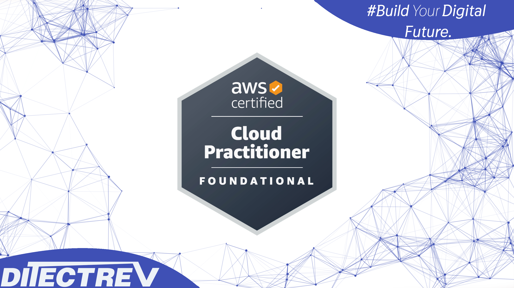

# ⬆️ Amazon Web Services Certified (AWS Certified) Cloud Practitioner (CLF-C02) Practice Tests Exams Questions & Answers

## Udemy & Etsy

❣️ Please support us by purchasing this course on Udemy in an interactive version with the [discounted link](https://www.udemy.com/course/aws-cloud-practitioner-clf-C01-practice-tests-exams/?referralCode=5FA00571456CA3B6E16D). If you're working for a company, you could most probably easily claim this expense during preparation for your exam. For us, it's to be, or not to be, in the game.

🛍️ Alternatively, you can buy the PDF with those questions on [Etsy](https://ditectrev.etsy.com/listing/1363743302).

## ✨ This course is unlike any Amazon Web Services Certified (AWS Certified) Cloud Practitioner (CLF-C02) course you will find online.

✋ Join a live online community and a course taught by industry experts and pass the Amazon Web Services Certified (AWS Certified) Cloud Practitioner (CLF-C02) confidently. We aim to build an ecosystem of Information Technology (IT) certifications and online courses in cooperation with the technology industry. We believe it will give our students 100% confidence in the pacing market in an open-source environment. We are just at the beginning of our way, so it's even better for you to join now!

## ⌛️ Short and to the point; why should you take the course:

1. Always happy to answer your questions on Udemy's Q&A's and outside :)
2. Failed? Please submit a screenshot of your exam result and request a refund (via our upcoming platform, not possible on Udemy); we'll always accept it.
3. Learn about topics, such as:
   - Access Control;
   - Amazon Aurora;
   - Amazon CloudFront;
   - Amazon CloudWatch;
   - Amazon Connect;
   - Amazon DynamoDB;
   - Amazon Elastic Block Store (Amazon EBS);
   - Amazon Elastic Compute Cloud (Amazon EC2);
   - Amazon Elastic Map Reduce (Amazon EMR);
   - Amazon Inspector;
   - Amazon Redshift;
   - Amazon Relational Database Service (Amazon RDS);
   - Amazon Simple Storage Service (Amazon S3);
   - Authentication & Authorization;
   - Availability Zones;
   - AWS Budgets;
   - AWS CloudFormation;
   - AWS CloudTrail;
   - AWS Command Line Interface (AWS CLI);
   - AWS Cost Explorer;
   - AWS Direct Connect;
   - AWS Health Dashboard;
   - AWS Identity and Access Management (AWS IAM);
   - AWS Key Management Service (AWS KMS);
   - AWS Lambda;
   - AWS Pricing Calculator;
   - AWS Trusted Advisor;
   - AWS Web Application Firewall (AWS WAF);
   - Capital Expenditure (CapEx) & Operational Expenditure (OpEx);
   - Cloud Concepts;
   - Compliancy, Governance, Identity & Privacy;
   - Inbound Data Traffic & Outbound Data Traffic;
   - Infrastructure as a Service (IaaS);
   - Platform as a Service (PaaS);
   - Public & Private Cloud;
   - Resource Groups;
   - Serverless;
   - Service Level Agreement (SLA);
   - Software as a Service (SaaS);
   - Virtual Private Clouds (VPC);
   - **Much More!**
4. Questions are similar to the actual exam, without duplications (like in other courses ;-)).
5. The Practice Tests Exams simulate the actual exam's content, timing, and percentage required to pass the exam.
6. This course is **not** a Amazon Web Services Certified (AWS Certified) Cloud Practitioner (CLF-C02) Exam Dump. Some people use brain dumps or exam dumps, but that's absurd, which we don't practice.
7. 597 **unique** questions.

## ☝️ Course Updates

**[v1.0.0](../../releases/tag/v1.0.0): December 7, 2022.**

- Launch of the course.

**[v1.1.0](../../releases/tag/v1.1.0): January 8, 2023.**

- Fix several questions with minor improvements.

**[v1.1.1](../../releases/tag/v1.1.1): March 7, 2023.**

- Fix several typos.

**[v1.1.2](../../releases/tag/v1.1.2): June 19, 2023.**

- Fix 1 question correct answer.

**[v1.1.3](../../releases/tag/v1.1.3): July 13, 2023.**

- Fix 1 question correct answer and several typos.

**[v1.1.4](../../releases/tag/v1.1.4): August 14, 2023.**

- Remove from 2 answers '(Correct)' word.

**[v1.2.0](../../releases/tag/v1.2.0): October 2, 2023.**

- Add 2 new questions and fix 6 questions with incorrect answers.

**[v1.2.1](../../releases/tag/v1.2.1): November 22, 2023.**

- Fix all remaining typos with support of automated proofreading software.

**[v1.2.2](../../releases/tag/v1.2.2): April 11, 2024.**

- Fix 1 question with a wrong answer.

## 🙋‍♀️ & 🙋‍♂️ Contribution

We are so thankful for every contribution, which makes sure we can deliver top-notch content. Whenever you find a missing resource, broken link in a [Table of Contents](#table-of-contents), the wrong answer, please submit an [issue](../../issues). Even better would be a [Pull Request (PR)](../../pulls).

## Who this course is for:

- 👨‍🎓 Students preparing for the Amazon Web Services Certified (AWS Certified) Cloud Practitioner (CLF-C02) Exam;
- 👨‍🎓 AWS Engineers;
- 👨‍🎓 Azure Engineers;
- 👨‍🎓 Cloud Architects;
- 👨‍🎓 Cloud Engineers;
- 👨‍🎓 DevOps Engineers;
- 👨‍🎓 Enterprise Architects;
- 👨‍🎓 Google Cloud Platform (GCP) Engineers;
- 👨‍🎓 Infrastructure Engineers;
- 👨‍🎓 IT Professionals;
- 👨‍🎓 Lead Engineers;
- 👨‍🎓 Product Architects;
- 👨‍🎓 Product Managers;
- 👨‍🎓 Product Owners;
- 👨‍🎓 Project Managers;
- 👨‍🎓 Scrum Masters;
- 👨‍🎓 Security Engineers;
- 👨‍🎓 Site Reliability Engineers;
- 👨‍🎓 Software Developers/Engineers;
- 👨‍🎓 Software Testers;
- 👨‍🎓 Solution Architects;
- 👨‍🎓 Team Leaders.

## Requirements

- 🤩 Excitement to learn!
- 0️⃣ Prior knowledge is required;
- ✅ You can pass the Amazon Web Services Certified (AWS Certified) Cloud Practitioner (CLF-C02) Exam solely based on our Practice Tests Exams.

## Table of Contents

| No. | Questions |
| --- | --------------------------- |
| 1   | [AWS allows users to manage their resources using a web based user interface. What is the name of this interface?](#aws-allows-users-to-manage-their-resources-using-a-web-based-user-interface-what-is-the-name-of-this-interface) |
| 2   | [Which of the following is an example of horizontal scaling in the AWS Cloud?](#which-of-the-following-is-an-example-of-horizontal-scaling-in-the-aws-cloud) |
| 3   | [You have noticed that several critical Amazon EC2 instances have been terminated. Which of the following AWS services would help you determine who took this action?](#you-have-noticed-that-several-critical-amazon-ec2-instances-have-been-terminated-which-of-the-following-aws-services-would-help-you-determine-who-took-this-action) |
| 4   | [Which of the below options are related to the reliability of AWS? (Choose TWO)](#which-of-the-below-options-are-related-to-the-reliability-of-aws-choose-two) |
| 5   | [Which statement is true regarding the AWS Shared Responsibility Model?](#which-statement-is-true-regarding-the-aws-shared-responsibility-model) |
| 6   | [You have set up consolidated billing for several AWS accounts. One of the accounts has purchased a number of reserved instances for 3 years. Which of the following is true regarding this scenario?](#you-have-set-up-consolidated-billing-for-several-aws-accounts-one-of-the-accounts-has-purchased-a-number-of-reserved-instances-for-3-years-which-of-the-following-is-true-regarding-this-scenario) |
| 7   | [A company has developed an eCommerce web application in AWS. What should they do to ensure that the application has the highest level of availability?](#a-company-has-developed-an-ecommerce-web-application-in-aws-what-should-they-do-to-ensure-that-the-application-has-the-highest-level-of-availability) |
| 8   | [What does AWS Snowball provide? (Choose TWO)](#what-does-aws-snowball-provide-choose-two) |
| 9   | [A company has an AWS Enterprise Support plan. They want quick and efficient guidance with their billing and account inquiries. Which of the following should the company use?](#a-company-has-an-aws-enterprise-support-plan-they-want-quick-and-efficient-guidance-with-their-billing-and-account-inquiries-which-of-the-following-should-the-company-use) |
| 10   | [A Japanese company hosts their applications on Amazon EC2 instances in the Tokyo Region. The company has opened new branches in the United States, and the US users are complaining of high latency. What can the company do to reduce latency for the users in the US while minimizing costs?](#a-japanese-company-hosts-their-applications-on-amazon-ec2-instances-in-the-tokyo-region-the-company-has-opened-new-branches-in-the-united-states-and-the-us-users-are-complaining-of-high-latency-what-can-the-company-do-to-reduce-latency-for-the-users-in-the-us-while-minimizing-costs) |
| 11   | [An organization has a large number of technical employees who operate their AWS Cloud infrastructure. What does AWS provide to help organize them into teams and then assign the appropriate permissions for each team?](#an-organization-has-a-large-number-of-technical-employees-who-operate-their-aws-cloud-infrastructure-what-does-aws-provide-to-help-organize-them-into-teams-and-then-assign-the-appropriate-permissions-for-each-team) |
| 12   | [A company has decided to migrate its Oracle database to AWS. Which AWS service can help achieve this without negatively impacting the functionality of the source database?](#a-company-has-decided-to-migrate-its-oracle-database-to-aws-which-aws-service-can-help-achieve-this-without-negatively-impacting-the-functionality-of-the-source-database) |
| 13   | [Adjusting compute capacity dynamically to reduce cost is an implementation of which AWS cloud best practice?](#adjusting-compute-capacity-dynamically-to-reduce-cost-is-an-implementation-of-which-aws-cloud-best-practice) |
| 14   | [What are the benefits of having infrastructure hosted in AWS? (Choose TWO)](#what-are-the-benefits-of-having-infrastructure-hosted-in-aws-choose-two) |
| 15   | [What is the advantage of the AWS-recommended practice of 'decoupling' applications?](#what-is-the-advantage-of-the-aws-recommended-practice-of-decoupling-applications) |
| 16   | [Which of the following helps a customer view the Amazon EC2 billing activity for the past month?](#which-of-the-following-helps-a-customer-view-the-amazon-ec2-billing-activity-for-the-past-month) |
| 17   | [What do you gain from setting up consolidated billing for five different AWS accounts under another master account?](#what-do-you-gain-from-setting-up-consolidated-billing-for-five-different-aws-accounts-under-another-master-account) |
| 18   | [What should you do in order to keep the data on EBS volumes safe? (Choose TWO)](#what-should-you-do-in-order-to-keep-the-data-on-ebs-volumes-safe-choose-two) |
| 19   | [One of the most important AWS best-practices to follow is the cloud architecture principle of elasticity. How does this principle improve your architecture's design?](#one-of-the-most-important-aws-best-practices-to-follow-is-the-cloud-architecture-principle-of-elasticity-how-does-this-principle-improve-your-architectures-design) |
| 20   | [A startup company is operating on limited funds and is extremely concerned about cost overruns. Which of the below options can be used to notify the company when their monthly AWS bill exceeds \$2000? (Choose TWO)](#a-startup-company-is-operating-on-limited-funds-and-is-extremely-concerned-about-cost-overruns-which-of-the-below-options-can-be-used-to-notify-the-company-when-their-monthly-aws-bill-exceeds-2000-choose-two) |
| 21   | [What does Amazon CloudFront use to distribute content to global users with low latency?](#what-does-amazon-cloudfront-use-to-distribute-content-to-global-users-with-low-latency) |
| 22   | [What does the 'Principle of Least Privilege' refer to?](#what-does-the-principle-of-least-privilege-refer-to) |
| 23   | [Which of the following does NOT belong to the AWS Cloud Computing models?](#which-of-the-following-does-not-belong-to-the-aws-cloud-computing-models) |
| 24   | [The identification process of an online financial services company requires that new users must complete an online interview with their security team. The completed recorded interviews are only required in the event of a legal issue or a regulatory compliance breach. What is the most cost-effective service to store the recorded videos?](#the-identification-process-of-an-online-financial-services-company-requires-that-new-users-must-complete-an-online-interview-with-their-security-team-the-completed-recorded-interviews-are-only-required-in-the-event-of-a-legal-issue-or-a-regulatory-compliance-breach-what-is-the-most-cost-effective-service-to-store-the-recorded-videos) |
| 25   | [Which service provides DNS in the AWS cloud?](#which-service-provides-dns-in-the-aws-cloud) |
| 26   | [Hundreds of thousands of DDoS attacks are recorded every month worldwide. What service does AWS provide to help protect AWS Customers from these attacks? (Choose TWO)](#hundreds-of-thousands-of-ddos-attacks-are-recorded-every-month-worldwide-what-service-does-aws-provide-to-help-protect-aws-customers-from-these-attacks-choose-two) |
| 27   | [A company is deploying a new two-tier web application in AWS. Where should the most frequently accessed data be stored so that the application's response time is optimal?](#a-company-is-deploying-a-new-two-tier-web-application-in-aws-where-should-the-most-frequently-accessed-data-be-stored-so-that-the-applications-response-time-is-optimal) |
| 28   | [You want to run a questionnaire application for only one day (without interruption), which Amazon EC2 purchase option should you use?](#you-want-to-run-a-questionnaire-application-for-only-one-day-without-interruption-which-amazon-ec2-purchase-option-should-you-use) |
| 29   | [You are working on a project that involves creating thumbnails of millions of images. Consistent uptime is not an issue, and continuous processing is not required. Which EC2 buying option would be the most cost-effective?](#you-are-working-on-a-project-that-involves-creating-thumbnails-of-millions-of-images-consistent-uptime-is-not-an-issue-and-continuous-processing-is-not-required-which-ec2-buying-option-would-be-the-most-cost-effective) |
| 30   | [Which of the following can be described as a global content delivery network (CDN) service?](#which-of-the-following-can-be-described-as-a-global-content-delivery-network-cdn-service) |
| 31   | [Which of the following services allows customers to manage their agreements with AWS?](#which-of-the-following-services-allows-customers-to-manage-their-agreements-with-aws) |
| 32   | [Which of the following are examples of AWS-Managed Services, where AWS is responsible for the operational and maintenance burdens of running the service? (Choose TWO)](#which-of-the-following-are-examples-of-aws-managed-services-where-aws-is-responsible-for-the-operational-and-maintenance-burdens-of-running-the-service-choose-two) |
| 33   | [Your company has a data store application that requires access to a NoSQL database. Which AWS database offering would meet this requirement?](#your-company-has-a-data-store-application-that-requires-access-to-a-nosql-database-which-aws-database-offering-would-meet-this-requirement) |
| 34   | [As part of the Enterprise support plan, who is the primary point of contact for ongoing support needs?](#as-part-of-the-enterprise-support-plan-who-is-the-primary-point-of-contact-for-ongoing-support-needs) |
| 35   | [How can you view the distribution of AWS spending in one of your AWS accounts?](#how-can-you-view-the-distribution-of-aws-spending-in-one-of-your-aws-accounts) |
| 36   | [Which of the following must an IAM user provide to interact with AWS services using the AWS Command Line Interface (AWS CLI)?](#which-of-the-following-must-an-iam-user-provide-to-interact-with-aws-services-using-the-aws-command-line-interface-aws-cli) |
| 37   | [You have AWS Basic support, and you have discovered that some AWS resources are being used maliciously, and those resources could potentially compromise your data. What should you do?](#you-have-aws-basic-support-and-you-have-discovered-that-some-aws-resources-are-being-used-maliciously-and-those-resources-could-potentially-compromise-your-data-what-should-you-do) |
| 38   | [Select TWO examples of the AWS shared controls.](#select-two-examples-of-the-aws-shared-controls)
| 39   | [In order to implement best practices when dealing with a 'Single Point of Failure,' you should attempt to build as much automation as possible in both detecting and reacting to failure. Which of the following AWS services would help? (Choose TWO)](#in-order-to-implement-best-practices-when-dealing-with-a-single-point-of-failure-you-should-attempt-to-build-as-much-automation-as-possible-in-both-detecting-and-reacting-to-failure-which-of-the-following-aws-services-would-help-choose-two) |
| 40   | [A company is planning to host an educational website on AWS. Their video courses will be streamed all around the world. Which of the following AWS services will help achieve high transfer speeds?](#a-company-is-planning-to-host-an-educational-website-on-aws-their-video-courses-will-be-streamed-all-around-the-world-which-of-the-following-aws-services-will-help-achieve-high-transfer-speeds) |
| 41   | [A developer is planning to build a two-tier web application that has a MySQL database layer. Which of the following AWS database services would provide automated backups for the application?](#a-developer-is-planning-to-build-a-two-tier-web-application-that-has-a-mysql-database-layer-which-of-the-following-aws-database-services-would-provide-automated-backups-for-the-application) |
| 42   | [What is the AWS service that enables AWS architects to manage infrastructure as code?](#what-is-the-aws-service-that-enables-aws-architects-to-manage-infrastructure-as-code) |
| 43   | [Under the shared responsibility model, which of the following is the responsibility of AWS?](#under-the-shared-responsibility-model-which-of-the-following-is-the-responsibility-of-aws) |
| 44   | [What does the AWS Health Dashboard provide? (Choose TWO)](#what-does-the-aws-health-dashboard-provide-choose-two) |
| 45   | [You have deployed your application on multiple Amazon EC2 instances. Your customers complain that sometimes they can't reach your application. Which AWS service allows you to monitor the performance of your EC2 instances to assist in troubleshooting these issues?](#you-have-deployed-your-application-on-multiple-amazon-ec2-instances-your-customers-complain-that-sometimes-they-cant-reach-your-application-which-aws-service-allows-you-to-monitor-the-performance-of-your-ec2-instances-to-assist-in-troubleshooting-these-issues) |
| 46   | [Your company is developing a critical web application in AWS, and the security of the application is a top priority. Which of the following AWS services will provide infrastructure security optimization recommendations?](#your-company-is-developing-a-critical-web-application-in-aws-and-the-security-of-the-application-is-a-top-priority-which-of-the-following-aws-services-will-provide-infrastructure-security-optimization-recommendations) |
| 47   | [Which of the following is not a benefit of Amazon S3? (Choose TWO)](#which-of-the-following-is-not-a-benefit-of-amazon-s3-choose-two) |
| 48   | [In the AWS Shared responsibility Model, which of the following are the responsibility of the customer? (Choose TWO)](#in-the-aws-shared-responsibility-model-which-of-the-following-are-the-responsibility-of-the-customer-choose-two) |
| 49   | [What does AWS provide to deploy popular technologies such as IBM MQ on AWS with the least amount of effort and time?](#what-does-aws-provide-to-deploy-popular-technologies-such-as-ibm-mq-on-aws-with-the-least-amount-of-effort-and-time) |
| 50   | [An organization has decided to purchase an Amazon EC2 Reserved Instance (RI) for three years in order to reduce costs. It is possible that the application workloads could change during the reservation period. What is the EC2 Reserved Instance (RI) type that will allow the company to exchange the purchased reserved instance for another reserved instance with higher computing power if they need to?](#an-organization-has-decided-to-purchase-an-amazon-ec2-reserved-instance-ri-for-three-years-in-order-to-reduce-costs-it-is-possible-that-the-application-workloads-could-change-during-the-reservation-period-what-is-the-ec2-reserved-instance-ri-type-that-will-allow-the-company-to-exchange-the-purchased-reserved-instance-for-another-reserved-instance-with-higher-computing-power-if-they-need-to) |
| 51   | [A global company with a large number of AWS accounts is seeking a way in which they can centrally manage billing and security policies across all accounts. Which AWS Service will assist them in meeting these goals?](#a-global-company-with-a-large-number-of-aws-accounts-is-seeking-a-way-in-which-they-can-centrally-manage-billing-and-security-policies-across-all-accounts-which-aws-service-will-assist-them-in-meeting-these-goals) |
| 52   | [Which service provides object-level storage in AWS?](#which-service-provides-object-level-storage-in-aws) |
| 53   | [A company is concerned that they are spending money on underutilized compute resources in AWS. Which AWS feature will help ensure that their applications are automatically adding/removing EC2 compute capacity to closely match the required demand?](#a-company-is-concerned-that-they-are-spending-money-on-underutilized-compute-resources-in-aws-which-aws-feature-will-help-ensure-that-their-applications-are-automatically-addingremoving-ec2-compute-capacity-to-closely-match-the-required-demand) |
| 54   | [Which S3 storage class is best for data with unpredictable access patterns?](#which-s3-storage-class-is-best-for-data-with-unpredictable-access-patterns) |
| 55   | [What is the AWS database service that allows you to upload data structured in key-value format?](#what-is-the-aws-database-service-that-allows-you-to-upload-data-structured-in-key-value-format) |
| 56   | [Which of the following is NOT correct regarding Amazon EC2 On-demand instances?](#which-of-the-following-is-not-correct-regarding-amazon-ec2-on-demand-instances) |
| 57   | [A company has moved to AWS recently. Which of the following AWS Services will help ensure that they have the proper security settings? (Choose TWO)](#a-company-has-moved-to-aws-recently-which-of-the-following-aws-services-will-help-ensure-that-they-have-the-proper-security-settings-choose-two) |
| 58   | [What is the AWS feature that provides an additional level of security above the default authentication mechanism of usernames and passwords?](#what-is-the-aws-feature-that-provides-an-additional-level-of-security-above-the-default-authentication-mechanism-of-usernames-and-passwords) |
| 59   | [A company is introducing a new product to their customers, and is expecting a surge in traffic to their web application. As part of their Enterprise Support plan, which of the following provides the company with architectural and scaling guidance?](#a-company-is-introducing-a-new-product-to-their-customers-and-is-expecting-a-surge-in-traffic-to-their-web-application-as-part-of-their-enterprise-support-plan-which-of-the-following-provides-the-company-with-architectural-and-scaling-guidance) |
| 60   | [You work as an on-premises MySQL DBA. The work of database configuration, backups, patching, and DR can be time-consuming and repetitive. Your company has decided to migrate to the AWS Cloud. Which of the following can help save time on database maintenance so you can focus on data architecture and performance?](#you-work-as-an-on-premises-mysql-dba-the-work-of-database-configuration-backups-patching-and-dr-can-be-time-consuming-and-repetitive-your-company-has-decided-to-migrate-to-the-aws-cloud-which-of-the-following-can-help-save-time-on-database-maintenance-so-you-can-focus-on-data-architecture-and-performance) |
| 61   | [Which of the below is a best-practice when designing solutions on AWS?](#which-of-the-below-is-a-best-practice-when-designing-solutions-on-aws) |
| 62   | [According to the AWS Acceptable Use Policy, which of the following statements is true regarding penetration testing of EC2 instances?](#according-to-the-aws-acceptable-use-policy-which-of-the-following-statements-is-true-regarding-penetration-testing-of-ec2-instances) |
| 63   | [Which service is used to ensure that messages between software components are not lost if one or more components fail?](#which-service-is-used-to-ensure-that-messages-between-software-components-are-not-lost-if-one-or-more-components-fail) |
| 64   | [The principle 'design for failure and nothing will fail' is very important when designing your AWS Cloud architecture. Which of the following would help adhere to this principle? (Choose TWO)](#the-principle-design-for-failure-and-nothing-will-fail-is-very-important-when-designing-your-aws-cloud-architecture-which-of-the-following-would-help-adhere-to-this-principle-choose-two) |
| 65   | [What is the AWS service that provides a virtual network dedicated to your AWS account?](#what-is-the-aws-service-that-provides-a-virtual-network-dedicated-to-your-aws-account) |
| 66   | [According to the AWS Shared responsibility model, which of the following are the responsibility of the customer? (Choose TWO)](#according-to-the-aws-shared-responsibility-model-which-of-the-following-are-the-responsibility-of-the-customer-choose-two) |
| 67   | [Which of the following AWS services can be used as a compute resource? (Choose TWO)](#which-of-the-following-aws-services-can-be-used-as-a-compute-resource-choose-two) |
| 68   | [Your company is designing a new application that will store and retrieve photos and videos. Which of the following services should you recommend as the underlying storage mechanism?](#your-company-is-designing-a-new-application-that-will-store-and-retrieve-photos-and-videos-which-of-the-following-services-should-you-recommend-as-the-underlying-storage-mechanism) |
| 69   | [Which of the following is equivalent to a user name and password and is used to authenticate your programmatic access to AWS services and APIs?](#which-of-the-following-is-equivalent-to-a-user-name-and-password-and-is-used-to-authenticate-your-programmatic-access-to-aws-services-and-apis) |
| 70   | [What does Amazon ElastiCache provide?](#what-does-amazon-elasticache-provide) |
| 71   | [What is the AWS service that enables you to manage all of your AWS accounts from a single master account?](#what-is-the-aws-service-that-enables-you-to-manage-all-of-your-aws-accounts-from-a-single-master-account) |
| 72   | [Which of the following EC2 instance purchasing options supports the Bring Your Own License (BYOL) model for almost every BYOL scenario?](#which-of-the-following-ec2-instance-purchasing-options-supports-the-bring-your-own-license-byol-model-for-almost-every-byol-scenario) |
| 73   | [Which of the following is one of the benefits of moving infrastructure from an on-premises data center to AWS?](#which-of-the-following-is-one-of-the-benefits-of-moving-infrastructure-from-an-on-premises-data-center-to-aws) |
| 74   | [Which of the following are important design principles you should adopt when designing systems on AWS? (Choose TWO)](#which-of-the-following-are-important-design-principles-you-should-adopt-when-designing-systems-on-aws-choose-two) |
| 75   | [Which AWS Service can be used to establish a dedicated, private network connection between AWS and your datacenter??](#which-aws-service-can-be-used-to-establish-a-dedicated-private-network-connection-between-aws-and-your-datacenter) |
| 76   | [You are working on two projects that require completely different network configurations. Which AWS service or feature will allow you to isolate resources and network configurations?](#you-are-working-on-two-projects-that-require-completely-different-network-configurations-which-aws-service-or-feature-will-allow-you-to-isolate-resources-and-network-configurations) |
| 77   | [Which of the following services can help protect your web applications from SQL injection and other vulnerabilities in your application code?](#which-of-the-following-services-can-help-protect-your-web-applications-from-sql-injection-and-other-vulnerabilities-in-your-application-code) |
| 78   | [An organization needs to analyze and process a large number of data sets. Which AWS service should they use?](#an-organization-needs-to-analyze-and-process-a-large-number-of-data-sets-which-aws-service-should-they-use) |
| 79   | [Based on the AWS Shared Responsibility Model, which of the following are the sole responsibility of AWS? (Choose TWO)](#based-on-the-aws-shared-responsibility-model-which-of-the-following-are-the-sole-responsibility-of-aws-choose-two) |
| 80   | [What is the AWS service that provides you the highest level of control over the underlying virtual infrastructure?](#what-is-the-aws-service-that-provides-you-the-highest-level-of-control-over-the-underlying-virtual-infrastructure) |
| 81   | [What are the default security credentials that are required to access the AWS management console for an IAM user account?](#what-are-the-default-security-credentials-that-are-required-to-access-the-aws-management-console-for-an-iam-user-account) |
| 82   | [In your on-premises environment, you can create as many virtual servers as you need from a single template. What can you use to perform the same in AWS?](#in-your-on-premises-environment-you-can-create-as-many-virtual-servers-as-you-need-from-a-single-template-what-can-you-use-to-perform-the-same-in-aws) |
| 83   | [What are two advantages of using Cloud Computing over using traditional data centers? (Choose TWO)](#what-are-two-advantages-of-using-cloud-computing-over-using-traditional-data-centers-choose-two) |
| 84   | [Which of the following aspects of security are managed by AWS? (Choose TWO)](#which-of-the-following-aspects-of-security-are-managed-by-aws-choose-two) |
| 85   | [Which statement best describes the operational excellence pillar of the AWS Well-Architected Framework?](#which-statement-best-describes-the-operational-excellence-pillar-of-the-aws-well-architected-framework) |
| 86   | [AWS has created a large number of Edge Locations as part of its Global Infrastructure. Which of the following is NOT a benefit of using Edge Locations?](#aws-has-created-a-large-number-of-edge-locations-as-part-of-its-global-infrastructure-which-of-the-following-is-not-a-benefit-of-using-edge-locations) |
| 87   | [What are the change management tools that helps AWS customers audit and monitor all resource changes in their AWS environment? (Choose TWO)](#what-are-the-change-management-tools-that-helps-aws-customers-audit-and-monitor-all-resource-changes-in-their-aws-environment-choose-two) |
| 88   | [Which of the following services allows you to run containerized applications on a cluster of EC2 instances?](#which-of-the-following-services-allows-you-to-run-containerized-applications-on-a-cluster-of-ec2-instances) |
| 89   | [Which of the following services will help businesses ensure compliance in AWS?](#which-of-the-following-services-will-help-businesses-ensure-compliance-in-aws) |
| 90   | [Which of the following procedures will help reduce your Amazon S3 costs?](#which-of-the-following-procedures-will-help-reduce-your-amazon-s3-costs) |
| 91   | [What are the AWS services/features that can help you maintain a highly available and fault-tolerant architecture in AWS? (Choose TWO)](#what-are-the-aws-servicesfeatures-that-can-help-you-maintain-a-highly-available-and-fault-tolerant-architecture-in-aws-choose-two) |
| 92   | [Which of the following activities may help reduce your AWS monthly costs?](#which-of-the-following-activities-may-help-reduce-your-aws-monthly-costs) |
| 93   | [What is the AWS service/feature that takes advantage of Amazon CloudFront's globally distributed edge locations to transfer files to S3 with higher upload speeds?](#what-is-the-aws-servicefeature-that-takes-advantage-of-amazon-cloudfronts-globally-distributed-edge-locations-to-transfer-files-to-s3-with-higher-upload-speeds) |
| 94   | [Which of the following AWS security features is associated with an EC2 instance and functions to filter incoming traffic requests?](#which-of-the-following-aws-security-features-is-associated-with-an-ec2-instance-and-functions-to-filter-incoming-traffic-requests) |
| 95   | [Which AWS services can be used to improve the performance of a global application and reduce latency for its users? (Choose TWO)](#which-aws-services-can-be-used-to-improve-the-performance-of-a-global-application-and-reduce-latency-for-its-users-choose-two) |
| 96   | [Using Amazon RDS falls under the shared responsibility model. Which of the following are customer responsibilities? (Choose TWO)](#using-amazon-rds-falls-under-the-shared-responsibility-model-which-of-the-following-are-customer-responsibilities-choose-two) |
| 97   | [A company has a large amount of structured data stored in their on-premises data center. They are planning to migrate all the data to AWS, what is the most appropriate AWS database option?](#a-company-has-a-large-amount-of-structured-data-stored-in-their-on-premises-data-center-they-are-planning-to-migrate-all-the-data-to-aws-what-is-the-most-appropriate-aws-database-option) |
| 98   | [A company has created a solution that helps AWS customers improve their architectures on AWS. Which AWS program may support this company?](#a-company-has-created-a-solution-that-helps-aws-customers-improve-their-architectures-on-aws-which-aws-program-may-support-this-company) |
| 99   | [What is the AWS serverless service that allows you to run your applications without any administrative burden?](#what-is-the-aws-serverless-service-that-allows-you-to-run-your-applications-without-any-administrative-burden) |
| 100   | [Jessica is managing an e-commerce web application in AWS. The application is hosted on six EC2 instances. One day, three of the instances crashed; but none of her customers were affected. What has Jessica done correctly in this scenario?](#jessica-is-managing-an-e-commerce-web-application-in-aws-the-application-is-hosted-on-six-ec2-instances-one-day-three-of-the-instances-crashed-but-none-of-her-customers-were-affected-what-has-jessica-done-correctly-in-this-scenario) |
| 101   | [Where can you store files in AWS? (Choose TWO)](#where-can-you-store-files-in-aws-choose-two) |
| 102   | [Which AWS service can be used to store and reliably deliver messages across distributed systems?](#which-aws-service-can-be-used-to-store-and-reliably-deliver-messages-across-distributed-systems) |
| 103   | [Which of the following describes the payment model that AWS makes available for customers that can commit to using Amazon EC2 over a one or 3-year term to reduce their total computing costs?](#which-of-the-following-describes-the-payment-model-that-aws-makes-available-for-customers-that-can-commit-to-using-amazon-ec2-over-a-one-or-3-year-term-to-reduce-their-total-computing-costs) |
| 104   | [A company is migrating its on-premises database to Amazon RDS. What should the company do to ensure Amazon RDS costs are kept to a minimum?](#a-company-is-migrating-its-on-premises-database-to-amazon-rds-what-should-the-company-do-to-ensure-amazon-rds-costs-are-kept-to-a-minimum) |
| 105   | [What is the primary storage service used by Amazon RDS database instances?](#what-is-the-primary-storage-service-used-by-amazon-rds-database-instances) |
| 106   | [A company is developing a new application using a microservices framework. The new application is having performance and latency issues. Which AWS Service should be used to troubleshoot these issues?](#a-company-is-developing-a-new-application-using-a-microservices-framework-the-new-application-is-having-performance-and-latency-issues-which-aws-service-should-be-used-to-troubleshoot-these-issues) |
| 107   | [Which of the following AWS services is designed with native Multi-AZ fault tolerance in mind? (Choose TWO)](#which-of-the-following-aws-services-is-designed-with-native-multi-az-fault-tolerance-in-mind-choose-two) |
| 108   | [What are the Amazon RDS features that can be used to improve the availability of your database? (Choose TWO)](#what-are-the-amazon-rds-features-that-can-be-used-to-improve-the-availability-of-your-database-choose-two) |
| 109   | [Sarah has deployed an application in the Northern California (us-west-1) region. After examining the application's traffic, she notices that about 30% of the traffic is coming from Asia. What can she do to reduce latency for the users in Asia?](#sarah-has-deployed-an-application-in-the-northern-california-us-west-1-region-after-examining-the-applications-traffic-she-notices-that-about-30-of-the-traffic-is-coming-from-asia-what-can-she-do-to-reduce-latency-for-the-users-in-asia) |
| 110   | [An organization runs many systems and uses many AWS products. Which of the following services enables them to control how each developer interacts with these products?](#an-organization-runs-many-systems-and-uses-many-aws-products-which-of-the-following-services-enables-them-to-control-how-each-developer-interacts-with-these-products) |
| 111   | [Using Amazon EC2 falls under which of the following cloud computing models?](#using-amazon-ec2-falls-under-which-of-the-following-cloud-computing-models) |
| 112   | [Which of the below is a best-practice when building applications on AWS?](#which-of-the-below-is-a-best-practice-when-building-applications-on-aws) |
| 113   | [Your company is designing a new application that will store and retrieve photos and videos. Which of the following services should you recommend as the underlying storage mechanism?](#your-company-is-designing-a-new-application-that-will-store-and-retrieve-photos-and-videos-which-of-the-following-services-should-you-recommend-as-the-underlying-storage-mechanism) |
| 114   | [Amazon Glacier is an Amazon S3 storage class that is suitable for storing [...] & [...]. (Choose TWO)](#amazon-glacier-is-an-amazon-s3-storage-class-that-is-suitable-for-storing----choose-two) |
| 115   | [What does Amazon Elastic Beanstalk provide?](#what-does-amazon-elastic-beanstalk-provide) |
| 116   | [What is the AWS service that performs automated network assessments of Amazon EC2 instances to check for vulnerabilities?](#what-is-the-aws-service-that-performs-automated-network-assessments-of-amazon-ec2-instances-to-check-for-vulnerabilities) |
| 117   | [Under the Shared Responsibility Model, which of the following controls do customers fully inherit from AWS? (Choose TWO)](#under-the-shared-responsibility-model-which-of-the-following-controls-do-customers-fully-inherit-from-aws-choose-two) |
| 118   | [A company needs to host a database in Amazon RDS for at least three years. Which of the following options would be the most cost-effective solution?](#a-company-needs-to-host-a-database-in-amazon-rds-for-at-least-three-years-which-of-the-following-options-would-be-the-most-cost-effective-solution) |
| 119   | [Your application has recently experienced significant global growth, and international users are complaining of high latency. What is the AWS characteristic that can help improve your international users' experience?](#your-application-has-recently-experienced-significant-global-growth-and-international-users-are-complaining-of-high-latency-what-is-the-aws-characteristic-that-can-help-improve-your-international-users-experience) |
| 120   | [Savings Plans are available for which of the following AWS compute services? (Choose TWO)](#savings-plans-are-available-for-which-of-the-following-aws-compute-services-choose-two) |
| 121   | [A company has business critical workloads hosted on AWS and they are unwilling to accept any downtime. Which of the following is a recommended best practice to protect their workloads in the event of an unexpected natural disaster?](#a-company-has-business-critical-workloads-hosted-on-aws-and-they-are-unwilling-to-accept-any-downtime-which-of-the-following-is-a-recommended-best-practice-to-protect-their-workloads-in-the-event-of-an-unexpected-natural-disaster) |
| 122   | [Which statement is correct with regards to AWS service limits? (Choose TWO)](#which-statement-is-correct-with-regards-to-aws-service-limits-choose-two) |
| 123   | [What is the AWS tool that enables you to use scripts to manage all AWS services and resources?](#what-is-the-aws-tool-that-enables-you-to-use-scripts-to-manage-all-aws-services-and-resources) |
| 124   | [What are the connectivity options that can be used to build hybrid cloud architectures? (Choose TWO)](#what-are-the-connectivity-options-that-can-be-used-to-build-hybrid-cloud-architectures-choose-two) |
| 125   | [A company has deployed a new web application on multiple Amazon EC2 instances. Which of the following should they use to ensure that the incoming HTTP traffic is distributed evenly across the instances?](#a-company-has-deployed-a-new-web-application-on-multiple-amazon-ec2-instances-which-of-the-following-should-they-use-to-ensure-that-the-incoming-http-traffic-is-distributed-evenly-across-the-instances) |
| 126   | [Which of the following AWS offerings is a MySQL-compatible relational database service that can scale capacity automatically based on demand?](#which-of-the-following-aws-offerings-is-a-mysql-compatible-relational-database-service-that-can-scale-capacity-automatically-based-on-demand) |
| 127   | [Which of the following can help protect your EC2 instances from DDoS attacks? (Choose TWO)](#which-of-the-following-can-help-protect-your-ec2-instances-from-ddos-attacks-choose-two) |
| 128   | [What is the AWS data warehouse service that supports a high level of query performance on large amounts of datasets?](#what-is-the-aws-data-warehouse-service-that-supports-a-high-level-of-query-performance-on-large-amounts-of-datasets) |
| 129   | [Which of the following should be considered when performing a TCO analysis to compare the costs of running an application on AWS instead of on-premises?](#which-of-the-following-should-be-considered-when-performing-a-tco-analysis-to-compare-the-costs-of-running-an-application-on-aws-instead-of-on-premises) |
| 130   | [How are AWS customers billed for Linux-based Amazon EC2 usage?](#how-are-aws-customers-billed-for-linux-based-amazon-ec2-usage) |
| 131   | [Which of the following will impact the price paid for an EC2 instance? (Choose TWO)](#which-of-the-following-will-impact-the-price-paid-for-an-ec2-instance-choose-two) |
| 132   | [A customer spent a lot of time configuring a newly deployed Amazon EC2 instance. After the workload increases, the customer decides to provision another EC2 instance with an identical configuration. How can the customer achieve this?](#a-customer-spent-a-lot-of-time-configuring-a-newly-deployed-amazon-ec2-instance-after-the-workload-increases-the-customer-decides-to-provision-another-ec2-instance-with-an-identical-configuration-how-can-the-customer-achieve-this) |
| 133   | [A company uses AWS Organizations to manage all of its AWS accounts. Which of the following allows the company to restrict what services and actions are allowed in each individual account?](#a-company-uses-aws-organizations-to-manage-all-of-its-aws-accounts-which-of-the-following-allows-the-company-to-restrict-what-services-and-actions-are-allowed-in-each-individual-account) |
| 134   | [Which of the following statements describes the AWS Cloud's agility?](#which-of-the-following-statements-describes-the-aws-clouds-agility) |
| 135   | [What are the benefits of using the Amazon Relational Database Service? (Choose TWO)](#what-are-the-benefits-of-using-the-amazon-relational-database-service-choose-two) |
| 136   | [What is the connectivity option that uses Internet Protocol Security (IPSec) to establish encrypted connectivity between an on-premises network and the AWS Cloud?](#what-is-the-connectivity-option-that-uses-internet-protocol-security-ipsec-to-establish-encrypted-connectivity-between-an-on-premises-network-and-the-aws-cloud) |
| 137   | [What is the minimum level of AWS support that provides 24x7 access to technical support engineers via phone and chat?](#what-is-the-minimum-level-of-aws-support-that-provides-24x7-access-to-technical-support-engineers-via-phone-and-chat) |
| 138   | [Which of the following is used to control network traffic in AWS? (Choose TWO)](#which-of-the-following-is-used-to-control-network-traffic-in-aws-choose-two) |
| 139   | [A company has developed a media transcoding application in AWS. The application is designed to recover quickly from hardware failures. Which one of the following types of instance would be the most cost-effective choice to use?](#a-company-has-developed-a-media-transcoding-application-in-aws-the-application-is-designed-to-recover-quickly-from-hardware-failures-which-one-of-the-following-types-of-instance-would-be-the-most-cost-effective-choice-to-use) |
| 140   | [Which AWS Service provides the current status of all AWS Services in all AWS Regions?](#which-aws-service-provides-the-current-status-of-all-aws-services-in-all-aws-regions) |
| 141   | [Which AWS service or feature can be used to call AWS Services from different programming languages?](#which-aws-service-or-feature-can-be-used-to-call-aws-services-from-different-programming-languages) |
| 142   | [Which AWS Service can be used to register a new domain name?](#which-aws-service-can-be-used-to-register-a-new-domain-name) |
| 143   | [App development companies move their business to AWS to reduce time-to-market and improve customer satisfaction, what are the AWS automation tools that help them deploy their applications faster? (Choose TWO)](#app-development-companies-move-their-business-to-aws-to-reduce-time-to-market-and-improve-customer-satisfaction-what-are-the-aws-automation-tools-that-help-them-deploy-their-applications-faster-choose-two) |
| 144   | [Which AWS service provides cost-optimization recommendations?](#which-aws-service-provides-cost-optimization-recommendations) |
| 145   | [A company has hundreds of VPCs in multiple AWS Regions worldwide. What service does AWS offer to simplify the connection management among the VPCs?](#a-company-has-hundreds-of-vpcs-in-multiple-aws-regions-worldwide-what-service-does-aws-offer-to-simplify-the-connection-management-among-the-vpcs) |
| 146   | [What is one benefit and one drawback of buying a reserved EC2 instance? (Select TWO)](#what-is-one-benefit-and-one-drawback-of-buying-a-reserved-ec2-instance-select-two) |
| 147   | [Why does every AWS Region contain multiple Availability Zones?](#why-does-every-aws-region-contain-multiple-availability-zones) |
| 148   | [What is the most cost-effective purchasing option for running a set of EC2 instances that must always be available for a period of two months?](#what-is-the-most-cost-effective-purchasing-option-for-running-a-set-of-ec2-instances-that-must-always-be-available-for-a-period-of-two-months) |
| 149   | [Which of the following is a benefit of running an application in multiple Availability Zones?](#which-of-the-following-is-a-benefit-of-running-an-application-in-multiple-availability-zones) |
| 150   | [Data security is one of the top priorities of AWS. How does AWS deal with old storage devices that have reached the end of their useful life?](#data-security-is-one-of-the-top-priorities-of-aws-how-does-aws-deal-with-old-storage-devices-that-have-reached-the-end-of-their-useful-life) |
| 151   | [A developer needs to set up an SSL security certificate for a client's eCommerce website in order to use the HTTPS protocol. Which of the following AWS services can be used to deploy the required SSL server certificates? (Choose TWO)](#a-developer-needs-to-set-up-an-ssl-security-certificate-for-a-clients-ecommerce-website-in-order-to-use-the-https-protocol-which-of-the-following-aws-services-can-be-used-to-deploy-the-required-ssl-server-certificates-choose-two) |
| 152   | [Which of the following AWS services scale automatically without your intervention? (Choose TWO)](#which-of-the-following-aws-services-scale-automatically-without-your-intervention-choose-two) |
| 153   | [A company is planning to migrate an application from Amazon EC2 to AWS Lambda to use a serverless architecture. Which of the following will be the responsibility of AWS after migration? (Choose TWO)](#a-company-is-planning-to-migrate-an-application-from-amazon-ec2-to-aws-lambda-to-use-a-serverless-architecture-which-of-the-following-will-be-the-responsibility-of-aws-after-migration-choose-two) |
| 154   | [How do ELBs improve the reliability of your application?](#how-do-elbs-improve-the-reliability-of-your-application) |
| 155   | [A company needs to migrate their website from on-premises to AWS. Security is a major concern for them, so they need to host their website on hardware that is NOT shared with other AWS customers. Which of the following EC2 instance options meets this requirement?](#a-company-needs-to-migrate-their-website-from-on-premises-to-aws-security-is-a-major-concern-for-them-so-they-need-to-host-their-website-on-hardware-that-is-not-shared-with-other-aws-customers-which-of-the-following-ec2-instance-options-meets-this-requirement) |
| 156   | [A customer is planning to move billions of images and videos to be stored on Amazon S3. The customer has approximately 60 Petabytes of data to move. Which of the following AWS Services is the best choice to transfer the data to AWS?](#a-customer-is-planning-to-move-billions-of-images-and-videos-to-be-stored-on-amazon-s3-the-customer-has-approximately-60-petabytes-of-data-to-move-which-of-the-following-aws-services-is-the-best-choice-to-transfer-the-data-to-aws) |
| 157   | [A company plans to migrate a large amount of archived data to AWS. The archived data must be maintained for a period of 5 years and must be retrievable within 5 hours of a request. What is the most cost-effective AWS storage service to use?](#a-company-plans-to-migrate-a-large-amount-of-archived-data-to-aws-the-archived-data-must-be-maintained-for-a-period-of-5-years-and-must-be-retrievable-within-5-hours-of-a-request-what-is-the-most-cost-effective-aws-storage-service-to-use) |
| 158   | [Which AWS Service is used to manage user permissions?](#which-aws-service-is-used-to-manage-user-permissions) |
| 159   | [Which support plan includes AWS Support Concierge Service?](#which-support-plan-includes-aws-support-concierge-service) |
| 160   | [A company needs to track resource changes using the API call history. Which AWS service can help the company achieve this goal?](#a-company-needs-to-track-resource-changes-using-the-api-call-history-which-aws-service-can-help-the-company-achieve-this-goal) |
| 161   | [What are the benefits of using an AWS-managed service? (Choose TWO)](#what-are-the-benefits-of-using-an-aws-managed-service-choose-two) |
| 162   | [Which of the following are use cases for Amazon S3? (Choose TWO)](#which-of-the-following-are-use-cases-for-amazon-s3-choose-two) |
| 163   | [What is the AWS' recommendation regarding access keys?](#what-is-the-aws-recommendation-regarding-access-keys) |
| 164   | [What is the AWS IAM feature that provides an additional layer of security on top of user-name and password authentication?](#what-is-the-aws-iam-feature-that-provides-an-additional-layer-of-security-on-top-of-user-name-and-password-authentication) |
| 165   | [What is the benefit of using an API to access AWS Services?](#what-is-the-benefit-of-using-an-api-to-access-aws-services) |
| 166   | [A company is planning to migrate a database with high read/write activity to AWS. What is the best storage option to use?](#a-company-is-planning-to-migrate-a-database-with-high-readwrite-activity-to-aws-what-is-the-best-storage-option-to-use) |
| 167   | [How can AWS customers track and avoid over-spending on underutilized reserved instances?](#how-can-aws-customers-track-and-avoid-over-spending-on-underutilized-reserved-instances) |
| 168   | [What is the AWS service that provides five times the performance of a standard MySQL database?](#what-is-the-aws-service-that-provides-five-times-the-performance-of-a-standard-mysql-database) |
| 169   | [What does AWS Service Catalog provide?](#what-does-aws-service-catalog-provide) |
| 170   | [For managed services like Amazon DynamoDB, which of the below is AWS responsible for? (Choose TWO)](#for-managed-services-like-amazon-dynamodb-which-of-the-below-is-aws-responsible-for-choose-two) |
| 171   | [Which of the following AWS Services helps with planning application migration to the AWS Cloud?](#which-of-the-following-aws-services-helps-with-planning-application-migration-to-the-aws-cloud) |
| 172   | [A company is trying to analyze the costs applied to their AWS account recently. Which of the following provides them the most granular data about their AWS costs and usage?](#a-company-is-trying-to-analyze-the-costs-applied-to-their-aws-account-recently-which-of-the-following-provides-them-the-most-granular-data-about-their-aws-costs-and-usage) |
| 173   | [Which statement best describes the concept of an AWS region?](#which-statement-best-describes-the-concept-of-an-aws-region) |
| 174   | [A company has discovered that multiple S3 buckets were deleted, but it is unclear who deleted the buckets. Which of the following can the company use to determine the identity that deleted the buckets?](#a-company-has-discovered-that-multiple-s3-buckets-were-deleted-but-it-is-unclear-who-deleted-the-buckets-which-of-the-following-can-the-company-use-to-determine-the-identity-that-deleted-the-buckets) |
| 175   | [Which of the following are factors in determining the appropriate database technology to use for a specific workload? (Choose TWO)](#which-of-the-following-are-factors-in-determining-the-appropriate-database-technology-to-use-for-a-specific-workload-choose-two) |
| 176   | [What are the benefits of implementing a tagging strategy for AWS resources? (Choose TWO)](#what-are-the-benefits-of-implementing-a-tagging-strategy-for-aws-resources-choose-two) |
| 177   | [What are AWS shared controls?](#what-are-aws-shared-controls) |
| 178   | [Which design principles relate to performance efficiency in AWS? (Choose TWO)](#which-design-principles-relate-to-performance-efficiency-in-aws-choose-two) |
| 179   | [Which of the below are responsibilities of the customer when using Amazon EC2? (Choose TWO)](#which-of-the-below-are-responsibilities-of-the-customer-when-using-amazon-ec2-choose-two) |
| 180   | [Why would an organization decide to use AWS over an on-premises data center? (Choose TWO)](#why-would-an-organization-decide-to-use-aws-over-an-on-premises-data-center-choose-two) |
| 181   | [Which of the following AWS services can help you perform security analysis and regulatory compliance auditing? (Choose TWO)](#which-of-the-following-aws-services-can-help-you-perform-security-analysis-and-regulatory-compliance-auditing-choose-two) |
| 182   | [Which of the following is NOT a characteristic of Amazon Elastic Compute Cloud (Amazon EC2)?](#which-of-the-following-is-not-a-characteristic-of-amazon-elastic-compute-cloud-amazon-ec2) |
| 183   | [What is the AWS Compute service that executes code only when triggered by events?](#what-is-the-aws-compute-service-that-executes-code-only-when-triggered-by-events) |
| 184   | [Both AWS and traditional IT distributors provide a wide range of virtual servers to meet their customers' requirements. What is the name of these virtual servers in AWS?](#both-aws-and-traditional-it-distributors-provide-a-wide-range-of-virtual-servers-to-meet-their-customers-requirements-what-is-the-name-of-these-virtual-servers-in-aws) |
| 185   | [What is the framework created by AWS Professional Services that helps organizations design a road map to successful cloud adoption?](#what-is-the-framework-created-by-aws-professional-services-that-helps-organizations-design-a-road-map-to-successful-cloud-adoption) |
| 186   | [TYMO Cloud Corp is looking forward to migrating their entire on-premises data center to AWS. What tool can they use to perform a cost-benefit analysis of moving to the AWS Cloud?](#tymo-cloud-corp-is-looking-forward-to-migrating-their-entire-on-premises-data-center-to-aws-what-tool-can-they-use-to-perform-a-cost-benefit-analysis-of-moving-to-the-aws-cloud) |
| 187   | [Which of the following activities supports the Operational Excellence pillar of the AWS Well-Architected Framework?](#which-of-the-following-activities-supports-the-operational-excellence-pillar-of-the-aws-well-architected-framework) |
| 188   | [Why do many startup companies prefer AWS over traditional on-premises solutions? (Choose TWO)](#why-do-many-startup-companies-prefer-aws-over-traditional-on-premises-solutions-choose-two) |
| 189   | [What are the benefits of using DynamoDB? (Choose TWO)](#what-are-the-benefits-of-using-dynamodb-choose-two) |
| 190   | [Which of the following can be used to protect data at rest on Amazon S3? (Choose TWO)](#which-of-the-following-can-be-used-to-protect-data-at-rest-on-amazon-s3-choose-two) |
| 191   | [As part of the AWS Migration Acceleration Program (MAP), what does AWS provide to accelerate Enterprise adoption of AWS? (Choose TWO)](#as-part-of-the-aws-migration-acceleration-program-map-what-does-aws-provide-to-accelerate-enterprise-adoption-of-aws-choose-two) |
| 192   | [AWS recommends some practices to help organizations avoid unexpected charges on their bill. Which of the following is NOT one of these practices?](#aws-recommends-some-practices-to-help-organizations-avoid-unexpected-charges-on-their-bill-which-of-the-following-is-not-one-of-these-practices) |
| 193   | [What is the AWS tool that can help a company visualize their AWS spending in the last few months?](#what-is-the-aws-tool-that-can-help-a-company-visualize-their-aws-spending-in-the-last-few-months) |
| 194   | [When running a workload in AWS, the customer is NOT responsible for: (Select TWO)](#when-running-a-workload-in-aws-the-customer-is-not-responsible-for-select-two) |
| 195   | [Which AWS service can be used to send promotional text messages (SMS) to more than 200 countries worldwide?](#which-aws-service-can-be-used-to-send-promotional-text-messages-sms-to-more-than-200-countries-worldwide) |
| 196   | [Which of the following allows you to create new RDS instances? (Choose TWO)](#which-of-the-following-allows-you-to-create-new-rds-instances-choose-two) |
| 197   | [One of the major advantages of using AWS is cost savings. What does AWS provide to reduce the cost of running Amazon EC2 instances?](#one-of-the-major-advantages-of-using-aws-is-cost-savings-what-does-aws-provide-to-reduce-the-cost-of-running-amazon-ec2-instances) |
| 198   | [Which AWS Group assists customers in achieving their desired business outcomes?](#which-aws-group-assists-customers-in-achieving-their-desired-business-outcomes) |
| 199   | [Which AWS service or feature is used to manage the keys used to encrypt customer data?](#which-aws-service-or-feature-is-used-to-manage-the-keys-used-to-encrypt-customer-data) |
| 200   | [Which AWS Service allows customers to download AWS SOC & PCI reports?](#which-aws-service-allows-customers-to-download-aws-soc--pci-reports) |
| 201   | [A company is using EC2 Instances to run their e-commerce site on the AWS platform. If the site becomes unavailable, the company will lose a significant amount of money for each minute the site is unavailable. Which design principle should the company use to minimize the risk of an outage?](#a-company-is-using-ec2-instances-to-run-their-e-commerce-site-on-the-aws-platform-if-the-site-becomes-unavailable-the-company-will-lose-a-significant-amount-of-money-for-each-minute-the-site-is-unavailable-which-design-principle-should-the-company-use-to-minimize-the-risk-of-an-outage) |
| 202   | [You decide to buy a reserved instance for a term of one year. Which option provides the largest total discount?](#you-decide-to-buy-a-reserved-instance-for-a-term-of-one-year-which-option-provides-the-largest-total-discount) |
| 203   | [What features does AWS offer to help protect your data in the Cloud? (Choose TWO)](#what-features-does-aws-offer-to-help-protect-your-data-in-the-cloud-choose-two) |
| 204   | [An AWS customer has used one Amazon Linux instance for 2 hours, 5 minutes and 9 seconds, and one CentOS instance for 4 hours, 23 minutes and 7 seconds. How much time will the customer be billed for?](#an-aws-customer-has-used-one-amazon-linux-instance-for-2-hours-5-minutes-and-9-seconds-and-one-centos-instance-for-4-hours-23-minutes-and-7-seconds-how-much-time-will-the-customer-be-billed-for) |
| 205   | [What is the AWS Support feature that allows customers to manage support cases programmatically?](#what-is-the-aws-support-feature-that-allows-customers-to-manage-support-cases-programmatically) |
| 206   | [Which methods can be used by customers to interact with AWS Identity and Access Management (IAM)? (Choose TWO)](#which-methods-can-be-used-by-customers-to-interact-with-aws-identity-and-access-management-iam-choose-two) |
| 207   | [Which of the following are types of AWS Identity and Access Management (IAM) identities? (Choose TWO)](#which-of-the-following-are-types-of-aws-identity-and-access-management-iam-identities-choose-two) |
| 208   | [Which of the following Amazon RDS features facilitates offloading of database read activity?](#which-of-the-following-amazon-rds-features-facilitates-offloading-of-database-read-activity) |
| 209   | [How does AWS notify customers about security and privacy events pertaining to AWS services?](#how-does-aws-notify-customers-about-security-and-privacy-events-pertaining-to-aws-services) |
| 210   | [Which IAM entity can best be used to grant temporary access to your AWS resources?](#which-iam-entity-can-best-be-used-to-grant-temporary-access-to-your-aws-resources) |
| 211   | [A company has a web application that is hosted on a single EC2 instance and is approaching 100 percent CPU Utilization during peak loads. Rather than scaling the server vertically, the company has decided to deploy three Amazon EC2 instances in parallel and to distribute traffic across the three servers. What AWS Service should the company use to distribute the traffic evenly?](#a-company-has-a-web-application-that-is-hosted-on-a-single-ec2-instance-and-is-approaching-100-percent-cpu-utilization-during-peak-loads-rather-than-scaling-the-server-vertically-the-company-has-decided-to-deploy-three-amazon-ec2-instances-in-parallel-and-to-distribute-traffic-across-the-three-servers-what-aws-service-should-the-company-use-to-distribute-the-traffic-evenly) |
| 212   | [Which of the following approaches will help you eliminate human error and automate the process of creating and updating your AWS environment?](#which-of-the-following-approaches-will-help-you-eliminate-human-error-and-automate-the-process-of-creating-and-updating-your-aws-environment) |
| 213   | [A company is seeking to better secure its AWS account from unauthorized access. Which of the below options can the customer use to achieve this goal?](#a-company-is-seeking-to-better-secure-its-aws-account-from-unauthorized-access-which-of-the-below-options-can-the-customer-use-to-achieve-this-goal) |
| 214   | [Which AWS Service offers volume discounts based on usage?](#which-aws-service-offers-volume-discounts-based-on-usage) |
| 215   | [Which of the following factors should be considered when determining the region in which AWS Resources will be deployed? (Choose TWO)](#which-of-the-following-factors-should-be-considered-when-determining-the-region-in-which-aws-resources-will-be-deployed-choose-two) |
| 216   | [You are running a financial services web application on AWS. The application uses a MySQL database to store the data. Which of the following AWS services would improve the performance of your application by allowing you to retrieve information from fast in-memory caches?](#you-are-running-a-financial-services-web-application-on-aws-the-application-uses-a-mysql-database-to-store-the-data-which-of-the-following-aws-services-would-improve-the-performance-of-your-application-by-allowing-you-to-retrieve-information-from-fast-in-memory-caches) |
| 217   | [What are the advantages of using Auto Scaling Groups for EC2 instances?](#what-are-the-advantages-of-using-auto-scaling-groups-for-ec2-instances) |
| 218   | [The TCO gap between AWS infrastructure and traditional infrastructure has widened over the recent years. Which of the following could be the reason for that?](#the-tco-gap-between-aws-infrastructure-and-traditional-infrastructure-has-widened-over-the-recent-years-which-of-the-following-could-be-the-reason-for-that) |
| 219   | [Which of the following are examples of the customer's responsibility to implement 'security IN the cloud'? (Choose TWO)](#which-of-the-following-are-examples-of-the-customers-responsibility-to-implement-security-in-the-cloud-choose-two) |
| 220   | [Which of the following is a type of MFA device that customers can use to protect their AWS resources?](#which-of-the-following-is-a-type-of-mfa-device-that-customers-can-use-to-protect-their-aws-resources) |
| 221   | [A company is seeking to deploy an existing .NET application onto AWS as quickly as possible. Which AWS Service should the customer use to achieve this goal?](#a-company-is-seeking-to-deploy-an-existing-net-application-onto-aws-as-quickly-as-possible-which-aws-service-should-the-customer-use-to-achieve-this-goal) |
| 222   | [Which of the following is NOT a factor when estimating the costs of Amazon EC2? (Choose TWO)](#which-of-the-following-is-not-a-factor-when-estimating-the-costs-of-amazon-ec2-choose-two) |
| 223   | [Which AWS Service helps enterprises extend their on-premises storage to AWS in a cost-effective manner?](#which-aws-service-helps-enterprises-extend-their-on-premises-storage-to-aws-in-a-cost-effective-manner) |
| 224   | [A company is building an online cloud storage platform. They need a storage service that can scale capacity automatically, while minimizing cost. Which AWS storage service should the company use to meet these requirements?](#a-company-is-building-an-online-cloud-storage-platform-they-need-a-storage-service-that-can-scale-capacity-automatically-while-minimizing-cost-which-aws-storage-service-should-the-company-use-to-meet-these-requirements) |
| 225   | [You have just hired a skilled sys-admin to join your team. As usual, you have created a new IAM user for him to interact with AWS services. On his first day, you ask him to create snapshots of all existing Amazon EBS volumes and save them in a new Amazon S3 bucket. However, the new member reports back that he is unable to create neither EBS snapshots nor S3 buckets. What might prevent him from doing this simple task?](#you-have-just-hired-a-skilled-sys-admin-to-join-your-team-as-usual-you-have-created-a-new-iam-user-for-him-to-interact-with-aws-services-on-his-first-day-you-ask-him-to-create-snapshots-of-all-existing-amazon-ebs-volumes-and-save-them-in-a-new-amazon-s3-bucket-however-the-new-member-reports-back-that-he-is-unable-to-create-neither-ebs-snapshots-nor-s3-buckets-what-might-prevent-him-from-doing-this-simple-task) |
| 226   | [An external auditor is requesting a log of all accesses to the AWS resources in the company's account. Which of the following services will provide the auditor with the requested information?](#an-external-auditor-is-requesting-a-log-of-all-accesses-to-the-aws-resources-in-the-companys-account-which-of-the-following-services-will-provide-the-auditor-with-the-requested-information) |
| 227   | [Which of the below options is true of Amazon Cloud Directory?](#which-of-the-below-options-is-true-of-amazon-cloud-directory) |
| 228   | [A user has opened a 'Production System Down' support case to get help from AWS Support after a production system disruption. What is the expected response time for this type of support case?](#a-user-has-opened-a-production-system-down-support-case-to-get-help-from-aws-support-after-a-production-system-disruption-what-is-the-expected-response-time-for-this-type-of-support-case) |
| 229   | [Which of the below options is a best practice for making your application on AWS highly available?](#which-of-the-below-options-is-a-best-practice-for-making-your-application-on-aws-highly-available) |
| 230   | [Which of the following should be taken into account when performing a TCO analysis regarding the costs of running an application on AWS VS on-premises? (Choose TWO)](#which-of-the-following-should-be-taken-into-account-when-performing-a-tco-analysis-regarding-the-costs-of-running-an-application-on-aws-vs-on-premises-choose-two) |
| 231   | [Your company requires a response time of less than 15 minutes from support interactions about their business-critical systems that are hosted on AWS if those systems go down. Which AWS Support Plan should this company use?](#your-company-requires-a-response-time-of-less-than-15-minutes-from-support-interactions-about-their-business-critical-systems-that-are-hosted-on-aws-if-those-systems-go-down-which-aws-support-plan-should-this-company-use) |
| 232   | [Which of the following AWS offerings are serverless services? (Choose TWO)](#which-of-the-following-aws-offerings-are-serverless-services-choose-two) |
| 233   | [Which AWS service enables you to quickly purchase and deploy SSL/TLS certificates?](#which-aws-service-enables-you-to-quickly-purchase-and-deploy-ssltls-certificates) |
| 234   | [Which AWS Service provides integration with Chef to automate the configuration of EC2 instances?](#which-aws-service-provides-integration-with-chef-to-automate-the-configuration-of-ec2-instances) |
| 235   | [A customer is seeking to store objects in their AWS environment and to make those objects downloadable over the internet. Which AWS Service can be used to accomplish this?](#a-customer-is-seeking-to-store-objects-in-their-aws-environment-and-to-make-those-objects-downloadable-over-the-internet-which-aws-service-can-be-used-to-accomplish-this) |
| 236   | [Which of the following services can be used to monitor the HTTP and HTTPS requests that are forwarded to Amazon CloudFront?](#which-of-the-following-services-can-be-used-to-monitor-the-http-and-https-requests-that-are-forwarded-to-amazon-cloudfront) |
| 237   | [A company is migrating a web application to AWS. The application's compute capacity is continually utilized throughout the year. Which of the below options offers the company the most cost-effective solution?](#a-company-is-migrating-a-web-application-to-aws-the-applications-compute-capacity-is-continually-utilized-throughout-the-year-which-of-the-below-options-offers-the-company-the-most-cost-effective-solution) |
| 238   | [A company wants to grant a new employee long-term access to manage Amazon DynamoDB databases. Which of the following is a recommended best-practice when granting these permissions?](#a-company-wants-to-grant-a-new-employee-long-term-access-to-manage-amazon-dynamodb-databases-which-of-the-following-is-a-recommended-best-practice-when-granting-these-permissions) |
| 239   | [When granting permissions to applications running on Amazon EC2 instances, which of the following is considered best practice?](#when-granting-permissions-to-applications-running-on-amazon-ec2-instances-which-of-the-following-is-considered-best-practice) |
| 240   | [Which of the following will help AWS customers save on costs when migrating their workloads to AWS?](#which-of-the-following-will-help-aws-customers-save-on-costs-when-migrating-their-workloads-to-aws) |
| 241   | [An organization has a legacy application designed using monolithic-based architecture. Which AWS Service can be used to decouple the components of the application?](#an-organization-has-a-legacy-application-designed-using-monolithic-based-architecture-which-aws-service-can-be-used-to-decouple-the-components-of-the-application) |
| 242   | [Which of the following can be used to enable the Virtual Multi-Factor Authentication? (Choose TWO)](#which-of-the-following-can-be-used-to-enable-the-virtual-multi-factor-authentication-choose-two) |
| 243   | [According to best practices, which of the below options is best suited for processing a large number of binary files?](#according-to-best-practices-which-of-the-below-options-is-best-suited-for-processing-a-large-number-of-binary-files) |
| 244   | [A company is planning to use Amazon S3 and Amazon CloudFront to distribute its video courses globally. What tool can the company use to estimate the costs of these services?](#a-company-is-planning-to-use-amazon-s3-and-amazon-cloudfront-to-distribute-its-video-courses-globally-what-tool-can-the-company-use-to-estimate-the-costs-of-these-services) |
| 245   | [What should you do if you see resources, which you don't remember creating, in the AWS Management Console? (Choose TWO)](#what-should-you-do-if-you-see-resources-which-you-dont-remember-creating-in-the-aws-management-console-choose-two) |
| 246   | [A key practice when designing solutions on AWS is to minimize dependencies between components so that the failure of a single component does not impact other components. What is this practice called?](#a-key-practice-when-designing-solutions-on-aws-is-to-minimize-dependencies-between-components-so-that-the-failure-of-a-single-component-does-not-impact-other-components-what-is-this-practice-called) |
| 247   | [Which AWS Service offers an NFS file system that can be mounted concurrently from multiple EC2 instances?](#which-aws-service-offers-an-nfs-file-system-that-can-be-mounted-concurrently-from-multiple-ec2-instances) |
| 248   | [Availability Zones within a Region are connected over low-latency links. Which of the following is a benefit of these links?](#availability-zones-within-a-region-are-connected-over-low-latency-links-which-of-the-following-is-a-benefit-of-these-links) |
| 249   | [Which of the following are true regarding the languages that are supported on AWS Lambda? (Choose TWO)](#which-of-the-following-are-true-regarding-the-languages-that-are-supported-on-aws-lambda-choose-two) |
| 250   | [What are the capabilities of AWS X-Ray? (Choose TWO)](#what-are-the-capabilities-of-aws-x-ray-choose-two) |
| 251   | [Which of the following is true regarding the AWS availability zones and edge locations?](#which-of-the-following-is-true-regarding-the-aws-availability-zones-and-edge-locations) |
| 252   | [Which features are included in the AWS Business Support Plan? (Choose TWO)](#which-features-are-included-in-the-aws-business-support-plan-choose-two) |
| 253   | [A company is developing a mobile application and wants to allow users to use their Amazon, Apple, Facebook, or Google identities to authenticate to the application. Which AWS Service should the company use for this purpose?](#a-company-is-developing-a-mobile-application-and-wants-to-allow-users-to-use-their-amazon-apple-facebook-or-google-identities-to-authenticate-to-the-application-which-aws-service-should-the-company-use-for-this-purpose) |
| 254   | [Which AWS Service allows customers to create a template that programmatically defines policies and configurations of all AWS resources as code and so that the same template can be reused among multiple projects?](#which-aws-service-allows-customers-to-create-a-template-that-programmatically-defines-policies-and-configurations-of-all-aws-resources-as-code-and-so-that-the-same-template-can-be-reused-among-multiple-projects) |
| 255   | [Which of the following are advantages of using AWS as a cloud computing provider? (Choose TWO)](#which-of-the-following-are-advantages-of-using-aws-as-a-cloud-computing-provider-choose-two) |
| 256   | [A customer is planning to migrate their Microsoft SQL Server databases to AWS. Which AWS Services can the customer use to run their Microsoft SQL Server database on AWS? (Choose TWO)](#a-customer-is-planning-to-migrate-their-microsoft-sql-server-databases-to-aws-which-aws-services-can-the-customer-use-to-run-their-microsoft-sql-server-database-on-aws-choose-two) |
| 257   | [Which AWS Service can perform health checks on Amazon EC2 instances?](#which-aws-service-can-perform-health-checks-on-amazon-ec2-instances) |
| 258   | [A company is developing an application that will leverage facial recognition to automate photo tagging. Which AWS Service should the company use for facial recognition?](#a-company-is-developing-an-application-that-will-leverage-facial-recognition-to-automate-photo-tagging-which-aws-service-should-the-company-use-for-facial-recognition) |
| 259   | [Which of the following are examples of AWS-managed databases? (Choose TWO)](#which-of-the-following-are-examples-of-aws-managed-databases-choose-two) |
| 260   | [A company's AWS workflow requires that it periodically perform large-scale image and video processing jobs. The customer is seeking to minimize cost and has stated that the amount of time it takes to process these jobs is not critical, but that cost minimization is the most important factor in designing the solution. Which EC2 instance class is best suited for this processing?](#a-companys-aws-workflow-requires-that-it-periodically-perform-large-scale-image-and-video-processing-jobs-the-customer-is-seeking-to-minimize-cost-and-has-stated-that-the-amount-of-time-it-takes-to-process-these-jobs-is-not-critical-but-that-cost-minimization-is-the-most-important-factor-in-designing-the-solution-which-ec2-instance-class-is-best-suited-for-this-processing) |
| 261   | [There is a requirement to grant a DevOps team full administrative access to all resources in an AWS account. Who can grant them these permissions?](#there-is-a-requirement-to-grant-a-devops-team-full-administrative-access-to-all-resources-in-an-aws-account-who-can-grant-them-these-permissions) |
| 262   | [You need to migrate a large number of on-premises workloads to AWS. Which AWS service is the most appropriate?](#you-need-to-migrate-a-large-number-of-on-premises-workloads-to-aws-which-aws-service-is-the-most-appropriate) |
| 263   | [What are some key benefits of using AWS CloudFormation? (Choose TWO)](#what-are-some-key-benefits-of-using-aws-cloudformation-choose-two) |
| 264   | [Which of the following is a cloud computing deployment model that connects infrastructure and applications between cloud-based resources and existing resources not located in the cloud?](#which-of-the-following-is-a-cloud-computing-deployment-model-that-connects-infrastructure-and-applications-between-cloud-based-resources-and-existing-resources-not-located-in-the-cloud) |
| 265   | [A company is hosting business critical workloads in an AWS Region. To protect against data loss and ensure business continuity, a mirror image of the current AWS environment should be created in another AWS Region. Company policy requires that the standby environment must be available in minutes in case of an outage in the primary AWS Region. Which AWS service can be used to meet these requirements?](#a-company-is-hosting-business-critical-workloads-in-an-aws-region-to-protect-against-data-loss-and-ensure-business-continuity-a-mirror-image-of-the-current-aws-environment-should-be-created-in-another-aws-region-company-policy-requires-that-the-standby-environment-must-be-available-in-minutes-in-case-of-an-outage-in-the-primary-aws-region-which-aws-service-can-be-used-to-meet-these-requirements) |
| 266   | [Which of the following S3 storage classes is most appropriate to host static assets for a popular e-commerce website with stable access patterns?](#which-of-the-following-s3-storage-classes-is-most-appropriate-to-host-static-assets-for-a-popular-e-commerce-website-with-stable-access-patterns) |
| 267   | [You want to create a backup of your data in another geographical location. Where should you create this backup?](#you-want-to-create-a-backup-of-your-data-in-another-geographical-location-where-should-you-create-this-backup) |
| 268   | [Which statement is true in relation to the security of Amazon EC2?](#which-statement-is-true-in-relation-to-the-security-of-amazon-ec2) |
| 269   | [What does AWS Cost Explorer provide to help manage your AWS spend?](#what-does-aws-cost-explorer-provide-to-help-manage-your-aws-spend) |
| 270   | [Which of the following is a feature of Amazon RDS that performs automatic failover when the primary database fails to respond?](#which-of-the-following-is-a-feature-of-amazon-rds-that-performs-automatic-failover-when-the-primary-database-fails-to-respond) |
| 271   | [You are using several on-demand EC2 Instances to run your development environment. What is the best way to reduce your charges when these instances are not in use?](#you-are-using-several-on-demand-ec2-instances-to-run-your-development-environment-what-is-the-best-way-to-reduce-your-charges-when-these-instances-are-not-in-use) |
| 272   | [Which of the following strategies helps protect your AWS root account?](#which-of-the-following-strategies-helps-protect-your-aws-root-account) |
| 273   | [Which of the following are factors should be considered for Amazon EBS pricing? (Choose TWO)](#which-of-the-following-are-factors-should-be-considered-for-amazon-ebs-pricing-choose-two) |
| 274   | [You have just set up your AWS environment and have created six IAM user accounts for the DevOps team. What is the AWS recommendation when granting permissions to these IAM accounts?](#you-have-just-set-up-your-aws-environment-and-have-created-six-iam-user-accounts-for-the-devops-team-what-is-the-aws-recommendation-when-granting-permissions-to-these-iam-accounts) |
| 275   | [Which of the following has the greatest impact on cost? (Choose TWO)](#which-of-the-following-has-the-greatest-impact-on-cost-choose-two) |
| 276   | [Who from the following will get the largest discount?](#who-from-the-following-will-get-the-largest-discount) |
| 277   | [Which of the following is an available option when purchasing Amazon EC2 instances?](#which-of-the-following-is-an-available-option-when-purchasing-amazon-ec2-instances) |
| 278   | [What does the term 'Economies of scale' mean?](#what-does-the-term-economies-of-scale-mean) |
| 279   | [A company experiences fluctuations in traffic patterns to their e-commerce website when running flash sales. What service can help the company dynamically match the required compute capacity to handle spikes in traffic during flash sales?](#a-company-experiences-fluctuations-in-traffic-patterns-to-their-e-commerce-website-when-running-flash-sales-what-service-can-help-the-company-dynamically-match-the-required-compute-capacity-to-handle-spikes-in-traffic-during-flash-sales) |
| 280   | [Which of the below options is true of Amazon VPC?](#which-of-the-below-options-is-true-of-amazon-vpc) |
| 281   | [Which tool can a non-AWS customer use to compare the cost of on-premises environment resources to AWS?](#which-tool-can-a-non-aws-customer-use-to-compare-the-cost-of-on-premises-environment-resources-to-aws) |
| 282   | [Which of the following services provide real-time auditing for compliance and vulnerabilities? (Choose TWO)](#which-of-the-following-services-provide-real-time-auditing-for-compliance-and-vulnerabilities-choose-two) |
| 283   | [Which of the following AWS services uses Puppet to automate how EC2 instances are configured?](#which-of-the-following-aws-services-uses-puppet-to-automate-how-ec2-instances-are-configured) |
| 284   | [An organization uses a hybrid cloud architecture to run their business. Which AWS service enables them to deploy their applications to any AWS or on-premises server?](#an-organization-uses-a-hybrid-cloud-architecture-to-run-their-business-which-aws-service-enables-them-to-deploy-their-applications-to-any-aws-or-on-premises-server) |
| 285   | [Select the services that are server-based: (Choose TWO)](#select-the-services-that-are-server-based-choose-two) |
| 286   | [What best describes penetration testing?](#what-best-describes-penetration-testing) |
| 287   | [Which of the following are use cases for Amazon EMR? (Choose TWO)](#which-of-the-following-are-use-cases-for-amazon-emr-choose-two) |
| 288   | [Your CTO has asked you to contact AWS support using the chat feature to ask for guidance related to EBS. However, when you open the AWS support center you can't see a way to contact support via Chat. What should you do?](#your-cto-has-asked-you-to-contact-aws-support-using-the-chat-feature-to-ask-for-guidance-related-to-ebs-however-when-you-open-the-aws-support-center-you-cant-see-a-way-to-contact-support-via-chat-what-should-you-do) |
| 289   | [A developer wants to quickly deploy and manage his application in the AWS Cloud, but he doesn't have any experience with cloud computing. Which of the following AWS services would help the developer achieve his goal?](#a-developer-wants-to-quickly-deploy-and-manage-his-application-in-the-aws-cloud-but-he-doesnt-have-any-experience-with-cloud-computing-which-of-the-following-aws-services-would-help-the-developer-achieve-his-goal) |
| 290   | [Which statement best describes the AWS Pay-As-You-Go pricing model?](#which-statement-best-describes-the-aws-pay-as-you-go-pricing-model) |
| 291   | [For Amazon RDS databases, what does AWS perform on your behalf? (Choose TWO)](#for-amazon-rds-databases-what-does-aws-perform-on-your-behalf-choose-two) |
| 292   | [Which of the following strategies help analyze costs in AWS?](#which-of-the-following-strategies-help-analyze-costs-in-aws) |
| 293   | [A media company has an application that requires the transfer of large data sets to and from AWS every day. This data is business critical and should be transferred over a consistent connection. Which AWS service should the company use?](#a-media-company-has-an-application-that-requires-the-transfer-of-large-data-sets-to-and-from-aws-every-day-this-data-is-business-critical-and-should-be-transferred-over-a-consistent-connection-which-aws-service-should-the-company-use) |
| 294   | [What is the main benefit of the AWS Storage Gateway service?](#what-is-the-main-benefit-of-the-aws-storage-gateway-service) |
| 295   | [To protect against data loss, you need to backup your database regularly. What is the most cost-effective storage option that provides immediate retrieval of your backups?](#to-protect-against-data-loss-you-need-to-backup-your-database-regularly-what-is-the-most-cost-effective-storage-option-that-provides-immediate-retrieval-of-your-backups) |
| 296   | [Which service can you use to route traffic to the endpoint that provides the best application performance for your users worldwide?](#which-service-can-you-use-to-route-traffic-to-the-endpoint-that-provides-the-best-application-performance-for-your-users-worldwide) |
| 297   | [Why are Serverless Architectures more economical than Server-based Architectures?](#why-are-serverless-architectures-more-economical-than-server-based-architectures) |
| 298   | [Which of the below options are use cases of the Amazon Route 53 service? (Choose TWO)](#which-of-the-below-options-are-use-cases-of-the-amazon-route-53-service-choose-two) |
| 299   | [You want to transfer 200 Terabytes of data from on-premises locations to the AWS Cloud, which of the following can do the job in a cost-effective way?](#you-want-to-transfer-200-terabytes-of-data-from-on-premises-locations-to-the-aws-cloud-which-of-the-following-can-do-the-job-in-a-cost-effective-way) |
| 300   | [You have a real-time IoT application that requires sub-millisecond latency. Which of the following services should you use?](#you-have-a-real-time-iot-application-that-requires-sub-millisecond-latency-which-of-the-following-services-should-you-use) |
| 301   | [Which of the following can help secure your sensitive data in Amazon S3? (Choose TWO)](#which-of-the-following-can-help-secure-your-sensitive-data-in-amazon-s3-choose-two) |
| 302   | [Which AWS service helps developers compile and test their code?](#which-aws-service-helps-developers-compile-and-test-their-code) |
| 303   | [Which of the following will affect how much you are charged for storing objects in S3? (Choose TWO)](#which-of-the-following-will-affect-how-much-you-are-charged-for-storing-objects-in-s3-choose-two) |
| 304   | [What does the Amazon CloudFront service provide? (Choose TWO)](#what-does-the-amazon-cloudfront-service-provide-choose-two) |
| 305   | [You are facing a lot of problems with your current contact center. Which service provides a cloud-based contact center that can deliver a better service for your customers?](#you-are-facing-a-lot-of-problems-with-your-current-contact-center-which-service-provides-a-cloud-based-contact-center-that-can-deliver-a-better-service-for-your-customers) |
| 306   | [You have migrated your application to AWS recently. How can you view the AWS costs applied to your account?](#you-have-migrated-your-application-to-aws-recently-how-can-you-view-the-aws-costs-applied-to-your-account) |
| 307   | [Which of the following are valid Amazon EC2 Reserved Instance types? (Choose TWO)](#which-of-the-following-are-valid-amazon-ec2-reserved-instance-types-choose-two) |
| 308   | [Which of the following services gives you access to all AWS auditor-issued reports and certifications?](#which-of-the-following-services-gives-you-access-to-all-aws-auditor-issued-reports-and-certifications) |
| 309   | [You manage a blog on AWS that has different environments: development, testing, and production. What can you use to create a custom console for each environment to view and manage your resources easily?](#you-manage-a-blog-on-aws-that-has-different-environments-development-testing-and-production-what-can-you-use-to-create-a-custom-console-for-each-environment-to-view-and-manage-your-resources-easily) |
| 310   | [Which AWS service collects metrics from running EC2 instances?](#which-aws-service-collects-metrics-from-running-ec2-instances) |
| 311   | [Your web application currently faces performance issues and suffers from long load times. Which of the following AWS services could help fix these issues and improve performance?](#your-web-application-currently-faces-performance-issues-and-suffers-from-long-load-times-which-of-the-following-aws-services-could-help-fix-these-issues-and-improve-performance) |
| 312   | [Which of the following compute resources are serverless? (Choose TWO)](#which-of-the-following-compute-resources-are-serverless-choose-two) |
| 313   | [For compliance and regulatory purposes, a government agency requires that their applications must run on hardware that is dedicated to them only. How can you meet this requirement?](#for-compliance-and-regulatory-purposes-a-government-agency-requires-that-their-applications-must-run-on-hardware-that-is-dedicated-to-them-only-how-can-you-meet-this-requirement) |
| 314   | [Which AWS Cost Governance best practice recommends refining workloads regularly to make the most of existing AWS resources and reduce costs?](#which-aws-cost-governance-best-practice-recommends-refining-workloads-regularly-to-make-the-most-of-existing-aws-resources-and-reduce-costs) |
| 315   | [An organization needs to build a financial application that requires support for ACID transactions. Which AWS database service is most appropriate in this case?](#an-organization-needs-to-build-a-financial-application-that-requires-support-for-acid-transactions-which-aws-database-service-is-most-appropriate-in-this-case) |
| 316   | [What can you use to assign permissions directly to an IAM user?](#what-can-you-use-to-assign-permissions-directly-to-an-iam-user) |
| 317   | [The owner of an E-Commerce application notices that the compute capacity requirements vary heavily from time to time. What makes AWS more economical than traditional data centers for this type of application?](#the-owner-of-an-e-commerce-application-notices-that-the-compute-capacity-requirements-vary-heavily-from-time-to-time-what-makes-aws-more-economical-than-traditional-data-centers-for-this-type-of-application) |
| 318   | [Amazon RDS supports multiple database engines to choose from. Which of the following is not one of them?](#amazon-rds-supports-multiple-database-engines-to-choose-from-which-of-the-following-is-not-one-of-them) |
| 319   | [Which of the following AWS services would help you migrate on-premise databases to AWS?](#which-of-the-following-aws-services-would-help-you-migrate-on-premise-databases-to-aws) |
| 320   | [For new AWS customers, what is the EASIEST way to launch a simple WordPress website on AWS?](#for-new-aws-customers-what-is-the-easiest-way-to-launch-a-simple-wordpress-website-on-aws) |
| 321   | [Which of the following would you use to manage your encryption keys in the AWS Cloud? (Choose TWO)](#which-of-the-following-would-you-use-to-manage-your-encryption-keys-in-the-aws-cloud-choose-two) |
| 322   | [Which of the following services allows you to install and run custom relational database software?](#which-of-the-following-services-allows-you-to-install-and-run-custom-relational-database-software) |
| 323   | [Your application requirements for CPU and RAM are changing in an unpredictable way. Which service can be used to dynamically adjust these resources based on load?](#your-application-requirements-for-cpu-and-ram-are-changing-in-an-unpredictable-way-which-service-can-be-used-to-dynamically-adjust-these-resources-based-on-load) |
| 324   | [A company has infrastructure hosted in an on-premises data center. They currently have an operations team that takes care of identity management. If they decide to migrate to the AWS cloud, which of the following services would help them perform the same role in AWS?](#a-company-has-infrastructure-hosted-in-an-on-premises-data-center-they-currently-have-an-operations-team-that-takes-care-of-identity-management-if-they-decide-to-migrate-to-the-aws-cloud-which-of-the-following-services-would-help-them-perform-the-same-role-in-aws) |
| 325   | [What are some key design principles for designing public cloud systems? (Choose TWO)](#what-are-some-key-design-principles-for-designing-public-cloud-systems-choose-two) |
| 326   | [Where can AWS account owners get a list of all users in their account, including the status of their AWS credentials?](#where-can-aws-account-owners-get-a-list-of-all-users-in-their-account-including-the-status-of-their-aws-credentials) |
| 327   | [Which of the following services enables you to easily generate and use your own encryption keys in the AWS Cloud?](#which-of-the-following-services-enables-you-to-easily-generate-and-use-your-own-encryption-keys-in-the-aws-cloud) |
| 328   | [You have developed a web application targeting a global audience. Which of the following will help you achieve the highest redundancy and fault tolerance from an infrastructure perspective?](#you-have-developed-a-web-application-targeting-a-global-audience-which-of-the-following-will-help-you-achieve-the-highest-redundancy-and-fault-tolerance-from-an-infrastructure-perspective) |
| 329   | [For some services, AWS automatically replicates data across multiple Availability Zones to provide fault tolerance in the event of a server failure or Availability Zone outage. Select TWO services that automatically replicate data across Availability Zones.](#for-some-services-aws-automatically-replicates-data-across-multiple-availability-zones-to-provide-fault-tolerance-in-the-event-of-a-server-failure-or-availability-zone-outage-select-two-services-that-automatically-replicate-data-across-availability-zones) |
| 330   | [Which of the following factors affect Amazon CloudFront cost? (Choose TWO)](#which-of-the-following-factors-affect-amazon-cloudfront-cost-choose-two) |
| 331   | [Which of the following resources can an AWS customer use to learn more about prohibited uses of the services offered by AWS?](#which-of-the-following-resources-can-an-aws-customer-use-to-learn-more-about-prohibited-uses-of-the-services-offered-by-aws) |
| 332   | [Which of the following security resources are available to any user for free? (Choose TWO)](#which-of-the-following-security-resources-are-available-to-any-user-for-free-choose-two) |
| 333   | [How can you protect data stored on Amazon S3 from accidental deletion?](#how-can-you-protect-data-stored-on-amazon-s3-from-accidental-deletion) |
| 334   | [Which of the following is the responsibility of AWS according to the AWS Shared Responsibility Model?](#which-of-the-following-is-the-responsibility-of-aws-according-to-the-aws-shared-responsibility-model) |
| 335   | [Which of the following AWS support plans provides access to only the seven core AWS Trusted Advisor checks?](#which-of-the-following-aws-support-plans-provides-access-to-only-the-seven-core-aws-trusted-advisor-checks) |
| 336   | [Which of the following is NOT a benefit of using AWS Lambda?](#which-of-the-following-is-not-a-benefit-of-using-aws-lambda) |
| 337   | [How does AWS help customers achieve compliance in the cloud?](#how-does-aws-help-customers-achieve-compliance-in-the-cloud) |
| 338   | [Who is responsible for scaling a DynamoDB database in the AWS Shared Responsibility Model?](#who-is-responsible-for-scaling-a-dynamodb-database-in-the-aws-shared-responsibility-model) |
| 339   | [You are working as a web app developer. You are currently facing issues in media playback for mobile devices because your media format is not supported. Which of the following AWS services can help you convert your media into another format?](#you-are-working-as-a-web-app-developer-you-are-currently-facing-issues-in-media-playback-for-mobile-devices-because-your-media-format-is-not-supported-which-of-the-following-aws-services-can-help-you-convert-your-media-into-another-format) |
| 340   | [What are the benefits of the AWS Organizations service? (Choose TWO)](#what-are-the-benefits-of-the-aws-organizations-service-choose-two) |
| 341   | [Which AWS service allows you to build a data warehouse in the cloud?](#which-aws-service-allows-you-to-build-a-data-warehouse-in-the-cloud) |
| 342   | [What AWS service allows you to buy third-party software solutions and services that run on AWS resources?](#what-aws-service-allows-you-to-buy-third-party-software-solutions-and-services-that-run-on-aws-resources) |
| 343   | [Which of the following services is an AWS repository management system that allows for storing, versioning, and managing your application code?](#which-of-the-following-services-is-an-aws-repository-management-system-that-allows-for-storing-versioning-and-managing-your-application-code) |
| 344   | [Which AWS service can be used to route end users to the nearest AWS Region to reduce latency?](#which-aws-service-can-be-used-to-route-end-users-to-the-nearest-aws-region-to-reduce-latency) |
| 345   | [Which feature enables users to sign into their AWS accounts with their existing corporate credentials?](#which-feature-enables-users-to-sign-into-their-aws-accounts-with-their-existing-corporate-credentials) |
| 346   | [According to the AWS shared responsibility model, what are the controls that customers fully inherit from AWS? (Choose TWO)](#according-to-the-aws-shared-responsibility-model-what-are-the-controls-that-customers-fully-inherit-from-aws-choose-two) |
| 347   | [What can you access by visiting the URL: http://status.aws.amazon.com?](#what-can-you-access-by-visiting-the-url-httpstatusawsamazoncom) |
| 348   | [Which of the following procedures can reduce latency when your end users are retrieving data? (Choose TWO)](#which-of-the-following-procedures-can-reduce-latency-when-your-end-users-are-retrieving-data-choose-two) |
| 349   | [Which of the following are part of the seven design principles for security in the cloud? (Choose TWO)](#which-of-the-following-are-part-of-the-seven-design-principles-for-security-in-the-cloud-choose-two) |
| 350   | [A company is migrating production workloads to AWS, and they are concerned about cost management across different departments. Which option should the company implement to categorize and track AWS spending?](#a-company-is-migrating-production-workloads-to-aws-and-they-are-concerned-about-cost-management-across-different-departments-which-option-should-the-company-implement-to-categorize-and-track-aws-spending) |
| 351   | [What is the main benefit of attaching security groups to an Amazon RDS instance?](#what-is-the-main-benefit-of-attaching-security-groups-to-an-amazon-rds-instance) |
| 352   | [A company wants to use Amazon Elastic Container Service (Amazon ECS) to run its containerized applications. For compliance reasons, the company wants to retain complete visibility and control over the underlying server cluster. Which Amazon ECS launch type will satisfy these requirements?](#a-company-wants-to-use-amazon-elastic-container-service-amazon-ecs-to-run-its-containerized-applications-for-compliance-reasons-the-company-wants-to-retain-complete-visibility-and-control-over-the-underlying-server-cluster-which-amazon-ecs-launch-type-will-satisfy-these-requirements) |
| 353   | [You have multiple standalone AWS accounts and you want to decrease your AWS monthly charges. What should you do?](#you-have-multiple-standalone-aws-accounts-and-you-want-to-decrease-your-aws-monthly-charges-what-should-you-do) |
| 354   | [You have been tasked with auditing the security of your VPC. As part of this process, you need to start by analyzing what inbound and outbound traffic is allowed on your EC2 instances. What two parts of the VPC do you need to check to accomplish this task?](#you-have-been-tasked-with-auditing-the-security-of-your-vpc-as-part-of-this-process-you-need-to-start-by-analyzing-what-inbound-and-outbound-traffic-is-allowed-on-your-ec2-instances-what-two-parts-of-the-vpc-do-you-need-to-check-to-accomplish-this-task) |
| 355   | [What does the AWS 'Business' support plan provide? (Choose TWO)](#what-does-the-aws-business-support-plan-provide-choose-two) |
| 356   | [You have just finished writing your application code. Which service can be used to automate the deployment and scaling of your application?](#you-have-just-finished-writing-your-application-code-which-service-can-be-used-to-automate-the-deployment-and-scaling-of-your-application) |
| 357   | [Which statement is true in relation to security in AWS?](#which-statement-is-true-in-relation-to-security-in-aws) |
| 358   | [Amazon EC2 instances are conceptually very similar to traditional servers. However, using Amazon EC2 server instances in the same manner as traditional hardware server instances is only a starting point. What are the main benefits of using the AWS EC2 instances instead of traditional servers? (Choose TWO)](#amazon-ec2-instances-are-conceptually-very-similar-to-traditional-servers-however-using-amazon-ec2-server-instances-in-the-same-manner-as-traditional-hardware-server-instances-is-only-a-starting-point-what-are-the-main-benefits-of-using-the-aws-ec2-instances-instead-of-traditional-servers-choose-two) |
| 359   | [Which statement is true regarding AWS pricing? (Choose TWO)](#which-statement-is-true-regarding-aws-pricing-choose-two) |
| 360   | [Which AWS service provides the EASIEST way to set up and manage a secure, well-architected, multi-account AWS environment?](#which-aws-service-provides-the-easiest-way-to-set-up-and-manage-a-secure-well-architected-multi-account-aws-environment) |
| 361   | [A company is running a large web application that needs to always be available. The application tends to slow down when CPU usage is greater than 60%. How can they track when CPU usage goes above 60% for any of the EC2 Instances in their account?](#a-company-is-running-a-large-web-application-that-needs-to-always-be-available-the-application-tends-to-slow-down-when-cpu-usage-is-greater-than-60-how-can-they-track-when-cpu-usage-goes-above-60-for-any-of-the-ec2-instances-in-their-account) |
| 362   | [What is the recommended storage option when hosting an often-changing database on an Amazon EC2 instance?](#what-is-the-recommended-storage-option-when-hosting-an-often-changing-database-on-an-amazon-ec2-instance) |
| 363   | [You are working as a site reliability engineer (SRE) in an AWS environment, which of the following services helps monitor your applications?](#you-are-working-as-a-site-reliability-engineer-sre-in-an-aws-environment-which-of-the-following-services-helps-monitor-your-applications) |
| 364   | [What factors determine how you are charged when using AWS Lambda? (Choose TWO)](#what-factors-determine-how-you-are-charged-when-using-aws-lambda-choose-two) |
| 365   | [What are the main differences between an IAM user and an IAM role in AWS? (Choose TWO)](#what-are-the-main-differences-between-an-iam-user-and-an-iam-role-in-aws-choose-two) |
| 366   | [Which of the following actions may reduce Amazon EBS costs? (Choose TWO)](#which-of-the-following-actions-may-reduce-amazon-ebs-costs-choose-two) |
| 367   | [What does Amazon GuardDuty do to protect AWS accounts and workloads?](#what-does-amazon-guardduty-do-to-protect-aws-accounts-and-workloads) |
| 368   | [Which database service should you use if your application and data schema require 'joins' or complex transactions?](#which-database-service-should-you-use-if-your-application-and-data-schema-require-joins-or-complex-transactions) |
| 369   | [Which of the following makes it easier for you to categorize, manage and filter your resources?](#which-of-the-following-makes-it-easier-for-you-to-categorize-manage-and-filter-your-resources) |
| 370   | [What should you consider when storing data in Amazon Glacier?](#what-should-you-consider-when-storing-data-in-amazon-glacier) |
| 371   | [Engineers are wasting a lot of time and effort managing batch computing software in traditional data centers. Which of the following AWS services allows them to easily run thousands of batch computing jobs?](#engineers-are-wasting-a-lot-of-time-and-effort-managing-batch-computing-software-in-traditional-data-centers-which-of-the-following-aws-services-allows-them-to-easily-run-thousands-of-batch-computing-jobs) |
| 372   | [How can you increase your application's fault-tolerance while it is being hosted in AWS?](#how-can-you-increase-your-applications-fault-tolerance-while-it-is-being-hosted-in-aws) |
| 373   | [Which of the following AWS Support Plans gives you 24/7 access to Cloud Support Engineers via email & phone? (Choose TWO)](#which-of-the-following-aws-support-plans-gives-you-247-access-to-cloud-support-engineers-via-email--phone-choose-two) |
| 374   | [Which of the following requires an access key ID and a secret access key to get long-lived programmatic access to AWS resources? (Choose TWO)](#which-of-the-following-requires-an-access-key-id-and-a-secret-access-key-to-get-long-lived-programmatic-access-to-aws-resources-choose-two) |
| 375   | [Which of the following is a benefit of the 'Loose Coupling' architecture principle?](#which-of-the-following-is-a-benefit-of-the-loose-coupling-architecture-principle) |
| 376   | [A company needs to host a big data application on AWS using EC2 instances. Which of the following AWS Storage services would they choose to automatically get high throughput to multiple compute nodes?](#a-company-needs-to-host-a-big-data-application-on-aws-using-ec2-instances-which-of-the-following-aws-storage-services-would-they-choose-to-automatically-get-high-throughput-to-multiple-compute-nodes) |
| 377   | [Which of the following Cloud Computing deployment models eliminates the need to run and maintain physical data centers?](#which-of-the-following-cloud-computing-deployment-models-eliminates-the-need-to-run-and-maintain-physical-data-centers) |
| 378   | [What are the benefits of the AWS Marketplace service? (Choose TWO)](#what-are-the-benefits-of-the-aws-marketplace-service-choose-two) |
| 379   | [What is the benefit of Amazon EBS volumes being automatically replicated within the same availability zone?](#what-is-the-benefit-of-amazon-ebs-volumes-being-automatically-replicated-within-the-same-availability-zone) |
| 380   | [You are planning to launch an advertising campaign over the coming weekend to promote a new digital product. It is expected that there will be heavy spikes in load during the campaign period, and you can't afford any downtime. You need additional compute resources to handle the additional load. What is the most cost-effective EC2 instance purchasing option for this job?](#you-are-planning-to-launch-an-advertising-campaign-over-the-coming-weekend-to-promote-a-new-digital-product-it-is-expected-that-there-will-be-heavy-spikes-in-load-during-the-campaign-period-and-you-cant-afford-any-downtime-you-need-additional-compute-resources-to-handle-the-additional-load-what-is-the-most-cost-effective-ec2-instance-purchasing-option-for-this-job) |
| 381   | [Which of the following AWS services integrates with AWS Shield and AWS Web Application Firewall (AWS WAF) to protect against network and application layer DDoS attacks?](#which-of-the-following-aws-services-integrates-with-aws-shield-and-aws-web-application-firewall-aws-waf-to-protect-against-network-and-application-layer-ddos-attacks) |
| 382   | [Which of the following services is used when encrypting EBS volumes?](#which-of-the-following-services-is-used-when-encrypting-ebs-volumes) |
| 383   | [The AWS account administrator of your company has been fired. With the permissions granted to him as an administrator, he was able to create multiple IAM user accounts and access keys. Additionally, you are not sure whether he has access to the AWS root account or not. What should you do immediately to protect your AWS infrastructure? (Choose TWO)](#the-aws-account-administrator-of-your-company-has-been-fired-with-the-permissions-granted-to-him-as-an-administrator-he-was-able-to-create-multiple-iam-user-accounts-and-access-keys-additionally-you-are-not-sure-whether-he-has-access-to-the-aws-root-account-or-not-what-should-you-do-immediately-to-protect-your-aws-infrastructure-choose-two) |
| 384   | [What is the Amazon ElastiCache service used for? (Choose TWO)](#what-is-the-amazon-elasticache-service-used-for-choose-two) |
| 385   | [The elasticity of the AWS Cloud enables customers to save costs when compared to traditional hosting providers. What can AWS customers do to benefit from the elasticity of the AWS Cloud? (Choose TWO)](#the-elasticity-of-the-aws-cloud-enables-customers-to-save-costs-when-compared-to-traditional-hosting-providers-what-can-aws-customers-do-to-benefit-from-the-elasticity-of-the-aws-cloud-choose-two) |
| 386   | [What are some of the benefits of using On-Demand EC2 instances? (Choose TWO)](#what-are-some-of-the-benefits-of-using-on-demand-ec2-instances-choose-two) |
| 387   | [Each AWS Region is composed of multiple Availability Zones. Which of the following best describes what an Availability Zone is?](#each-aws-region-is-composed-of-multiple-availability-zones-which-of-the-following-best-describes-what-an-availability-zone-is) |
| 388   | [AWS provides disaster recovery capability by allowing customers to deploy infrastructure into multiple [...].](#aws-provides-disaster-recovery-capability-by-allowing-customers-to-deploy-infrastructure-into-multiple-) |
| 389   | [A financial services company decides to migrate one of its applications to AWS. The application deals with sensitive data, such as credit card information, and must run on a PCI-compliant environment. Which of the following is the company's responsibility when building a PCI-compliant environment in AWS? (Choose TWO)](#a-financial-services-company-decides-to-migrate-one-of-its-applications-to-aws-the-application-deals-with-sensitive-data-such-as-credit-card-information-and-must-run-on-a-pci-compliant-environment-which-of-the-following-is-the-companys-responsibility-when-building-a-pci-compliant-environment-in-aws-choose-two) |
| 390   | [What is the maximum amount of data that can be stored in S3 in a single AWS account?](#what-is-the-maximum-amount-of-data-that-can-be-stored-in-s3-in-a-single-aws-account) |
| 391   | [Which pillar of the AWS Well-Architected Framework provides recommendations to help customers select the right compute resources based on workload requirements?](#which-pillar-of-the-aws-well-architected-framework-provides-recommendations-to-help-customers-select-the-right-compute-resources-based-on-workload-requirements) |
| 392   | [Which AWS service delivers data, videos, applications, and APIs to users globally with low latency and high transfer speeds?](#which-aws-service-delivers-data-videos-applications-and-apis-to-users-globally-with-low-latency-and-high-transfer-speeds) |
| 393   | [Which of the following steps should be taken by a customer when conducting penetration testing on AWS?](#which-of-the-following-steps-should-be-taken-by-a-customer-when-conducting-penetration-testing-on-aws) |
| 394   | [Which AWS Cost Management tool allows you to view the most granular data about your AWS bill?](#which-aws-cost-management-tool-allows-you-to-view-the-most-granular-data-about-your-aws-bill) |
| 395   | [Which element of the AWS global infrastructure consists of one or more discrete data centers each with redundant power networking and connectivity which are housed in separate facilities?](#which-element-of-the-aws-global-infrastructure-consists-of-one-or-more-discrete-data-centers-each-with-redundant-power-networking-and-connectivity-which-are-housed-in-separate-facilities) |
| 396   | [How many Availability Zones should compute resources be provisioned across to achieve high availability?](#how-many-availability-zones-should-compute-resources-be-provisioned-across-to-achieve-high-availability) |
| 397   | [The AWS Cloud's multiple Regions are an example of:](#the-aws-clouds-multiple-regions-are-an-example-of) |
| 398   | [Which AWS service can be used to manually launch instances based on resource requirements?](#which-aws-service-can-be-used-to-manually-launch-instances-based-on-resource-requirements) |
| 399   | [Which is a recommended pattern for designing a highly available architecture on AWS?](#which-is-a-recommended-pattern-for-designing-a-highly-available-architecture-on-aws) |
| 400   | [Which AWS characteristics make AWS cost effective for a workload with dynamic user demand? (Select TWO)](#which-aws-characteristics-make-aws-cost-effective-for-a-workload-with-dynamic-user-demand-select-two) |
| 401   | [An administrator needs to rapidly deploy a popular IT solution and start using it immediately. Where can the administrator find assistance?](#an-administrator-needs-to-rapidly-deploy-a-popular-it-solution-and-start-using-it-immediately-where-can-the-administrator-find-assistance) |
| 402   | [What is one of the advantages of the Amazon Relational Database Service (Amazon RDS)?](#what-is-one-of-the-advantages-of-the-amazon-relational-database-service-amazon-rds) |
| 403   | [Which of the following AWS Cloud services can be used to run a customer-managed relational database?](#which-of-the-following-aws-cloud-services-can-be-used-to-run-a-customer-managed-relational-database) |
| 404   | [A user is planning to launch two additional Amazon EC2 instances to increase availability. Which action should the user take?](#a-user-is-planning-to-launch-two-additional-amazon-ec2-instances-to-increase-availability-which-action-should-the-user-take) |
| 405   | [Which of the following can limit Amazon Storage Service (Amazon S3) bucket access to specific users?](#which-of-the-following-can-limit-amazon-storage-service-amazon-s3-bucket-access-to-specific-users) |
| 406   | [Which AWS service allows companies to connect an Amazon VPC to an on-premises data center?](#which-aws-service-allows-companies-to-connect-an-amazon-vpc-to-an-on-premises-data-center) |
| 407   | [Which AWS service of feature can be used to monitor CPU usage?](#which-aws-service-of-feature-can-be-used-to-monitor-cpu-usage) |
| 408   | [Which task is AWS responsible for in the shared responsibility model for security and compliance?](#which-task-is-aws-responsible-for-in-the-shared-responsibility-model-for-security-and-compliance) |
| 409   | [Which of the following security-related actions are available at no cost?](#which-of-the-following-security-related-actions-are-available-at-no-cost) |
| 410   | [Which storage service can be used as a low-cost option for hosting static websites?](#which-storage-service-can-be-used-as-a-low-cost-option-for-hosting-static-websites) |
| 411   | [According to the AWS shared responsibility model what is the sole responsibility of AWS?](#according-to-the-aws-shared-responsibility-model-what-is-the-sole-responsibility-of-aws) |
| 412   | [Which of the following are pillars of the AWS Well-Architected Framework? (Select TWO)](#which-of-the-following-are-pillars-of-the-aws-well-architected-framework-select-two) |
| 413   | [Which AWS service identifies security groups that allow unrestricted access to a user's AWS resources?](#which-aws-service-identifies-security-groups-that-allow-unrestricted-access-to-a-users-aws-resources) |
| 414   | [Which design principles for cloud architecture are recommended when re-architecting a large monolithic application? (Select TWO)](#which-design-principles-for-cloud-architecture-are-recommended-when-re-architecting-a-large-monolithic-application-select-two) |
| 415   | [When architecting cloud applications, which of the following are a key design principle?](#when-architecting-cloud-applications-which-of-the-following-are-a-key-design-principle) |
| 416   | [A company has deployed several relational databases on Amazon EC2 instances Every month the database software vendor releases new security patches that need to be applied to the databases. What is the MOST efficient way to apply the security patches?](#a-company-has-deployed-several-relational-databases-on-amazon-ec2-instances-every-month-the-database-software-vendor-releases-new-security-patches-that-need-to-be-applied-to-the-databases-what-is-the-most-efficient-way-to-apply-the-security-patches) |
| 417   | [Which mechanism allows developers to access AWS sendees from application code?](#which-mechanism-allows-developers-to-access-aws-sendees-from-application-code) |
| 418   | [Which AWS feature will reduce the customer's total cost of ownership (TCO)?](#which-aws-feature-will-reduce-the-customers-total-cost-of-ownership-tco) |
| 419   | [Which of the following is a benefit of using the AWS Cloud?](#which-of-the-following-is-a-benefit-of-using-the-aws-cloud) |
| 420   | [Which of the following are categories of AWS Trusted Advisor? (Select TWO)](#which-of-the-following-are-categories-of-aws-trusted-advisor-select-two) |
| 421   | [What is Amazon CloudWatch?](#what-is-amazon-cloudwatch) |
| 422   | [Under the AWS shared responsibility model, which of the following activities are the customer's responsibility? (Select TWO)](#under-the-aws-shared-responsibility-model-which-of-the-following-activities-are-the-customers-responsibility-select-two) |
| 423   | [Under the shared responsibility model, which of the following is a shared control between a customer and AWS?](#under-the-shared-responsibility-model-which-of-the-following-is-a-shared-control-between-a-customer-and-aws) |
| 424   | [Which AWS service is used to pay AWS bills, and monitor usage and budget costs?](#which-aws-service-is-used-to-pay-aws-bills-and-monitor-usage-and-budget-costs) |
| 425   | [How do customers benefit from Amazon's massive economies of scale?](#how-do-customers-benefit-from-amazons-massive-economies-of-scale) |
| 426   | [Which AWS feature allows a company to take advantage of usage tiers for services across multiple member accounts?](#which-aws-feature-allows-a-company-to-take-advantage-of-usage-tiers-for-services-across-multiple-member-accounts) |
| 427   | [Which AWS services provide a way to extend an on-premises architecture to the aws cloud? (Select TWO)](#which-aws-services-provide-a-way-to-extend-an-on-premises-architecture-to-the-aws-cloud-select-two) |
| 428   | [Which of the following services will automatically scale with an expected increase in web traffic?](#which-of-the-following-services-will-automatically-scale-with-an-expected-increase-in-web-traffic) |
| 429   | [Which service provides a virtually unlimited amount of online highly durable object storage?](#which-service-provides-a-virtually-unlimited-amount-of-online-highly-durable-object-storage) |
| 430   | [Which AWS feature should a customer leverage to achieve high availability of an application?](#which-aws-feature-should-a-customer-leverage-to-achieve-high-availability-of-an-application) |
| 431   | [Which AWS service or feature can enhance network security by blocking requests from a particular network for a web application on AWS? (Select TWO)](#which-aws-service-or-feature-can-enhance-network-security-by-blocking-requests-from-a-particular-network-for-a-web-application-on-aws-select-two) |
| 432   | [Which of the following is a cloud architectural design principle?](#which-of-the-following-is-a-cloud-architectural-design-principle) |
| 433   | [Which service enables risk auditing by continuously monitoring and logging account activity, including user actions in the AWS Management Console and AWS SDKs?](#which-service-enables-risk-auditing-by-continuously-monitoring-and-logging-account-activity-including-user-actions-in-the-aws-management-console-and-aws-sdks) |
| 434   | [Where can AWS compliance and certification reports be downloaded?](#where-can-aws-compliance-and-certification-reports-be-downloaded) |
| 435   | [The financial benefits of using AWS are: (Select TWO)](#the-financial-benefits-of-using-aws-are-select-two) |
| 436   | [Which AWS service can serve a static website?](#which-aws-service-can-serve-a-static-website) |
| 437   | [What are the benefits of using the AWS Cloud for companies with customers in many countries around the world (Select TWO)](#what-are-the-benefits-of-using-the-aws-cloud-for-companies-with-customers-in-many-countries-around-the-world-select-two) |
| 438   | [Which of the following are main components of the AWS global infrastructure? (Select TWO)](#which-of-the-following-are-main-components-of-the-aws-global-infrastructure-select-two) |
| 439   | [What is the AWS customer responsible for according to the AWS shared responsibility model?](#what-is-the-aws-customer-responsible-for-according-to-the-aws-shared-responsibility-model) |
| 440   | [If each department within a company has its own AWS account, what is one way to enable consolidated billing?](#if-each-department-within-a-company-has-its-own-aws-account-what-is-one-way-to-enable-consolidated-billing) |
| 441   | [What costs are included when comparing AWS Total Cost of Ownership (TCO) with on-premises TCO?](#what-costs-are-included-when-comparing-aws-total-cost-of-ownership-tco-with-on-premises-tco) |
| 442   | [What is the benefit of using AWS managed services, such as Amazon ElastiCache and Amazon Relational Database Service (Amazon RDS)?](#what-is-the-benefit-of-using-aws-managed-services-such-as-amazon-elasticache-and-amazon-relational-database-service-amazon-rds) |
| 443   | [Which services can be used across hybrid AWS Cloud architectures? (Select TWO)](#which-services-can-be-used-across-hybrid-aws-cloud-architectures-select-two) |
| 444   | [Which statement best describes Elastic Load Balancing?](#which-statement-best-describes-elastic-load-balancing) | UWAGA:Możliwe zgonione pytanie, bo 4 odpowiedź była ozaczona jako E
| 445   | [Which of the following is a fast and reliable NoSQL database service?](#which-of-the-following-is-a-fast-and-reliable-nosql-database-service) |
| 446   | [Which AWS service would you use to obtain compliance reports and certificates?](#which-aws-service-would-you-use-to-obtain-compliance-reports-and-certificates) |
| 447   | [Which AWS services are defined as global instead of regional? (Select TWO)](#which-aws-services-are-defined-as-global-instead-of-regional-select-two) |
| 448   | [How would an AWS customer easily apply common access controls to a large set of users?](#how-would-an-aws-customer-easily-apply-common-access-controls-to-a-large-set-of-users) |
| 449   | [Which of the following is an important architectural design principle when designing cloud applications?](#which-of-the-following-is-an-important-architectural-design-principle-when-designing-cloud-applications) |
| 450   | [Which service allows a company with multiple AWS accounts to combine its usage to obtain volume discounts?](#which-service-allows-a-company-with-multiple-aws-accounts-to-combine-its-usage-to-obtain-volume-discounts) |
| 451   | [Which of the following can an AWS customer use to launch a new Amazon Relational Database Service (Amazon RDS) cluster? (Select TWO)](#which-of-the-following-can-an-aws-customer-use-to-launch-a-new-amazon-relational-database-service-amazon-rds-cluster-select-two) |
| 452   | [Which of the following Reserved Instance (RI) pricing models provides the highest average savings compared to On-Demand pricing?](#which-of-the-following-reserved-instance-ri-pricing-models-provides-the-highest-average-savings-compared-to-on-demand-pricing) |
| 453   | [Which of the following are features of Amazon CloudWatch Logs? (Select TWO)](#which-of-the-following-are-features-of-amazon-cloudwatch-logs-select-two) |
| 454   | [Which of the following is an AWS-managed compute service?](#which-of-the-following-is-an-aws-managed-compute-service) |
| 455   | [A company wants to reduce the physical compute footprint that developers use to run code. Which service would meet that need by enabling serverless architectures?](#a-company-wants-to-reduce-the-physical-compute-footprint-that-developers-use-to-run-code-which-service-would-meet-that-need-by-enabling-serverless-architectures) |
| 456   | [Which of the following is the customer's responsibility under the AWS shared responsibility model?](#which-of-the-following-is-the-customers-responsibility-under-the-aws-shared-responsibility-model) |
| 457   | [According to the AWS shared responsibility model who is responsible for configuration management?](#according-to-the-aws-shared-responsibility-model-who-is-responsible-for-configuration-management) |
| 458   | [Which security service automatically recognizes and classifies sensitive data or intellectual property on AWS?](#which-security-service-automatically-recognizes-and-classifies-sensitive-data-or-intellectual-property-on-aws) |
| 459   | [Which of the following BEST describe the AWS pricing model? (Select TWO)](#which-of-the-following-best-describe-the-aws-pricing-model-select-two) |
| 460   | [Under the shared responsibility model, which of the following tasks are the responsibility of the AWS customer? (Select TWO)](#under-the-shared-responsibility-model-which-of-the-following-tasks-are-the-responsibility-of-the-aws-customer-select-two) |
| 461   | [A customer is using multiple AWS accounts with separate billing. How can the customer take advantage of volume discounts with minimal impact to the AWS resources?](#a-customer-is-using-multiple-aws-accounts-with-separate-billing-how-can-the-customer-take-advantage-of-volume-discounts-with-minimal-impact-to-the-aws-resources) |
| 462   | [Which Amazon EC2 pricing model offers the MOST significant discount when compared to OnDemand Instances?](#which-amazon-ec2-pricing-model-offers-the-most-significant-discount-when-compared-to-ondemand-instances) |
| 463   | [Which AWS services should be used for read/write of constantly changing data? (Select TWO)](#which-aws-services-should-be-used-for-readwrite-of-constantly-changing-data-select-two) |
| 464   | [Which AWS service allows users to identify the changes made to a resource over time?](#which-aws-service-allows-users-to-identify-the-changes-made-to-a-resource-over-time) |
| 465   | [According to best practices, how should an application be designed to run in the AWS Cloud?](#according-to-best-practices-how-should-an-application-be-designed-to-run-in-the-aws-cloud) |
| 466   | [Which benefits are included with the AWS Business Support plan? (Select TWO)](#which-benefits-are-included-with-the-aws-business-support-plan-select-two) |
| 467   | [Which of the following is an AWS managed Domain Name System (DNS) web service?](#which-of-the-following-is-an-aws-managed-domain-name-system-dns-web-service) |
| 468   | [A user must meet compliance and software licensing requirements that state a workload must be hosted on a physical server. When Amazon EC2 instance pricing option will meet these requirements?](#a-user-must-meet-compliance-and-software-licensing-requirements-that-state-a-workload-must-be-hosted-on-a-physical-server-when-amazon-ec2-instance-pricing-option-will-meet-these-requirements) |
| 469   | [Which of the Reserved Instance (RI) pricing models can change the attributes of the RI as long as the exchange results in the creation of RIs of equal or greater value?](#which-of-the-reserved-instance-ri-pricing-models-can-change-the-attributes-of-the-ri-as-long-as-the-exchange-results-in-the-creation-of-ris-of-equal-or-greater-value) |
| 470   | [Which service is best for storing common database query results, which helps to alleviate database access load?](#which-service-is-best-for-storing-common-database-query-results-which-helps-to-alleviate-database-access-load) |
| 471   | [When should a company consider using Amazon EC2 Spot Instances? (Select TWO)](#when-should-a-company-consider-using-amazon-ec2-spot-instances-select-two) |
| 472   | [Which AWS tools assist with estimating costs? (Select three)](#which-aws-tools-assist-with-estimating-costs-select-three) |
| 473   | [A company wants to focus on business activities instead of managing compute and capacity. Which AWS service can be used to automatically add or remove Amazon EC2 instances based on demand?](#a-company-wants-to-focus-on-business-activities-instead-of-managing-compute-and-capacity-which-aws-service-can-be-used-to-automatically-add-or-remove-amazon-ec2-instances-based-on-demand) |
| 474   | [Which is the minimum AWS Support plan that includes Infrastructure Event Management without additional costs?](#which-is-the-minimum-aws-support-plan-that-includes-infrastructure-event-management-without-additional-costs) |
| 475   | [Access keys in AWS Identity and Access Management (IM1) are used to:](#access-keys-in-aws-identity-and-access-management-im1-are-used-to) |
| 476   | [Which AWS service can be used to query stored datasets directly from Amazon S3 using standard SQL?](#which-aws-service-can-be-used-to-query-stored-datasets-directly-from-amazon-s3-using-standard-sql) |
| 477   | [How does AWS shorten the time to provision IT resources?](#how-does-aws-shorten-the-time-to-provision-it-resources) |
| 478   | [Which AWS services can be used to gather information about AWS account activity? (Select TWO)](#which-aws-services-can-be-used-to-gather-information-about-aws-account-activity-select-two) |
| 479   | [Which of the following are characteristics of Amazon S3? (Select TWO)](#which-of-the-following-are-characteristics-of-amazon-s3-select-two) |
| 480   | [A user wants guidance on possible savings when migrating from on-premises to AWS. Which tool is suitable for this scenario?](#a-user-wants-guidance-on-possible-savings-when-migrating-from-on-premises-to-aws-which-tool-is-suitable-for-this-scenario) |
| 481   | [Which of the following services is in the category of AWS serverless platform?](#which-of-the-following-services-is-in-the-category-of-aws-serverless-platform) |
| 482   | [The use of what AWS feature or service allows companies to track and categorize spending on a detailed level?](#the-use-of-what-aws-feature-or-service-allows-companies-to-track-and-categorize-spending-on-a-detailed-level) |
| 483   | [Which of the following inspects AWS environments to find opportunities that can save money for users and also improve system performance?](#which-of-the-following-inspects-aws-environments-to-find-opportunities-that-can-save-money-for-users-and-also-improve-system-performance) |
| 484   | [Web servers running on Amazon EC2 access a legacy application running in a corporate data center. What term would describe this model?](#web-servers-running-on-amazon-ec2-access-a-legacy-application-running-in-a-corporate-data-center-what-term-would-describe-this-model) |
| 485   | [What technology enables compute capacity to adjust as loads change?](#what-technology-enables-compute-capacity-to-adjust-as-loads-change) |
| 486   | [Which AWS service is a managed NoSQL database?](#which-aws-service-is-a-managed-nosql-database) |
| 487   | [Which of the following is a correct relationship between regions, Availability Zones, and edge locations?](#which-of-the-following-is-a-correct-relationship-between-regions-availability-zones-and-edge-locations) |
| 488   | [What approach to transcoding a large number of individual video files adheres to AWS architecture principles?](#what-approach-to-transcoding-a-large-number-of-individual-video-files-adheres-to-aws-architecture-principles) |
| 489   | [Which AWS services can host a Microsoft SQL Server database? (Select TWO)](#which-aws-services-can-host-a-microsoft-sql-server-database-select-two) |
| 490   | [Which AWS IAM feature allows developers to access AWS services through the AWS CLI?](#which-aws-iam-feature-allows-developers-to-access-aws-services-through-the-aws-cli) |
| 491   | [The user is fully responsible for which action when running workloads on AWS?](#the-user-is-fully-responsible-for-which-action-when-running-workloads-on-aws) |
| 492   | [Which AWS support plan includes a dedicated Technical Account Manager?](#which-aws-support-plan-includes-a-dedicated-technical-account-manager) |
| 493   | [What time-savings advantage is offered with the use of Amazon Rekognition?](#what-time-savings-advantage-is-offered-with-the-use-of-amazon-rekognition) |
| 494   | [Which AWS service can be used to automatically scale an application up and down without making capacity planning decisions?](#which-aws-service-can-be-used-to-automatically-scale-an-application-up-and-down-without-making-capacity-planning-decisions) |
| 495   | [Amazon Relational Database Service (Amazon RDS) offers which of the following benefits over traditional database management?](#amazon-relational-database-service-amazon-rds-offers-which-of-the-following-benefits-over-traditional-database-management) |
| 496   | [A company's web application currently has light dependencies on underlying components so when one component fails the entire web application fails. Applying which AWS Cloud design principle will address the current design issue?](#a-companys-web-application-currently-has-light-dependencies-on-underlying-components-so-when-one-component-fails-the-entire-web-application-fails-applying-which-aws-cloud-design-principle-will-address-the-current-design-issue) |
| 497   | [A customer would like to design and build a new workload on AWS Cloud but does not have the AWS-related software technical expertise in-house. Which of the following AWS programs can a customer take advantage of to achieve that outcome?](#a-customer-would-like-to-design-and-build-a-new-workload-on-aws-cloud-but-does-not-have-the-aws-related-software-technical-expertise-in-house-which-of-the-following-aws-programs-can-a-customer-take-advantage-of-to-achieve-that-outcome) |
| 498   | [Which service stores objects, provides real-time access to those objects, and offers versioning and lifecycle capabilities?](#which-service-stores-objects-provides-real-time-access-to-those-objects-and-offers-versioning-and-lifecycle-capabilities) |
| 499   | [Distributing workloads across multiple Availability Zones supports which cloud architecture design principle?](#distributing-workloads-across-multiple-availability-zones-supports-which-cloud-architecture-design-principle) |
| 500   | [Which service should a customer use to consolidate and centrally manage multiple AWS accounts?](#which-service-should-a-customer-use-to-consolidate-and-centrally-manage-multiple-aws-accounts) |
| 501   | [How can a company reduce its Total Cost of Ownership (TCO) using AWS?](#how-can-a-company-reduce-its-total-cost-of-ownership-tco-using-aws) |
| 502   | [Which options does AWS make available for customers who want to learn about security in the cloud in an instructor-led setting? (Select TWO)](#which-options-does-aws-make-available-for-customers-who-want-to-learn-about-security-in-the-cloud-in-an-instructor-led-setting-select-two) |
| 503   | [Which of the following will enhance the security of access to the AWS Management Console'? (Select TWO)](#which-of-the-following-will-enhance-the-security-of-access-to-the-aws-management-console-select-two) |
| 504   | [Which of the following features can be configured through the Amazon Virtual Private Cloud (Amazon VPC) Dashboard? (Select TWO)](#which-of-the-following-features-can-be-configured-through-the-amazon-virtual-private-cloud-amazon-vpc-dashboard-select-two) |
| 505   | [For which auditing process does AWS have sole responsibility?](#for-which-auditing-process-does-aws-have-sole-responsibility) |
| 506   | [Which of the following are advantages of AWS consolidated billing? (Select TWO)](#which-of-the-following-are-advantages-of-aws-consolidated-billing-select-two) |
| 507   | [Which of the following common IT tasks can AWS cover to free up company IT resources? (Select TWO)](#which-of-the-following-common-it-tasks-can-aws-cover-to-free-up-company-it-resources-select-two) |
| 508   | [A company wants to expand from one AWS Region into a second AWS Region. What does the company need to do to start supporting the new Region?](#a-company-wants-to-expand-from-one-aws-region-into-a-second-aws-region-what-does-the-company-need-to-do-to-start-supporting-the-new-region) |
| 509   | [Why is it beneficial to use Elastic Load Balancers with applications?](#why-is-it-beneficial-to-use-elastic-load-balancers-with-applications) |
| 510   | [Which is the MINIMUM AWS Support plan that allows for one-hour target response time for support cases?](#which-is-the-minimum-aws-support-plan-that-allows-for-one-hour-target-response-time-for-support-cases) |
| 511   | [What is the lowest-cost, durable storage option for retaining database backups for immediate retrieval?](#what-is-the-lowest-cost-durable-storage-option-for-retaining-database-backups-for-immediate-retrieval) |
| 512   | [What AWS team assists customers with accelerating cloud adoption through paid engagements in any of several specialty practice areas?](#what-aws-team-assists-customers-with-accelerating-cloud-adoption-through-paid-engagements-in-any-of-several-specialty-practice-areas) |
| 513   | [A company needs 24/7 phone email and chat access with a response time of less than 1 hour if a production system has a service interruption. Which AWS Support plan meets these requirements at the LOWEST cost?](#a-company-needs-247-phone-email-and-chat-access-with-a-response-time-of-less-than-1-hour-if-a-production-system-has-a-service-interruption-which-aws-support-plan-meets-these-requirements-at-the-lowest-cost) |
| 514   | [If a customer needs to audit the change management of AWS resources, which of the following AWS services should the customer use?](#if-a-customer-needs-to-audit-the-change-management-of-aws-resources-which-of-the-following-aws-services-should-the-customer-use) |
| 515   | [How does AWS Trusted Advisor provide guidance to users of the AWS Cloud? (Select TWO)](#how-does-aws-trusted-advisor-provide-guidance-to-users-of-the-aws-cloud-select-two) |
| 516   | [Which AWS managed service is used to host databases?](#which-aws-managed-service-is-used-to-host-databases) |
| 517   | [Which of the following Identity and Access Management (IAM) entities is associated with an access key ID and secret access key when using AWS Command Line Interface (AWS CLI)?](#which-of-the-following-identity-and-access-management-iam-entities-is-associated-with-an-access-key-id-and-secret-access-key-when-using-aws-command-line-interface-aws-cli) |
| 518   | [Under the shared responsibility model, which of the following is the customer responsible for?](#under-the-shared-responsibility-model-which-of-the-following-is-the-customer-responsible-for) |
| 519   | [Which AWS service provides a simple and scalable shared file storage solution for use with Linux-based AWS and on-premises servers?](#which-aws-service-provides-a-simple-and-scalable-shared-file-storage-solution-for-use-with-linux-based-aws-and-on-premises-servers) |
| 520   | [What credential components are required to gain programmatic access to an AWS account? (Select TWO)](#what-credential-components-are-required-to-gain-programmatic-access-to-an-aws-account-select-two) |
| 521   | [Which of the following is a shared control between the customer and AWS?](#which-of-the-following-is-a-shared-control-between-the-customer-and-aws) |
| 522   | [Which type of AWS storage is ephemeral and is deleted when an instance is stopped Of terminated?](#which-type-of-aws-storage-is-ephemeral-and-is-deleted-when-an-instance-is-stopped-of-terminated) |
| 523   | [Which of the following is an advantage of consolidated billing on AWS?](#which-of-the-following-is-an-advantage-of-consolidated-billing-on-aws) |
| 524   | [Which services are parts of the AWS serverless platform?](#which-services-are-parts-of-the-aws-serverless-platform) |
| 525   | [Which of the following Amazon EC2 pricing models allow customers to use existing server-bound software licenses?](#which-of-the-following-amazon-ec2-pricing-models-allow-customers-to-use-existing-server-bound-software-licenses) |
| 526   | [Which of the following security measures protect access to an AWS account? (Select TWO)](#which-of-the-following-security-measures-protect-access-to-an-aws-account-select-two) |
| 527   | [Which AWS service provides the ability to manage infrastructure as code?](#which-aws-service-provides-the-ability-to-manage-infrastructure-as-code) |
| 528   | [What is an advantage of deploying an application across multiple Availability Zones?](#what-is-an-advantage-of-deploying-an-application-across-multiple-availability-zones) |
| 529   | [A customer needs to run a MySQL database that easily scales. Which AWS service should they use?](#a-customer-needs-to-run-a-mysql-database-that-easily-scales-which-aws-service-should-they-use) |
| 530   | [Which of the following is an AWS Cloud architecture design principle?](#which-of-the-following-is-an-aws-cloud-architecture-design-principle) |
| 531   | [AWS Enterprise Support users have access to which service or feature that is not available to users with other AWS Support plans?](#aws-enterprise-support-users-have-access-to-which-service-or-feature-that-is-not-available-to-users-with-other-aws-support-plans) |
| 532   | [A company will be moving from an on-premises data center to the AWS Cloud. What would be one financial difference after the move?](#a-company-will-be-moving-from-an-on-premises-data-center-to-the-aws-cloud-what-would-be-one-financial-difference-after-the-move) |
| 533   | [When performing a cost analysis that supports physical isolation of a customer workload, which compute hosting model should be accounted for in the Total Cost of Ownership (TCO)?](#when-performing-a-cost-analysis-that-supports-physical-isolation-of-a-customer-workload-which-compute-hosting-model-should-be-accounted-for-in-the-total-cost-of-ownership-tco) |
| 534   | [Which AWS service should be used for long-term, low-cost storage of data backups?](#which-aws-service-should-be-used-for-long-term-low-cost-storage-of-data-backups) |
| 535   | [Which is the MINIMUM AWS Support plan that provides technical support through phone calls?](#which-is-the-minimum-aws-support-plan-that-provides-technical-support-through-phone-calls) |
| 536   | [Which Amazon EC2 instance pricing model can provide discounts of up to 90%?](#which-amazon-ec2-instance-pricing-model-can-provide-discounts-of-up-to-90) |
| 537   | [Which of the following AWS services can be used to serve large amounts of online video content with the lowest possible latency? (Select TWO)](#which-of-the-following-aws-services-can-be-used-to-serve-large-amounts-of-online-video-content-with-the-lowest-possible-latency-select-two) |
| 538   | [What can AWS edge locations be used for? (Select TWO)](#what-can-aws-edge-locations-be-used-for-select-two) |
| 539   | [A company is planning to migrate from on-premises to the AWS Cloud. When AWS tool or service provides detailed reports on estimated cost savings after migration?](#a-company-is-planning-to-migrate-from-on-premises-to-the-aws-cloud-when-aws-tool-or-service-provides-detailed-reports-on-estimated-cost-savings-after-migration) |
| 540   | [Which AWS service provides a customized view of the health of specific AWS services that power a customer's workloads running on AWS?](#which-aws-service-provides-a-customized-view-of-the-health-of-specific-aws-services-that-power-a-customers-workloads-running-on-aws) |
| 541   | [One of the advantages to moving infrastructure from an on-premises data center to the AWS Cloud is:](#one-of-the-advantages-to-moving-infrastructure-from-an-on-premises-data-center-to-the-aws-cloud-is) |
| 542   | [How can an AWS user with an AWS Basic Support plan obtain technical assistance from AWS?](#how-can-an-aws-user-with-an-aws-basic-support-plan-obtain-technical-assistance-from-aws) |
| 543   | [How can a user protect against AWS service disruptions if a natural disaster affects an entire geographic area?](#how-can-a-user-protect-against-aws-service-disruptions-if-a-natural-disaster-affects-an-entire-geographic-area) |
| 544   | [Which activity is a customer responsibility in the AWS Cloud according to the AWS shared responsibility model?](#which-activity-is-a-customer-responsibility-in-the-aws-cloud-according-to-the-aws-shared-responsibility-model) |
| 545   | [In which scenario should Amazon EC2 Spot Instances be used?](#in-which-scenario-should-amazon-ec2-spot-instances-be-used) |
| 546   | [A customer is deploying a new application and needs to choose an AWS Region. Which of the following factors could influence the customer's decision? (Select TWO)](#a-customer-is-deploying-a-new-application-and-needs-to-choose-an-aws-region-which-of-the-following-factors-could-influence-the-customers-decision-select-two) |
| 547   | [Which AWS service provides alerts when an AWS event may impact a company's AWS resources?](#which-aws-service-provides-alerts-when-an-aws-event-may-impact-a-companys-aws-resources) |
| 548   | [Which disaster recovery scenario offers the lowest probability of down time?](#which-disaster-recovery-scenario-offers-the-lowest-probability-of-down-time) |
| 549   | [Which service's PRIMARY purpose is software version control?](#which-services-primary-purpose-is-software-version-control) |
| 550   | [How can a customer increase security to AWS account logons? (Select TWO)](#how-can-a-customer-increase-security-to-aws-account-logons-select-two) |
| 551   | [Which of the following components of the AWS Global Infrastructure consists of one or more discrete data centers interconnected through low latency links?](#which-of-the-following-components-of-the-aws-global-infrastructure-consists-of-one-or-more-discrete-data-centers-interconnected-through-low-latency-links) |
| 552   | [One benefit of On-Demand Amazon Elastic Compute Cloud (Amazon EC2) pricing is:](#one-benefit-of-on-demand-amazon-elastic-compute-cloud-amazon-ec2-pricing-is) |
| 553   | [What can assist in evaluating an application for migration to the cloud? (Select TWO)](#what-can-assist-in-evaluating-an-application-for-migration-to-the-cloud-select-two) |
| 554   | [A characteristic of edge locations is that they:](#a-characteristic-of-edge-locations-is-that-they) |
| 555   | [Which of the following are valid ways for a customer to interact with AWS services? (Select TWO)](#which-of-the-following-are-valid-ways-for-a-customer-to-interact-with-aws-services-select-two) |
| 556   | [What is a value proposition of the AWS Cloud?](#what-is-a-value-proposition-of-the-aws-cloud) |
| 557   | [A company is migrating an application that is running non-interruptible workloads for a three-year time frame. Which pricing construct would provide the MOST cost-effective solution?](#a-company-is-migrating-an-application-that-is-running-non-interruptible-workloads-for-a-three-year-time-frame-which-pricing-construct-would-provide-the-most-cost-effective-solution) |
| 558   | [Which AWS service is used to track record, and audit configuration changes made to AWS resources?](#which-aws-service-is-used-to-track-record-and-audit-configuration-changes-made-to-aws-resources) |
| 559   | [Which feature of the AWS Cloud will support an international company's requirement for low latency to all of its customers?](#which-feature-of-the-aws-cloud-will-support-an-international-companys-requirement-for-low-latency-to-all-of-its-customers) |
| 560   | [How can one AWS account use Reserved Instances from another AWS account?](#how-can-one-aws-account-use-reserved-instances-from-another-aws-account) |
| 561   | [What are the benefits of developing and running a new application in the AWS Cloud compared to on-premises? (Select TWO)](#what-are-the-benefits-of-developing-and-running-a-new-application-in-the-aws-cloud-compared-to-on-premises-select-two) |
| 562   | [Which of the following services falls under the responsibility of the customer to maintain operating system configuration, security patching, and networking?](#which-of-the-following-services-falls-under-the-responsibility-of-the-customer-to-maintain-operating-system-configuration-security-patching-and-networking) |
| 563   | [AWS supports which of the following methods to add security to Identity and Access Management (IAM) users? (Select TWO)](#aws-supports-which-of-the-following-methods-to-add-security-to-identity-and-access-management-iam-users-select-two) |
| 564   | [Which service provides a hybrid storage service that enables on-premises applications to seamlessly use cloud storage?](#which-service-provides-a-hybrid-storage-service-that-enables-on-premises-applications-to-seamlessly-use-cloud-storage) |
| 565   | [Where should a company go to search software listings from independent software vendors to find, test, buy and deploy software that runs on AWS?](#where-should-a-company-go-to-search-software-listings-from-independent-software-vendors-to-find-test-buy-and-deploy-software-that-runs-on-aws) |
| 566   | [Which of the following is a component of the AWS Global Infrastructure?](#which-of-the-following-is-a-component-of-the-aws-global-infrastructure) |
| 567   | [Which Amazon EC2 pricing model adjusts based on supply and demand of EC2 instances?](#which-amazon-ec2-pricing-model-adjusts-based-on-supply-and-demand-of-ec2-instances) |
| 568   | [A company wants to migrate its applications to a VPC on AWS. These applications will need to access on-premises resources. What combination of actions will enable the company to accomplish this goals? (Select TWO)](#a-company-wants-to-migrate-its-applications-to-a-vpc-on-aws-these-applications-will-need-to-access-on-premises-resources-what-combination-of-actions-will-enable-the-company-to-accomplish-this-goals-select-two) |
| 569   | [A Cloud Practitioner must determine if any security groups in an AWS account have been provisioned to allow unrestricted access for specific ports. What is the SIMPLEST way to do this?](#a-cloud-practitioner-must-determine-if-any-security-groups-in-an-aws-account-have-been-provisioned-to-allow-unrestricted-access-for-specific-ports-what-is-the-simplest-way-to-do-this) |
| 570   | [Which of the following security-related services does AWS offer? (Select TWO)](#which-of-the-following-security-related-services-does-aws-offer-select-two) |
| 571   | [Which of the following services have Distributed Denial of Service (DDoS) mitigation features? (Select TWO)](#which-of-the-following-services-have-distributed-denial-of-service-ddos-mitigation-features-select-two) |
| 572   | [Which of the following AWS features enables a user to launch a pre-configured Amazon Elastic Compute Cloud (Amazon EC2) instance?](#which-of-the-following-aws-features-enables-a-user-to-launch-a-pre-configured-amazon-elastic-compute-cloud-amazon-ec2-instance) |
| 573   | [A solution that is able to support growth in users, traffic, or data size with no drop in performance aligns with which cloud architecture principle?](#a-solution-that-is-able-to-support-growth-in-users-traffic-or-data-size-with-no-drop-in-performance-aligns-with-which-cloud-architecture-principle) |
| 574   | [Which AWS Cloud benefit eliminates the need for users to try estimating future infrastructure usage?](#which-aws-cloud-benefit-eliminates-the-need-for-users-to-try-estimating-future-infrastructure-usage) |
| 575   | [What can users access from AWS Artifact?](#what-can-users-access-from-aws-artifact) |
| 576   | [Compared with costs in traditional and virtualized data centers, AWS has:](#compared-with-costs-in-traditional-and-virtualized-data-centers-aws-has) |
| 577   | [Which AWS service would a customer use with a static website to achieve tower latency and high transfer speeds?](#which-aws-service-would-a-customer-use-with-a-static-website-to-achieve-tower-latency-and-high-transfer-speeds) |
| 578   | [How do Amazon EC2 Auto Scaling groups help achieve high availability for a web application?](#how-do-amazon-ec2-auto-scaling-groups-help-achieve-high-availability-for-a-web-application) |
| 579   | [Which of the following can limit Amazon Simple Storage Service (Amazon S3) bucket access to specific users?](#which-of-the-following-can-limit-amazon-simple-storage-service-amazon-s3-bucket-access-to-specific-users) |
| 580   | [How should a customer forecast the future costs for running a new web application?](#how-should-a-customer-forecast-the-future-costs-for-running-a-new-web-application) |
| 581   | [Where are AWS compliance documents, such as an SOC 1 report, located?](#where-are-aws-compliance-documents-such-as-an-soc-1-report-located) |
| 582   | [Which of the following tasks is the responsibility of AWS?](#which-of-the-following-tasks-is-the-responsibility-of-aws) |
| 583   | [Under the shared responsibility model which of the following areas are the customer's responsibility? (Select TWO)](#under-the-shared-responsibility-model-which-of-the-following-areas-are-the-customers-responsibility-select-two) |
| 584   | [A company is looking for a scalable data warehouse solution. Which of the following AWS solutions would meet the company's needs?](#a-company-is-looking-for-a-scalable-data-warehouse-solution-which-of-the-following-aws-solutions-would-meet-the-companys-needs) |
| 585   | [Much AWS services provide a way to extend an on-premises architecture to the AWS Cloud? (Select TWO)](#much-aws-services-provide-a-way-to-extend-an-on-premises-architecture-to-the-aws-cloud-select-two) |
| 586   | [What are the advantages of the AWS Cloud? (Select TWO)](#what-are-the-advantages-of-the-aws-cloud-select-two) |
| 587   | [How can the AWS Cloud increase user workforce productivity after migration from an on-premises data center?](#how-can-the-aws-cloud-increase-user-workforce-productivity-after-migration-from-an-on-premises-data-center) |
| 588   | [Which of the following services could be used to deploy an application to servers running on-premises? (Select TWO)](#which-of-the-following-services-could-be-used-to-deploy-an-application-to-servers-running-on-premises-select-two) |
| 589   | [What is an example of agility in the AWS Cloud?](#what-is-an-example-of-agility-in-the-aws-cloud) |
| 590   | [Which AWS security service protects applications from distributed denial of service attacks with always-on detection and automatic inline mitigations?](#which-aws-security-service-protects-applications-from-distributed-denial-of-service-attacks-with-always-on-detection-and-automatic-inline-mitigations) |
| 591   | [Which of the following are advantages of AWS consolidated billing? (Choose two)](#which-of-the-following-are-advantages-of-aws-consolidated-billing-choose-two)  |
| 592   | [A company is considering using AWS for a self-hosted database that requires a nightly shutdown for maintenance and cost-saving purposes. Which service should the company use?](#a-company-is-considering-using-aws-for-a-self-hosted-database-that-requires-a-nightly-shutdown-for-maintenance-and-cost-saving-purposes-which-service-should-the-company-use)  |
| 593   | [Which type of mirroring does SPAN technology perform?](#which-type-of-mirroring-does-span-technology-perform)  |
| 594   | [Your customer wants to grant restricted proxy rights to their HR Department to act on behalf of employees belonging to their legal entity. How can you perform this requirement? There are 2 correct answers to this question.](#your-customer-wants-to-grant-restricted-proxy-rights-to-their-hr-department-to-act-on-behalf-of-employees-belonging-to-their-legal-entity-how-can-you-perform-this-requirement-there-are-2-correct-answers-to-this-question)  |
| 595   | [Which two statements about configuring a traffic monitoring session are true?  (Choose two)](#which-two-statements-about-configuring-a-traffic-monitoring-session-are-true-choose-two)  |
| 596   | [What are the advantages of the AWS Cloud? (Select TWO)](#what-are-the-advantages-of-the-aws-cloud-select-two-1)
| 597   | [A company wants to migrate its applications from its on-premises data center to a VPC in the AWS Cloud. These applications will need to access on-premises resources. Which actions will meet these requirements? (Choose TWO)](#a-company-wants-to-migrate-its-applications-from-its-on-premises-data-center-to-a-vpc-in-the-aws-cloud-these-applications-will-need-to-access-on-premises-resources-which-actions-will-meet-these-requirements-choose-two)

### AWS allows users to manage their resources using a web based user interface. What is the name of this interface?

- [ ] AWS CLI.
- [ ] AWS API.
- [ ] AWS SDK.
- [x] AWS Management Console.

**[⬆ Back to Top](#table-of-contents)**

### Which of the following is an example of horizontal scaling in the AWS Cloud?

- [ ] Replacing an existing EC2 instance with a larger, more powerful one.
- [ ] Increasing the compute capacity of a single EC< instance to address the growing demands of an application.
- [ ] Adding more RAM capacity to an EC2 instance.
- [x] Adding more EC2 instances of the same size to handle an increase in traffic.

**[⬆ Back to Top](#table-of-contents)**

### You have noticed that several critical Amazon EC2 instances have been terminated. Which of the following AWS services would help you determine who took this action?

- [ ] Amazon Inspector.
- [x] AWS CloudTrail.
- [ ] AWS Trusted Advisor.
- [ ] EC2 Instance Usage Report.

**[⬆ Back to Top](#table-of-contents)**

### Which of the below options are related to the reliability of AWS? (Choose TWO)

- [ ] Applying the principle of least privilege to all AWS resources.
- [x] Automatically provisioning new resources to meet demand.
- [ ] All AWS services are considered Global Services, and this design helps customers serve their international users.
- [ ] Providing compensation to customers if issues occur.
- [x] Ability to recover quickly from failures.

**[⬆ Back to Top](#table-of-contents)**

### Which statement is true regarding the AWS Shared Responsibility Model?

- [x] Responsibilities vary depending on the services used.
- [ ] Security of the IaaS services is the responsibility of AWS.
- [ ] Patching the guest OS is always the responsibility of AWS.
- [ ] Security of the managed services is the responsibility of the customer.

**[⬆ Back to Top](#table-of-contents)**

### You have set up consolidated billing for several AWS accounts. One of the accounts has purchased a number of reserved instances for 3 years. Which of the following is true regarding this scenario?

- [ ] The Reserved Instance discounts can only be shared with the master account.
- [x] All accounts can receive the hourly cost benefit of the Reserved Instances.
- [ ] The purchased instances will have better performance than On-demand instances.
- [ ] There are no cost benefits from using consolidated billing; It is for informational purposes only.

**[⬆ Back to Top](#table-of-contents)**

### A company has developed an eCommerce web application in AWS. What should they do to ensure that the application has the highest level of availability?

- [ ] Deploy the application across multiple Availability Zones and Edge locations.
- [ ] Deploy the application across multiple Availability Zones and subnets.
- [x] Deploy the application across multiple Regions and Availability Zones.
- [ ] Deploy the application across multiple VPC's and subnets.

**[⬆ Back to Top](#table-of-contents)**

### What does AWS Snowball provide? (Choose TWO)

- [x] Built-in computing capabilities that allow customers to process data locally.
- [ ] A catalog of third-party software solutions that customers need to build solutions and run their businesses.
- [ ] A hybrid cloud storage between on-premises environments and the AWS Cloud.
- [ ] An Exabyte-scale data transfer service that allows you to move extremely large amounts of data to AWS.
- [x] Secure transfer of large amounts of data into and out of the AWS.

**[⬆ Back to Top](#table-of-contents)**

### A company has an AWS Enterprise Support plan. They want quick and efficient guidance with their billing and account inquiries. Which of the following should the company use?

- [ ] AWS Health Dashboard.
- [x] AWS Support Concierge.
- [ ] AWS Customer Service.
- [ ] AWS Operations Support.

**[⬆ Back to Top](#table-of-contents)**

### A Japanese company hosts their applications on Amazon EC2 instances in the Tokyo Region. The company has opened new branches in the United States, and the US users are complaining of high latency. What can the company do to reduce latency for the users in the US while minimizing costs?

- [ ] Applying the Amazon Connect latency-based routing policy.
- [ ] Registering a new US domain name to serve the users in the US.
- [ ] Building a new data center in the US and implementing a hybrid model.
- [x] Deploying new Amazon EC2 instances in a Region located in the US.

**[⬆ Back to Top](#table-of-contents)**

### An organization has a large number of technical employees who operate their AWS Cloud infrastructure. What does AWS provide to help organize them into teams and then assign the appropriate permissions for each team?

- [ ] IAM roles.
- [ ] IAM users.
- [x] IAM user groups.
- [ ] AWS Organizations.

**[⬆ Back to Top](#table-of-contents)**

### A company has decided to migrate its Oracle database to AWS. Which AWS service can help achieve this without negatively impacting the functionality of the source database?

- [ ] AWS OpsWorks.
- [x] AWS Database Migration Service.
- [ ] AWS Server Migration Service.
- [ ] AWS Application Discovery Service.

**[⬆ Back to Top](#table-of-contents)**

### Adjusting compute capacity dynamically to reduce cost is an implementation of which AWS cloud best practice?

- [ ] Build security in every layer.
- [ ] Parallelize tasks.
- [x] Implement elasticity.
- [ ] Adopt monolithic architecture.

**[⬆ Back to Top](#table-of-contents)**

### What are the benefits of having infrastructure hosted in AWS? (Choose TWO)

- [x] Increasing speed and agility.
- [ ] There is no need to worry about security.
- [ ] Gaining complete control over the physical infrastructure.
- [ ] Operating applications on behalf of customers.
- [x] All of the physical security and most of the data/network security are taken care of for you.

**[⬆ Back to Top](#table-of-contents)**

### What is the advantage of the AWS-recommended practice of 'decoupling' applications?

- [ ] Allows treating an application as a single, cohesive unit.
- [x] Reduces inter-dependencies so that failures do not impact other components of the application.
- [ ] Allows updates of any monolithic application quickly and easily.
- [ ] Allows tracking of any API call made to any AWS service.

**[⬆ Back to Top](#table-of-contents)**

### Which of the following helps a customer view the Amazon EC2 billing activity for the past month?

- [ ] AWS Budgets.
- [ ] AWS Pricing Calculator.
- [ ] AWS Systems Manager.
- [x] AWS Cost & Usage Reports.

**[⬆ Back to Top](#table-of-contents)**

### What do you gain from setting up consolidated billing for five different AWS accounts under another master account?

- [ ] AWS services' costs will be reduced to half the original price.
- [ ] The consolidated billing feature is just for organizational purpose.
- [x] Each AWS account gets volume discounts.
- [ ] Each AWS account gets five times the free-tier services capacity.

**[⬆ Back to Top](#table-of-contents)**

### What should you do in order to keep the data on EBS volumes safe? (Choose TWO)

- [ ] Regularly update firmware on EBS devices.
- [x] Create EBS snapshots.
- [x] Ensure that EBS data is encrypted at rest.
- [ ] Store a backup daily in an external drive.
- [ ] Prevent any unauthorized access to AWS data centers.

**[⬆ Back to Top](#table-of-contents)**

### One of the most important AWS best-practices to follow is the cloud architecture principle of elasticity. How does this principle improve your architecture's design?

- [ ] By automatically scaling your on-premises resources based on changes in demand.
- [ ] By automatically scaling your AWS resources using an Elastic Load Balancer.
- [ ] By reducing interdependencies between application components wherever possible.
- [x] By automatically provisioning the required AWS resources based on changes in demand.

**[⬆ Back to Top](#table-of-contents)**

### A startup company is operating on limited funds and is extremely concerned about cost overruns. Which of the below options can be used to notify the company when their monthly AWS bill exceeds $2000? (Choose TWO)

- [x] Setup a CloudWatch billing alarm that triggers an SNS notification when the threshold is exceeded.
- [ ] Configure the Amazon Simple Email Service to send billing alerts to their email address on a daily basis.
- [x] Configure the AWS Budgets Service to alert the company when the threshold is exceeded.
- [ ] Configure AWS CloudTrail to automatically delete all AWS resources when the threshold is exceeded.
- [ ] Configure the Amazon Connect Service to alert the company when the threshold is exceeded.

**[⬆ Back to Top](#table-of-contents)**

### What does Amazon CloudFront use to distribute content to global users with low latency?

- [ ] AWS Global Accelerator.
- [ ] AWS Regions.
- [x] AWS Edge Locations.
- [ ] AWS Availability Zones.

**[⬆ Back to Top](#table-of-contents)**

### What does the 'Principle of Least Privilege' refer to?

- [x] You should grant your users only the permissions they need when they need them and nothing more.
- [ ] AllIAM users should have at least the necessary permissions to access the core AWS services.
- [ ] All trusted IAM users should have access to any AWS service in the respective AWS account.
- [ ] IAM users should not be granted any permissions; to keep your account safe.

**[⬆ Back to Top](#table-of-contents)**

### Which of the following does NOT belong to the AWS Cloud Computing models?

- [ ] Platform as a Service (PaaS).
- [ ] Infrastructure as a Service (IaaS).
- [ ] Software as a Service (SaaS).
- [x] Networking as a Service (NaaS).

**[⬆ Back to Top](#table-of-contents)**

### The identification process of an online financial services company requires that new users must complete an online interview with their security team. The completed recorded interviews are only required in the event of a legal issue or a regulatory compliance breach. What is the most cost-effective service to store the recorded videos?

- [ ] S3 Intelligent-Tiering.
- [ ] AWS Marketplace.
- [x] Amazon S3 Glacier Deep Archive.
- [ ] Amazon EBS.

**[⬆ Back to Top](#table-of-contents)**

### Which service provides DNS in the AWS cloud?

- [x] Route 53.
- [ ] AWS Config.
- [ ] Amazon CloudFront.
- [ ] Amazon EMR.

**[⬆ Back to Top](#table-of-contents)**

### Hundreds of thousands of DDoS attacks are recorded every month worldwide. What service does AWS provide to help protect AWS Customers from these attacks? (Choose TWO)

- [x] AWS Shield.
- [ ] AWS Config.
- [ ] Amazon Cognito.
- [x] AWS WAF.
- [ ] AWS KMS.

**[⬆ Back to Top](#table-of-contents)**

### A company is deploying a new two-tier web application in AWS. Where should the most frequently accessed data be stored so that the application's response time is optimal?

- [ ] AWS OpsWorks.
- [ ] AWS Storage Gateway.
- [ ] Amazon EBS volume.
- [x] Amazon ElastiCache.

**[⬆ Back to Top](#table-of-contents)**

### You want to run a questionnaire application for only one day (without interruption), which Amazon EC2 purchase option should you use?

- [ ] Reserved instances.
- [ ] Spot instances.
- [ ] Dedicated instances.
- [x] On-demand instances.

**[⬆ Back to Top](#table-of-contents)**

### You are working on a project that involves creating thumbnails of millions of images. Consistent uptime is not an issue, and continuous processing is not required. Which EC2 buying option would be the most cost-effective?

- [ ] Reserved Instances.
- [ ] On-demand Instances.
- [ ] Dedicated Instances.
- [x] Spot Instances.

**[⬆ Back to Top](#table-of-contents)**

### Which of the following can be described as a global content delivery network (CDN) service?

- [ ] AWS VPN.
- [ ] AWS Direct Connect.
- [ ] AWS Regions.
- [x] Amazon CloudFront.

**[⬆ Back to Top](#table-of-contents)**

### Which of the following services allows customers to manage their agreements with AWS?

- [x] AWS Artifact.
- [ ] AWS Certificate Manager.
- [ ] AWS Systems Manager.
- [ ] AWS Organizations.

**[⬆ Back to Top](#table-of-contents)**

### Which of the following are examples of AWS-Managed Services, where AWS is responsible for the operational and maintenance burdens of running the service? (Choose TWO)

- [ ] Amazon VPC.
- [x] Amazon DynamoDB.
- [x] Amazon Elastic MapReduce.
- [ ] AWS IAM.
- [ ] Amazon Elastic Compute Cloud.

**[⬆ Back to Top](#table-of-contents)**

### Your company has a data store application that requires access to a NoSQL database. Which AWS database offering would meet this requirement?

- [ ] Amazon Aurora.
- [x] Amazon DynamoDB.
- [ ] Amazon Elastic Block Store.
- [ ] Amazon Redshift.

**[⬆ Back to Top](#table-of-contents)**

### As part of the Enterprise support plan, who is the primary point of contact for ongoing support needs?

- [ ] AWS Identity and Access Management (IAM) user.
- [ ] Infrastructure Event Management (IEM) engineer.
- [ ] AWS Consulting Partners.
- [x] Technical Account Manager (TAM).

**[⬆ Back to Top](#table-of-contents)**

### How can you view the distribution of AWS spending in one of your AWS accounts?

- [ ] By using Amazon VPC console.
- [ ] By contacting the AWS Support team.
- [x] By using AWS Cost Explorer.
- [ ] By contacting the AWS Finance team.

**[⬆ Back to Top](#table-of-contents)**

### Which of the following must an IAM user provide to interact with AWS services using the AWS Command Line Interface (AWS CLI)?

- [x] Access keys.
- [ ] Secret token.
- [ ] UserID.
- [ ] User name and password.

**[⬆ Back to Top](#table-of-contents)**

### You have AWS Basic support, and you have discovered that some AWS resources are being used maliciously, and those resources could potentially compromise your data. What should you do?

- [ ] Contact the AWS Customer Service team.
- [x] Contact the AWS Abuse team.
- [ ] Contact the AWS Concierge team.
- [ ] Contact the AWS Security team.

**[⬆ Back to Top](#table-of-contents)**

### Select TWO examples of the AWS shared controls.

- [x] Patch Management.
- [ ] IAM Management.
- [ ] VPC Management.
- [x] Configuration Management.
- [ ] Data Center operations.

**[⬆ Back to Top](#table-of-contents)**

### In order to implement best practices when dealing with a 'Single Point of Failure,' you should attempt to build as much automation as possible in both detecting and reacting to failure. Which of the following AWS services would help? (Choose TWO)

- [x] ELB.
- [x] Auto Scaling.
- [ ] Amazon Athen.
- [ ] ECR.
- [ ] Amazon EC2.

**[⬆ Back to Top](#table-of-contents)**

### A company is planning to host an educational website on AWS. Their video courses will be streamed all around the world. Which of the following AWS services will help achieve high transfer speeds?

- [ ] Amazon SNS.
- [ ] Amazon Kinesis Video Streams.
- [ ] AWS CloudFormation.
- [x] Amazon CloudFront.

**[⬆ Back to Top](#table-of-contents)**

### A developer is planning to build a two-tier web application that has a MySQL database layer. Which of the following AWS database services would provide automated backups for the application?

- [ ] A MySQL database installed on an EC2 instance.
- [x] Amazon Aurora.
- [ ] Amazon DynamoDB.
- [ ] Amazon Neptune.

**[⬆ Back to Top](#table-of-contents)**

### What is the AWS service that enables AWS architects to manage infrastructure as code?

- [x] AWS CloudFormation.
- [ ] AWS Config.
- [ ] Amazon SES.
- [ ] Amazon EMR.

**[⬆ Back to Top](#table-of-contents)**

### Under the shared responsibility model, which of the following is the responsibility of AWS?

- [ ] Client-side encryption.
- [x] Configuring infrastructure devices.
- [ ] Server-side encryption.
- [ ] Filtering traffic with Security Groups.

**[⬆ Back to Top](#table-of-contents)**

### What does the AWS Health Dashboard provide? (Choose TWO)

- [x] Detailed troubleshooting guidance to address AWS events impacting your resources.
- [ ] Health checks for Auto Scaling instances.
- [ ] Recommendations for Cost Optimization.
- [ ] A dashboard detailing vulnerabilities in your applications.
- [x] Personalized view of AWS service health.

**[⬆ Back to Top](#table-of-contents)**

### You have deployed your application on multiple Amazon EC2 instances. Your customers complain that sometimes they can't reach your application. Which AWS service allows you to monitor the performance of your EC2 instances to assist in troubleshooting these issues?

- [ ] AWS Lambda.
- [ ] AWS Config.
- [x] Amazon CloudWatch.
- [ ] AWS CloudTrail.

**[⬆ Back to Top](#table-of-contents)**

### Your company is developing a critical web application in AWS, and the security of the application is a top priority. Which of the following AWS services will provide infrastructure security optimization recommendations?

- [ ] AWS Shield.
- [ ] AWS Management Console.
- [ ] AWS Secrets Manager.
- [x] AWS Trusted Advisor.

**[⬆ Back to Top](#table-of-contents)**

### Which of the following is not a benefit of Amazon S3? (Choose TWO)

- [ ] Amazon S3 provides unlimited storage for any type of data.
- [x] Amazon S3 can run any type of application or backend system.
- [ ] Amazon S3 stores any number of objects, but with object size limits.
- [x] Amazon S3 can be scaled manually to store and retrieve any amount of data from anywhere.
- [ ] Amazon S3 provides 99.999999999% (11 9's) of data durability.

**[⬆ Back to Top](#table-of-contents)**

### In the AWS Shared responsibility Model, which of the following are the responsibility of the customer? (Choose TWO)

- [ ] Disk disposal.
- [ ] Controlling physical access to compute resources.
- [ ] Patching the Network infrastructure.
- [x] Setting password complexity rules.
- [x] Configuring network access rules.

**[⬆ Back to Top](#table-of-contents)**

### What does AWS provide to deploy popular technologies such as IBM MQ on AWS with the least amount of effort and time?

- [ ] Amazon Aurora.
- [ ] Amazon CloudWatch.
- [x] AWS Quick Start reference deployments.
- [ ] AWS OpsWorks.

**[⬆ Back to Top](#table-of-contents)**

### An organization has decided to purchase an Amazon EC2 Reserved Instance (RI) for three years in order to reduce costs. It is possible that the application workloads could change during the reservation period. What is the EC2 Reserved Instance (RI) type that will allow the company to exchange the purchased reserved instance for another reserved instance with higher computing power if they need to?

- [ ] Elastic RI.
- [ ] Premium RI.
- [ ] Standard RI.
- [x] Convertible RI.

**[⬆ Back to Top](#table-of-contents)**

### A global company with a large number of AWS accounts is seeking a way in which they can centrally manage billing and security policies across all accounts. Which AWS Service will assist them in meeting these goals?

- [x] AWS Organizations.
- [ ] AWS Trusted Advisor.
- [ ] IAM User Groups.
- [ ] AWS Config.

**[⬆ Back to Top](#table-of-contents)**

### Which service provides object-level storage in AWS?

- [ ] Amazon EBS.
- [ ] Amazon Instance Store.
- [ ] Amazon EFS.
- [x] Amazon S3.

**[⬆ Back to Top](#table-of-contents)**

### A company is concerned that they are spending money on underutilized compute resources in AWS. Which AWS feature will help ensure that their applications are automatically adding/removing EC2 compute capacity to closely match the required demand?

- [ ] AWS Elastic Load Balancer.
- [ ] AWS Budgets.
- [x] AWS Auto Scaling.
- [ ] AWS Cost Explorer.

**[⬆ Back to Top](#table-of-contents)**

### Which S3 storage class is best for data with unpredictable access patterns?

- [x] Amazon S3 Intelligent-Tiering.
- [ ] Amazon S3 Glacier Flexible Retrieval.
- [ ] Amazon S3 Standard.
- [ ] Amazon S3 Standard-Infrequent Access.

**[⬆ Back to Top](#table-of-contents)**

### What is the AWS database service that allows you to upload data structured in key-value format?

- [x] Amazon DynamoDB.
- [ ] Amazon Aurora.
- [ ] Amazon Redshift.
- [ ] Amazon RDS.

**[⬆ Back to Top](#table-of-contents)**

### Which of the following is NOT correct regarding Amazon EC2 On-demand instances?

- [x] You have to pay a start-up fee when launching a new instance for the first time.
- [ ] The on-demand instances follow the AWS pay-as-you-go pricing model.
- [ ] With on-demand instances, no longer-term commitments or upfront payments are needed.
- [ ] When using on-demand Linux instances, you are charged per second based on an hourly rate.

**[⬆ Back to Top](#table-of-contents)**

### A company has moved to AWS recently. Which of the following AWS Services will help ensure that they have the proper security settings? (Choose TWO)

- [x] AWS Trusted Advisor.
- [x] Amazon Inspector.
- [ ] Amazon SNS.
- [ ] Amazon CloudWatch.
- [ ] Concierge Support Team.

**[⬆ Back to Top](#table-of-contents)**

### What is the AWS feature that provides an additional level of security above the default authentication mechanism of usernames and passwords?

- [ ] Encrypted keys.
- [ ] Email verification.
- [ ] AWS KMS.
- [x] AWS MFA.

**[⬆ Back to Top](#table-of-contents)**

### A company is introducing a new product to their customers, and is expecting a surge in traffic to their web application. As part of their Enterprise Support plan, which of the following provides the company with architectural and scaling guidance?

- [ ] AWS Knowledge Center.
- [ ] AWS Health Dashboard.
- [x] Infrastructure Event Management.
- [ ] AWS Support Concierge Service.

**[⬆ Back to Top](#table-of-contents)**

### You work as an on-premises MySQL DBA. The work of database configuration, backups, patching, and DR can be time-consuming and repetitive. Your company has decided to migrate to the AWS Cloud. Which of the following can help save time on database maintenance so you can focus on data architecture and performance?

- [x] Amazon RDS.
- [ ] Amazon Redshift.
- [ ] Amazon DynamoDB.
- [ ] Amazon CloudWatch.

**[⬆ Back to Top](#table-of-contents)**

### Which of the below is a best-practice when designing solutions on AWS?

- [ ] Invest heavily in architecting your environment, as it is not easy to change your design later.
- [ ] Use AWS reservations to reduce costs when testing your production environment.
- [x] Automate wherever possible to make architectural (© ) experimentation easier.
- [ ] Provision a large compute capacity to handle any spikes in load

**[⬆ Back to Top](#table-of-contents)**

### According to the AWS Acceptable Use Policy, which of the following statements is true regarding penetration testing of EC2 instances?

- [ ] Penetration testing is not allowed in AWS.
- [ ] Penetration testing is performed automatically by AWS to determine vulnerabilities in your AWS infrastructure.
- [x] Penetration testing can be performed by the customer on their own instances without prior authorization from AWS.
- [ ] The AWS customers are only allowed to perform penetration testing on services managed by AWS.

**[⬆ Back to Top](#table-of-contents)**

### Which service is used to ensure that messages between software components are not lost if one or more components fail?

- [x] Amazon SQS.
- [ ] Amazon SES.
- [ ] AWS Direct Connect.
- [ ] Amazon Connect.

**[⬆ Back to Top](#table-of-contents)**

### The principle 'design for failure and nothing will fail' is very important when designing your AWS Cloud architecture. Which of the following would help adhere to this principle? (Choose TWO)

- [ ] Multi-factor authentication.
- [x] Availability Zones.
- [x] Elastic Load Balancing.
- [ ] Penetration testing.
- [ ] Vertical Scaling.

**[⬆ Back to Top](#table-of-contents)**

### What is the AWS service that provides a virtual network dedicated to your AWS account?

- [ ] AWS VPN.
- [ ] AWS Subnets.
- [ ] AWS Dedicated Hosts.
- [x] Amazon VPC.

**[⬆ Back to Top](#table-of-contents)**

### According to the AWS Shared responsibility model, which of the following are the responsibility of the customer? (Choose TWO)

- [ ] Managing environmental events of AWS data centers.
- [x] Protecting the confidentiality of data in transit in Amazon S3.
- [ ] Controlling physical access to AWS Regions.
- [ ] Ensuring that the underlying EC2 host is configured properly.
- [x] Patching applications installed on Amazon EC2.

**[⬆ Back to Top](#table-of-contents)**

### Which of the following AWS services can be used as a compute resource? (Choose TWO)

- [ ] Amazon VPC.
- [ ] Amazon CloudWatch.
- [ ] Amazon S3.
- [x] Amazon EC2.
- [x] AWS Lambda.

**[⬆ Back to Top](#table-of-contents)**

### Your company is designing a new application that will store and retrieve photos and videos. Which of the following services should you recommend as the underlying storage mechanism?

- [ ] Amazon EBS.
- [ ] Amazon SQS.
- [x] Amazon S3.
- [ ] Amazon Instance store.

**[⬆ Back to Top](#table-of-contents)**

### Which of the following is equivalent to a user name and password and is used to authenticate your programmatic access to AWS services and APIs?

- [ ] Instance Password.
- [ ] Key pairs.
- [x] Access Keys.
- [ ] MFA.

**[⬆ Back to Top](#table-of-contents)**

### What does Amazon ElastiCache provide?

- [x] In-memory caching for read-heavy applications.
- [ ] An Ehcache compatible in-memory data store.
- [ ] An online software store that allows Customers to launch pre-configured software with just few clicks.
- [ ] A domain name system in the cloud.

**[⬆ Back to Top](#table-of-contents)**

### What is the AWS service that enables you to manage all of your AWS accounts from a single master account?

- [ ] AWS WAF.
- [ ] AWS Trusted Advisor.
- [x] AWS Organizations.
- [ ] Amazon Config.

**[⬆ Back to Top](#table-of-contents)**

### Which of the following EC2 instance purchasing options supports the Bring Your Own License (BYOL) model for almost every BYOL scenario?

- [ ] Dedicated Instances.
- [x] Dedicated Hosts.
- [ ] On-demand Instances.
- [ ] Reserved Instances.

**[⬆ Back to Top](#table-of-contents)**

### Which of the following is one of the benefits of moving infrastructure from an on-premises data center to AWS?

- [ ] Free support for all enterprise customers.
- [ ] Automatic data protection.
- [x] Reduced Capital Expenditure (CapEx).
- [ ] AWS holds responsibility for managing customer applications.

**[⬆ Back to Top](#table-of-contents)**

### Which of the following are important design principles you should adopt when designing systems on AWS? (Choose TWO)

- [ ] Always use Global Services in your architecture rather than Regional Services.
- [ ] Always choose to pay as you go.
- [ ] Treat servers as fixed resources.
- [x] Automate wherever possible.
- [x] Remove single points of failure.

**[⬆ Back to Top](#table-of-contents)**

### Which AWS Service can be used to establish a dedicated, private network connection between AWS and your datacenter?

- [x] AWS Direct Connect.
- [ ] Amazon CloudFront.
- [ ] AWS Snowball.
- [ ] Amazon Route 53.

**[⬆ Back to Top](#table-of-contents)**

### You are working on two projects that require completely different network configurations. Which AWS service or feature will allow you to isolate resources and network configurations?

- [ ] Internet gateways.
- [x] Virtual Private Cloud.
- [ ] Security Groups.
- [ ] Amazon CloudFront.

**[⬆ Back to Top](#table-of-contents)**

### Which of the following services can help protect your web applications from SQL injection and other vulnerabilities in your application code?

- [ ] Amazon Cognito.
- [ ] AWS IAM.
- [ ] Amazon Aurora.
- [x] AWS WAF.

**[⬆ Back to Top](#table-of-contents)**

### An organization needs to analyze and process a large number of data sets. Which AWS service should they use?

- [x] Amazon EMR.
- [ ] Amazon MQ.
- [ ] Amazon SNS.
- [ ] Amazon SQS.

**[⬆ Back to Top](#table-of-contents)**

### Based on the AWS Shared Responsibility Model, which of the following are the sole responsibility of AWS? (Choose TWO)

- [ ] Monitoring network performance.
- [ ] Installing software on EC2 instances.
- [x] Creating hypervisors.
- [ ] Configuring Access Control Lists (ACLs).
- [x] Hardware maintenance.

**[⬆ Back to Top](#table-of-contents)**

### What is the AWS service that provides you the highest level of control over the underlying virtual infrastructure?

- [ ] Amazon Redshift.
- [ ] Amazon DynamoDB.
- [x] Amazon EC2.
- [ ] Amazon RDS.

**[⬆ Back to Top](#table-of-contents)**

### What are the default security credentials that are required to access the AWS management console for an IAM user account?

- [ ] MFA.
- [ ] Security tokens.
- [x] A user name and password.
- [ ] Access keys.

**[⬆ Back to Top](#table-of-contents)**

### In your on-premises environment, you can create as many virtual servers as you need from a single template. What can you use to perform the same in AWS?

- [ ] IAM.
- [ ] An internet gateway.
- [ ] EBS Snapshot.
- [x] AMI.

**[⬆ Back to Top](#table-of-contents)**

### What are two advantages of using Cloud Computing over using traditional data centers? (Choose TWO)

- [ ] Reserved Compute capacity.
- [x] Eliminating Single Points of Failure (SPOFs).
- [x] Distributed infrastructure.
- [ ] Virtualized compute resources.
- [ ] Dedicated hosting.

**[⬆ Back to Top](#table-of-contents)**

### Which of the following aspects of security are managed by AWS? (Choose TWO)

- [ ] Encryption of EBS volumes.
- [ ] VPC security.
- [ ] Access permissions.
- [x] Hardware patching.
- [x] Securing global physical infrastructure.

**[⬆ Back to Top](#table-of-contents)**

### Which statement best describes the operational excellence pillar of the AWS Well-Architected Framework?

- [ ] The ability of a system to recover gracefully from failure.
- [ ] The efficient use of computing resources to meet requirements.
- [x] The ability to monitor systems and improve supporting processes and procedures.
- [ ] The ability to manage datacenter operations more efficiently.

**[⬆ Back to Top](#table-of-contents)**

### AWS has created a large number of Edge Locations as part of its Global Infrastructure. Which of the following is NOT a benefit of using Edge Locations?

- [ ] Edge locations are used by CloudFront to cache the most recent responses.
- [ ] Edge locations are used by CloudFront to improve your end users' experience when uploading files.
- [x] Edge locations are used by CloudFront to distribute traffic across multiple instances to reduce latency.
- [ ] Edge locations are used by CloudFront to distribute content to global users with low latency.

**[⬆ Back to Top](#table-of-contents)**

### What are the change management tools that helps AWS customers audit and monitor all resource changes in their AWS environment? (Choose TWO)

- [x] AWS CloudTrail.
- [ ] Amazon Comprehend.
- [ ] AWS Transit Gateway.
- [ ] AWS X-Ray.
- [x] AWS Config.

**[⬆ Back to Top](#table-of-contents)**

### Which of the following services allows you to run containerized applications on a cluster of EC2 instances?

- [x] Amazon ECS.
- [ ] AWS Data Pipeline.
- [ ] AWS Cloud9.
- [ ] AWS Personal Health Dashboard.

**[⬆ Back to Top](#table-of-contents)**

### Which of the following services will help businesses ensure compliance in AWS?

- [ ] CloudFront.
- [ ] CloudEndure Migration.
- [ ] CloudWatch.
- [x] CloudTrail.

**[⬆ Back to Top](#table-of-contents)**

### Which of the following procedures will help reduce your Amazon S3 costs?

- [ ] Use the Import/Export feature to move old files automatically to Amazon Glacier.
- [x] Use the right combination of storage classes based on different use cases.
- [ ] Pick the right Availability Zone for your S3 bucket.
- [ ] Move all the data stored in S3 standard to EBS.

**[⬆ Back to Top](#table-of-contents)**

### What are the AWS services/features that can help you maintain a highly available and fault-tolerant architecture in AWS? (Choose TWO)

- [ ] AWS Direct Connect.
- [x] Amazon EC2 Auto Scaling.
- [x] Elastic Load Balancer.
- [ ] CloudFormation.
- [ ] Network ACLs.

**[⬆ Back to Top](#table-of-contents)**

### Which of the following activities may help reduce your AWS monthly costs?

- [x] Enabling Amazon EC2 Auto Scaling for all of your workloads.
- [ ] Using the AWS Network Load Balancer (NLB) to load balance the incoming HTTP requests.
- [ ] Removing all of your Cost Allocation Tags.
- [ ] Deploying your AWS resources across multiple Availability Zones.

**[⬆ Back to Top](#table-of-contents)**

### What is the AWS service/feature that takes advantage of Amazon CloudFront's globally distributed edge locations to transfer files to S3 with higher upload speeds?

- [x] S3 Transfer Acceleration.
- [ ] AWS WAF.
- [ ] AWS Snowmobile.
- [ ] AWS Snowball.

**[⬆ Back to Top](#table-of-contents)**

### Which of the following AWS security features is associated with an EC2 instance and functions to filter incoming traffic requests?

- [ ] AWS X-Ray.
- [ ] Network ACL.
- [x] Security Groups.
- [ ] VPC Flow logs.

**[⬆ Back to Top](#table-of-contents)**

### Which AWS services can be used to improve the performance of a global application and reduce latency for its users? (Choose TWO)

- [ ] AWS KMS.
- [x] AWS Global accelerator.
- [ ] AWS Direct Connect.
- [ ] AWS Glue.
- [x] Amazon CloudFront.

**[⬆ Back to Top](#table-of-contents)**

### Using Amazon RDS falls under the shared responsibility model. Which of the following are customer responsibilities? (Choose TWO)

- [x] Building the relational database schema.
- [ ] Performing backups.
- [x] Managing the database settings.
- [ ] Patching the database software.
- [ ] Installing the database software.

**[⬆ Back to Top](#table-of-contents)**

### A company has a large amount of structured data stored in their on-premises data center. They are planning to migrate all the data to AWS, what is the most appropriate AWS database option?

- [ ] Amazon DynamoDB.
- [ ] Amazon SNS.
- [x] Amazon RDS.
- [ ] Amazon ElastiCache.

**[⬆ Back to Top](#table-of-contents)**

### A company has created a solution that helps AWS customers improve their architectures on AWS. Which AWS program may support this company?

- [x] APN Consulting Partners.
- [ ] AWS TAM.
- [ ] APN Technology Partners.
- [ ] AWS Professional Services.

**[⬆ Back to Top](#table-of-contents)**

### What is the AWS serverless service that allows you to run your applications without any administrative burden?

- [ ] Amazon LightSail.
- [x] AWS Lambda.
- [ ] Amazon RDS instances.
- [ ] Amazon EC2 instances.

**[⬆ Back to Top](#table-of-contents)**

### Jessica is managing an e-commerce web application in AWS. The application is hosted on six EC2 instances. One day, three of the instances crashed; but none of her customers were affected. What has Jessica done correctly in this scenario?

- [ ] She has properly built an elastic system.
- [x] She has properly built a fault tolerant system.
- [ ] She has properly built an encrypted system.
- [ ] She has properly built a scalable system.

**[⬆ Back to Top](#table-of-contents)**

### Where can you store files in AWS? (Choose TWO)

- [x] Amazon EFS.
- [ ] Amazon SNS.
- [x] Amazon EBS.
- [ ] Amazon ECS.
- [ ] Amazon EMR.

**[⬆ Back to Top](#table-of-contents)**

### Which AWS service can be used to store and reliably deliver messages across distributed systems?

- [x] Amazon Simple Queue Service.
- [ ] AWS Storage Gateway.
- [ ] Amazon Simple Email Service.
- [ ] Amazon Simple Storage Service.

**[⬆ Back to Top](#table-of-contents)**

### Which of the following describes the payment model that AWS makes available for customers that can commit to using Amazon EC2 over a one or 3-year term to reduce their total computing costs?

- [ ] Pay less as AWS grows.
- [ ] Pay as you go.
- [ ] Pay less by using more.
- [x] Save when you reserve.

**[⬆ Back to Top](#table-of-contents)**

### A company is migrating its on-premises database to Amazon RDS. What should the company do to ensure Amazon RDS costs are kept to a minimum?

- [ ] Right-size before and after migration.
- [x] Use a Multi-Region Active-Passive architecture.
- [ ] Combine On-demand Capacity Reservations with Saving Plans.
- [ ] Use a Multi-Region Active-Active architecture.

**[⬆ Back to Top](#table-of-contents)**

### What is the primary storage service used by Amazon RDS database instances?

- [ ] Amazon Glacier.
- [x] Amazon EBS.
- [ ] Amazon EFS.
- [ ] Amazon S3.

**[⬆ Back to Top](#table-of-contents)**

### A company is developing a new application using a microservices framework. The new application is having performance and latency issues. Which AWS Service should be used to troubleshoot these issues?

- [ ] AWS CodePipeline.
- [x] AWS X-Ray.
- [ ] Amazon Inspector.
- [ ] AWS CloudTrail.

**[⬆ Back to Top](#table-of-contents)**

### Which of the following AWS services is designed with native Multi-AZ fault tolerance in mind? (Choose TWO)

- [ ] Amazon Redshift.
- [ ] AWS Snowball.
- [x] Amazon Simple Storage Service.
- [ ] Amazon EBS.
- [x] Amazon DynamoDB.

**[⬆ Back to Top](#table-of-contents)**

### What are the Amazon RDS features that can be used to improve the availability of your database? (Choose TWO)

- [ ] AWS Regions.
- [x] Multi-AZ Deployment.
- [ ] Automatic patching.
- [x] Read Replicas.
- [ ] Edge Locations.

**[⬆ Back to Top](#table-of-contents)**

### Sarah has deployed an application in the Northern California (us-west-1) region. After examining the application's traffic, she notices that about 30% of the traffic is coming from Asia. What can she do to reduce latency for the users in Asia?

- [ ] Replicate the current resources across multiple Availability Zones within the same region.
- [ ] Migrate the application to a hosting provider in Asia.
- [ ] Recreate the website content.
- [x] Create a CDN using CloudFront, so that content is cached at Edge Locations close to and in Asia.

**[⬆ Back to Top](#table-of-contents)**

### An organization runs many systems and uses many AWS products. Which of the following services enables them to control how each developer interacts with these products?

- [x] AWS Identity and Access Management.
- [ ] Amazon RDS.
- [ ] Network Access Control Lists.
- [ ] Amazon EMR.

**[⬆ Back to Top](#table-of-contents)**

### Using Amazon EC2 falls under which of the following cloud computing models?

- [ ] Iaas & SaaS.
- [x] IaaS.
- [ ] SaaS.
- [ ] PaaS.

**[⬆ Back to Top](#table-of-contents)**

### Which of the below is a best-practice when building applications on AWS?

- [ ] Strengthen physical security by applying the principle of least privilege.
- [ ] Ensure that the application runs on hardware from trusted vendors.
- [ ] Use IAM policies to maintain performance.
- [x] Decouple the components of the application so that they run independently.

**[⬆ Back to Top](#table-of-contents)**

### Your company is designing a new application that will store and retrieve photos and videos. Which of the following services should you recommend as the underlying storage mechanism?

- [ ] Amazon EBS.
- [ ] Amazon SQS.
- [ ] Amazon Instance store.
- [x] Amazon S3.

**[⬆ Back to Top](#table-of-contents)**

### Amazon Glacier is an Amazon S3 storage class that is suitable for storing [...] & [...]. (Choose TWO)

- [x] Active archives.
- [ ] Dynamic websites' assets.
- [x] Long-term analytic data.
- [ ] Active databases.
- [ ] Cached data.

**[⬆ Back to Top](#table-of-contents)**

### What does Amazon Elastic Beanstalk provide?

- [x] A PaaS solution to automate application deployment.
- [ ] A compute engine for Amazon ECS.
- [ ] A scalable file storage solution for use with AWS and on-premises servers.
- [ ] A NoSQL database service.

**[⬆ Back to Top](#table-of-contents)**

### What is the AWS service that performs automated network assessments of Amazon EC2 instances to check for vulnerabilities?

- [ ] Amazon Kinesis.
- [ ] Security groups.
- [x] Amazon Inspector.
- [ ] AWS Network Access Control Lists.

**[⬆ Back to Top](#table-of-contents)**

### Under the Shared Responsibility Model, which of the following controls do customers fully inherit from AWS? (Choose TWO)

- [ ] Patch management controls.
- [ ] Database controls.
- [ ] Awareness & Training.
- [x] Environmental controls.
- [x] Physical controls.

**[⬆ Back to Top](#table-of-contents)**

### A company needs to host a database in Amazon RDS for at least three years. Which of the following options would be the most cost-effective solution?

- [ ] Reserved instances - No Upfront.
- [x] Reserved instances - Partial Upfront.
- [ ] On-Demand instances.
- [ ] Spot Instances.

**[⬆ Back to Top](#table-of-contents)**

### Your application has recently experienced significant global growth, and international users are complaining of high latency. What is the AWS characteristic that can help improve your international users' experience?

- [ ] Elasticity.
- [x] Global reach.
- [ ] Data durability.
- [ ] High availability.

**[⬆ Back to Top](#table-of-contents)**

### Savings Plans are available for which of the following AWS compute services? (Choose TWO)

- [ ] AWS Batch.
- [ ] AWS Outposts.
- [ ] Amazon Lightsail.
- [x] Amazon EC2.
- [x] AWS Lambda.

**[⬆ Back to Top](#table-of-contents)**

### A company has business critical workloads hosted on AWS and they are unwilling to accept any downtime. Which of the following is a recommended best practice to protect their workloads in the event of an unexpected natural disaster?

- [ ] Replicate data across multiple Edge Locations worldwide and use Amazon CloudFront to perform automatic failover in the event of an outage.
- [ ] Deploy AWS resources across multiple Availability Zones within the same AWS Region.
- [ ] Create point-in-time backups in another subnet and recover this data when a disaster occurs.
- [x] Deploy AWS resources to another AWS Region and implement an Active-Active disaster recovery strategy.

**[⬆ Back to Top](#table-of-contents)**

### Which statement is correct with regards to AWS service limits? (Choose TWO)

- [x] You can contact AWS support to increase the service limits.
- [ ] Each IAM user has the same service limit.
- [ ] There are no service limits on AWS.
- [x] You can use the AWS Trusted Advisor to monitor your service limits.
- [ ] The Amazon Simple Email Service is responsible for sending email notifications when usage approaches a service limit.

**[⬆ Back to Top](#table-of-contents)**

### What is the AWS tool that enables you to use scripts to manage all AWS services and resources?

- [ ] AWS Console.
- [ ] AWS Service Catalog.
- [ ] AWS OpsWorks.
- [x] AWS CLI.

**[⬆ Back to Top](#table-of-contents)**

### What are the connectivity options that can be used to build hybrid cloud architectures? (Choose TWO)

- [ ] AWS Artifact.
- [ ] AWS Cloud9.
- [x] AWS Direct Connect.
- [ ] AWS CloudTrail.
- [x] AWS VPN.

**[⬆ Back to Top](#table-of-contents)**

### A company has deployed a new web application on multiple Amazon EC2 instances. Which of the following should they use to ensure that the incoming HTTP traffic is distributed evenly across the instances?

- [ ] AWS EC2 Auto Recovery.
- [ ] AWS Auto Scaling.
- [ ] AWS Network Load Balancer.
- [x] AWS Application Load Balancer.

**[⬆ Back to Top](#table-of-contents)**

### Which of the following AWS offerings is a MySQL-compatible relational database service that can scale capacity automatically based on demand?

- [ ] Amazon Neptune.
- [x] Amazon Aurora.
- [ ] Amazon RDS for SQL Server.
- [ ] Amazon RDS for PostgreSQL.

**[⬆ Back to Top](#table-of-contents)**

### Which of the following can help protect your EC2 instances from DDoS attacks? (Choose TWO)

- [ ] AWS CloudHSM.
- [x] Security Groups.
- [ ] AWS Batch.
- [ ] AWS IAM.
- [x] Network Access Control Lists (Network ACLs).

**[⬆ Back to Top](#table-of-contents)**

### What is the AWS data warehouse service that supports a high level of query performance on large amounts of datasets?

- [x] Amazon Redshift.
- [ ] Amazon Kinesis.
- [ ] Amazon DynamoDB.
- [ ]  Amazon RDS.

**[⬆ Back to Top](#table-of-contents)**

### Which of the following should be considered when performing a TCO analysis to compare the costs of running an application on AWS instead of on-premises?

- [ ] Application development.
- [ ] Market research.
- [ ] Business analysis.
- [x] Physical hardware.

**[⬆ Back to Top](#table-of-contents)**

### How are AWS customers billed for Linux-based Amazon EC2 usage?

- [x] EC2 instances will be billed on one second increments, with a minimum of one minute.
- [ ] EC2 instances will be billed on one hour increments, with a minimum of one day.
- [ ] EC2 instances will be billed on one minute increments, with a minimum of one hour.
- [ ] EC2 instances will be billed on one day increments, with a minimum of one month.

**[⬆ Back to Top](#table-of-contents)**

### Which of the following will impact the price paid for an EC2 instance? (Choose TWO)

- [x] Instance type.
- [x] The Availability Zone where the instance is provisioned.
- [ ] Load balancing.
- [ ] Number of buckets.
- [ ] Number of private IPs.

**[⬆ Back to Top](#table-of-contents)**

### A customer spent a lot of time configuring a newly deployed Amazon EC2 instance. After the workload increases, the customer decides to provision another EC2 instance with an identical configuration. How can the customer achieve this?

- [ ] By creating an AWS Config template from the old instance and launching a new instance from it.
- [ ] By creating an EBS Snapshot of the old instance.
- [ ] By installing Aurora on EC2 and launching a new instance from it.
- [x] By creating an AMI from the old instance and launching a new instance from it.

**[⬆ Back to Top](#table-of-contents)**

### A company uses AWS Organizations to manage all of its AWS accounts. Which of the following allows the company to restrict what services and actions are allowed in each individual account?

- [ ] IAM Principals.
- [x] AWS Service Control Policies (SCPs).
- [ ] IAM policies.
- [ ] AWS Fargate.

**[⬆ Back to Top](#table-of-contents)**

### Which of the following statements describes the AWS Cloud's agility?

- [ ] AWS allows you to host your applications in multiple regions around the world.
- [ ] AWS provides customizable hardware at the lowest possible cost.
- [x] AWS allows you to provision resources in minutes.
- [ ] AWS allows you to pay upfront to reduce costs.

**[⬆ Back to Top](#table-of-contents)**

### What are the benefits of using the Amazon Relational Database Service? (Choose TWO)

- [x] Lower administrative burden.
- [ ] Complete control over the underlying host.
- [x] Resizable compute capacity.
- [ ] Scales automatically to larger or smaller instance types.
- [ ] Supports the document and key-value data structure.

**[⬆ Back to Top](#table-of-contents)**

### What is the connectivity option that uses Internet Protocol Security (IPSec) to establish encrypted connectivity between an on-premises network and the AWS Cloud?

- [ ] Internet Gateway.
- [ ] AWS IQ.
- [ ] AWS Direct Connect.
- [x] AWS Site-to-Site VPN.

**[⬆ Back to Top](#table-of-contents)**

### What is the minimum level of AWS support that provides 24x7 access to technical support engineers via phone and chat?

- [ ] Enterprise Support.
- [ ] Developer Support.
- [ ] Basic Support.
- [x] Business Support.

**[⬆ Back to Top](#table-of-contents)**

### Which of the following is used to control network traffic in AWS? (Choose TWO)

- [x] Network Access Control Lists (NACLs).
- [ ] Key Pairs.
- [ ] Access Keys.
- [ ] IAM Policies.
- [x] Security Groups.

**[⬆ Back to Top](#table-of-contents)**

### A company has developed a media transcoding application in AWS. The application is designed to recover quickly from hardware failures. Which one of the following types of instance would be the most cost-effective choice to use?

- [ ] Reserved instances.
- [x] Spot Instances.
- [ ] On-Demand instances.
- [ ] Dedicated instances.

**[⬆ Back to Top](#table-of-contents)**

### Which AWS Service provides the current status of all AWS Services in all AWS Regions?

- [x] AWS Service Health Dashboard.
- [ ] AWS Management Console.
- [ ] Amazon CloudWatch.
- [ ] AWS Personal Health Dashboard.

**[⬆ Back to Top](#table-of-contents)**

### Which AWS service or feature can be used to call AWS Services from different programming languages?

- [x] AWS Software Development Kit.
- [ ] AWS Command Line Interface.
- [ ] AWS CodeDeploy.
- [ ] AWS Management Console.

**[⬆ Back to Top](#table-of-contents)**

### Which AWS Service can be used to register a new domain name?

- [ ] Amazon Personalize.
- [x] Amazon Route 53.
- [ ] AWS KMS.
- [ ] AWS Config.

**[⬆ Back to Top](#table-of-contents)**

### App development companies move their business to AWS to reduce time-to-market and improve customer satisfaction, what are the AWS automation tools that help them deploy their applications faster? (Choose TWO)

- [x] AWS CloudFormation.
- [ ] AWS Migration Hub.
- [ ] AWS IAM.
- [x] AWS Elastic Beanstalk.
- [ ] Amazon Macie.

**[⬆ Back to Top](#table-of-contents)**

### Which AWS service provides cost-optimization recommendations?

- [x] AWS Trusted Advisor.
- [ ] AWS Pricing Calculator.
- [ ] Amazon QuickSight.
- [ ] AWS X-Ray.

**[⬆ Back to Top](#table-of-contents)**

### A company has hundreds of VPCs in multiple AWS Regions worldwide. What service does AWS offer to simplify the connection management among the VPCs?

- [ ] VPC Peering.
- [x] AWS Transit Gateway.
- [ ] Amazon Connect.
- [ ] Security Groups.

**[⬆ Back to Top](#table-of-contents)**

### What is one benefit and one drawback of buying a reserved EC2 instance? (Select TWO)

- [ ] Instances can be shut down by AWS at any time with no notification.
- [x] Reserved instances require at least a one-year pricing commitment.
- [ ] There is no additional charge for using dedicated instances.
- [x] Reserved instances provide a significant discount compared to on-demand instances.
- [ ]Reserved instances are best suited for periodic workloads.

**[⬆ Back to Top](#table-of-contents)**

### Why does every AWS Region contain multiple Availability Zones?

- [x] Multiple Availability Zones allows you to build resilient and highly available architectures.
- [ ] Multiple Availability Zones results in lower total cost compared to deploying in a single Availability Zone.
- [ ] Multiple Availability Zones allows for data replication and global reach.
- [ ] Multiple Availability Zones within a region increases the storage capacity available in that region.

**[⬆ Back to Top](#table-of-contents)**

### What is the most cost-effective purchasing option for running a set of EC2 instances that must always be available for a period of two months?

- [x] On-Demand Instances.
- [ ] Spot Instances.
- [ ] Reserved Instances - All Upfront.
- [ ] Reserved Instances - No Upfront.

**[⬆ Back to Top](#table-of-contents)**

### Which of the following is a benefit of running an application in multiple Availability Zones?

- [ ] Allows you to exceed AWS service limits.
- [ ] Reduces application response time between servers and global users.
- [ ] Increases available compute capacity.
- [x] Increases the availability of your application.

**[⬆ Back to Top](#table-of-contents)**

### Data security is one of the top priorities of AWS. How does AWS deal with old storage devices that have reached the end of their useful life?

- [ ] AWS sells the old devices to other hosting providers.
- [x] AWS destroys the old devices in accordance with industry-standard practices.
- [ ] AWS sends the old devices for remanufacturing.
- [ ] AWS stores the old devices in a secure place.

**[⬆ Back to Top](#table-of-contents)**

### A developer needs to set up an SSL security certificate for a client's eCommerce website in order to use the HTTPS protocol. Which of the following AWS services can be used to deploy the required SSL server certificates? (Choose TWO)

- [ ] Amazon Route 53.
- [x] AWS ACM.
- [ ] AWS Directory Service.
- [x] AWS Identity & Access Management.
- [ ] AWS Data Pipeline.

**[⬆ Back to Top](#table-of-contents)**

### Which of the following AWS services scale automatically without your intervention? (Choose TWO)

- [ ] Amazon EC2.
- [x] Amazon S3.
- [x] AWS Lambda.
- [ ] Amazon EMR.
- [ ] Amazon EBS.

**[⬆ Back to Top](#table-of-contents)**

### A company is planning to migrate an application from Amazon EC2 to AWS Lambda to use a serverless architecture. Which of the following will be the responsibility of AWS after migration? (Choose TWO)

- [ ] Application management.
- [x] Capacity management.
- [ ] Access control.
- [x] Operating system maintenance.
- [ ] Data management.

**[⬆ Back to Top](#table-of-contents)**

### How do ELBs improve the reliability of your application?

- [ ] By distributing traffic across multiple S3 buckets.
- [ ] By replicating data to multiple availability zones.
- [ ] By creating database Read Replicas.
- [x] By ensuring that only healthy targets receive traffic.

**[⬆ Back to Top](#table-of-contents)**

### A company needs to migrate their website from on-premises to AWS. Security is a major concern for them, so they need to host their website on hardware that is NOT shared with other AWS customers. Which of the following EC2 instance options meets this requirement?

- [ ] On-demand instances.
- [ ] Spot instances.
- [x] Dedicated instances.
- [ ] Reserved instances.

**[⬆ Back to Top](#table-of-contents)**

### A customer is planning to move billions of images and videos to be stored on Amazon S3. The customer has approximately 60 Petabytes of data to move. Which of the following AWS Services is the best choice to transfer the data to AWS?

- [ ] Snowball.
- [x] S3 Transfer Acceleration.
- [ ] Snowmobile.
- [ ] Amazon VPC.

**[⬆ Back to Top](#table-of-contents)**

### A company plans to migrate a large amount of archived data to AWS. The archived data must be maintained for a period of 5 years and must be retrievable within 5 hours of a request. What is the most cost-effective AWS storage service to use?

- [x] Amazon S3 Glacier.
- [ ] Amazon EFS.
- [ ] Amazon S3 Standard.
- [ ] Amazon EBS.

**[⬆ Back to Top](#table-of-contents)**

### Which AWS Service is used to manage user permissions?

- [ ] Security Groups.
- [ ] Amazon ECS.
- [x] AWS IAM.
- [ ] AWS Support.

**[⬆ Back to Top](#table-of-contents)**

### Which support plan includes AWS Support Concierge Service?

- [ ] Premium Support.
- [ ] Business Support.
- [x] Enterprise Support.
- [ ] Standard Support.

**[⬆ Back to Top](#table-of-contents)**

### A company needs to track resource changes using the API call history. Which AWS service can help the company achieve this goal?

- [ ] AWS Config.
- [x] Amazon CloudWatch.
- [ ] AWS CloudTrail.
- [ ] AWS CloudFormation.

**[⬆ Back to Top](#table-of-contents)**

### What are the benefits of using an AWS-managed service? (Choose TWO)

- [ ] Provides complete control over the virtual infrastructure.
- [x] Allows customers to deliver new solutions faster.
- [x] Lowers operational complexity.
- [ ] Eliminates the need to encrypt data.
- [ ] Allows developers to control all patching related activities.

**[⬆ Back to Top](#table-of-contents)**

### Which of the following are use cases for Amazon S3? (Choose TWO)

- [x] Hosting static websites.
- [ ] Hosting websites that require sustained high CPU utilization.
- [ ] Cost-effective database and log storage.
- [x] A media store for the CloudFront service.
- [ ] Processing data streams at any scale.

**[⬆ Back to Top](#table-of-contents)**

### What is the AWS' recommendation regarding access keys?

- [ ] Delete all access keys and use passwords instead.
- [ ] Only share them with trusted people.
- [x] Rotate them regularly.
- [ ] Save them within your application code.

**[⬆ Back to Top](#table-of-contents)**

### What is the AWS IAM feature that provides an additional layer of security on top of user-name and password authentication?

- [ ] Key Pair.
- [ ] Access Keys.
- [ ] SDK.
- [x] MFA.

**[⬆ Back to Top](#table-of-contents)**

### What is the benefit of using an API to access AWS Services?

- [ ] It improves the performance of AWS resources.
- [ ] It reduces the time needed to provision AWS resources.
- [ ] It reduces the number of developers necessary.
- [x] It allows for programmatic management of AWS resources.

**[⬆ Back to Top](#table-of-contents)**

### A company is planning to migrate a database with high read/write activity to AWS. What is the best storage option to use?

- [ ] AWS Storage Gateway.
- [ ] Amazon S3.
- [x] Amazon EBS.
- [ ] Amazon Glacier.

**[⬆ Back to Top](#table-of-contents)**

### How can AWS customers track and avoid over-spending on underutilized reserved instances?

- [ ] Customers can add all AWS accounts to an AWS Organization, enable Consolidated Billing, and turn off Reserved Instance sharing.
- [ ] Customers can use Amazon Neptune to track and analyze their usage patterns, detect underutilized reserved instances, and then sell them on the Amazon EC2 Reserved Instance Marketplace.
- [x] Customers can use the AWS Budgets service to track the reserved instances usage and set up alert notifications when their utilization drops below the threshold that they define.
- [ ] Customers can use Amazon CloudTrail to automatically check for unused reservations and get recommendations to reduce their bill.

**[⬆ Back to Top](#table-of-contents)**

### What is the AWS service that provides five times the performance of a standard MySQL database?

- [x] Amazon Aurora.
- [ ] Amazon Redshift.
- [ ] Amazon DynamoDB.
- [ ] Amazon Neptune.

**[⬆ Back to Top](#table-of-contents)**

### What does AWS Service Catalog provide?

- [ ] It enables customers to quickly find descriptions and use cases for AWS services.
- [ ] It enables customers to explore the different catalogs of AWS services.
- [x] It simplifies organizing and governing commonly deployed IT services.
- [ ] It allows developers to deploy infrastructure on AWS using familiar programming languages.

**[⬆ Back to Top](#table-of-contents)**

### For managed services like Amazon DynamoDB, which of the below is AWS responsible for? (Choose TWO)

- [ ] Protecting credentials.
- [ ] Logging access activity.
- [x] Patching the database software.
- [x] Operating system maintenance.
- [ ] Creating access policies.

**[⬆ Back to Top](#table-of-contents)**

### Which of the following AWS Services helps with planning application migration to the AWS Cloud?

- [ ] AWS Snowball Migration Service.
- [x] AWS Application Discovery Service.
- [ ] AWS DMS.
- [ ] AWS Migration Hub.

**[⬆ Back to Top](#table-of-contents)**

### A company is trying to analyze the costs applied to their AWS account recently. Which of the following provides them the most granular data about their AWS costs and usage?

- [ ] Amazon Machine Image.
- [x] AWS Cost Explorer.
- [ ] AWS Cost & Usage Report.
- [ ] Amazon CloudWatch.

**[⬆ Back to Top](#table-of-contents)**

### Which statement best describes the concept of an AWS region?

- [ ] An AWS Region is a geographical location with a collection of Edge locations.
- [ ] An AWS Region is a virtual network dedicated only to a single AWS customer.
- [x] An AWS Region is a geographical location with a collection of Availability Zones.
- [ ] An AWS Region represents the country where the AWS infrastructure exist.

**[⬆ Back to Top](#table-of-contents)**

### A company has discovered that multiple S3 buckets were deleted, but it is unclear who deleted the buckets. Which of the following can the company use to determine the identity that deleted the buckets?

- [ ] SNS logs.
- [ ] SQS logs.
- [ ] CloudWatch Logs.
- [x] CloudTrail logs.

**[⬆ Back to Top](#table-of-contents)**

### Which of the following are factors in determining the appropriate database technology to use for a specific workload? (Choose TWO)

- [ ] Availability Zones.
- [ ] Data sovereignty.
- [x] The number of reads and writes per second.
- [x] The nature of the queries.
- [ ] Software bugs.

**[⬆ Back to Top](#table-of-contents)**

### What are the benefits of implementing a tagging strategy for AWS resources? (Choose TWO)

- [x] Quickly identify resources that belong to a specific project.
- [ ] Quickly identify software solutions on AWS.
- [ ] Track API calls in your AWS account.
- [ ] Quickly identify deleted resources and their metadata.
- [x] Track AWS spending across multiple resources.

**[⬆ Back to Top](#table-of-contents)**

### What are AWS shared controls?

- [ ] Controls that are solely the responsibility of the customer based on the application they are deploying within AWS services.
- [ ] Controls that a customer inherits from AWS.
- [x] Controls that apply to both the infrastructure layer and customer layers.
- [ ] Controls that the customer and AWS collaborate together upon to secure the infrastructure.

**[⬆ Back to Top](#table-of-contents)**

### Which design principles relate to performance efficiency in AWS? (Choose TWO)

- [x] Build multi-region architectures to better serve global customers.
- [ ] Apply security at all layers.
- [ ] Implement strong Identity and Access controls.
- [x] Use serverless architectures.
- [ ] Enable audit logging.

**[⬆ Back to Top](#table-of-contents)**

### Which of the below are responsibilities of the customer when using Amazon EC2? (Choose TWO)

- [x] Protecting sensitive data.
- [ ] Patching of the underlying infrastructure.
- [ ] Setup and operation of managed databases.
- [ ] Maintaining consistent hardware components.
- [x] Installing and configuring third-party software.

**[⬆ Back to Top](#table-of-contents)**

### Why would an organization decide to use AWS over an on-premises data center? (Choose TWO)

- [ ] Free commercial software licenses.
- [ ] Free technical support.
- [x] Elastic resources.
- [ ] On-site visits for auditing.
- [x] Cost Savings.

**[⬆ Back to Top](#table-of-contents)**

### Which of the following AWS services can help you perform security analysis and regulatory compliance auditing? (Choose TWO)

- [x] Amazon Inspector.
- [ ] AWS Virtual Private Gateway.
- [ ] AWS Batch.
- [ ] Amazon ECS.
- [x] AWS Config.

**[⬆ Back to Top](#table-of-contents)**

### Which of the following is NOT a characteristic of Amazon Elastic Compute Cloud (Amazon EC2)?

- [ ] Amazon EC2 is considered a Serverless Web Service.
- [x] Amazon EC2 eliminates the need to invest in hardware upfront.
- [ ] Amazon EC2 can launch as many or as few virtual servers as needed.
- [ ] Amazon EC2 offers scalable computing.

**[⬆ Back to Top](#table-of-contents)**

### What is the AWS Compute service that executes code only when triggered by events?

- [x] AWS Lambda.
- [ ] Amazon CloudWatch.
- [ ] AWS Transit Gateway.
- [ ] Amazon EC2.

**[⬆ Back to Top](#table-of-contents)**

### Both AWS and traditional IT distributors provide a wide range of virtual servers to meet their customers' requirements. What is the name of these virtual servers in AWS?

- [ ] Amazon EBS Snapshots.
- [ ] Amazon VPC.
- [ ] AWS Managed Servers.
- [x] Amazon EC2 Instances.

**[⬆ Back to Top](#table-of-contents)**

### What is the framework created by AWS Professional Services that helps organizations design a road map to successful cloud adoption?

- [ ] AWS Secrets Manager.
- [ ] AWS WAF.
- [x] AWS CAF.
- [ ] Amazon EFS.

**[⬆ Back to Top](#table-of-contents)**

### TYMO Cloud Corp is looking forward to migrating their entire on-premises data center to AWS. What tool can they use to perform a cost-benefit analysis of moving to the AWS Cloud?

- [ ] AWS Cost Explorer.
- [x] AWS TCO Calculator.
- [ ] AWS Budgets.
- [ ] AWS Pricing Calculator.

**[⬆ Back to Top](#table-of-contents)**

### Which of the following activities supports the Operational Excellence pillar of the AWS Well-Architected Framework?

- [ ] Using AWS Trusted Advisor to find underutilized resources.
- [ ] Using AWS CloudTrail to record user activities.
- [x] Using AWS CloudFormation to manage infrastructure as code.
- [ ] Deploying an application in multiple Availability Zones.

**[⬆ Back to Top](#table-of-contents)**

### Why do many startup companies prefer AWS over traditional on-premises solutions? (Choose TWO)

- [ ] AWS allows them to pay later when their business succeed.
- [ ] AWS can build complete data centers faster than any other Cloud provider.
- [x] Using AWS, they can reduce time-to-market by focusing on business activities rather than on building and managing data centers.
- [ ] AWS removes the need to invest in operational expenditure.
- [x] Using AWS allows companies to replace large capital expenditure with low variable costs.

**[⬆ Back to Top](#table-of-contents)**

### What are the benefits of using DynamoDB? (Choose TWO)

- [x] Automatically scales to meet required throughput capacity.
- [ ] Provides resizable instances to match the current demand.
- [ ] Supports both relational and non-relational data models.
- [x] Offers extremely low (single-digit millisecond) latency.
- [ ] Supports the most popular NoSQL database engines such as CouchDB and MongoDB.

**[⬆ Back to Top](#table-of-contents)**

### Which of the following can be used to protect data at rest on Amazon S3? (Choose TWO)

- [x] Versioning.
- [ ] Deduplication.
- [x] Permissions.
- [ ] Decryption.
- [ ] Conversion.

**[⬆ Back to Top](#table-of-contents)**

### As part of the AWS Migration Acceleration Program (MAP), what does AWS provide to accelerate Enterprise adoption of AWS? (Choose TWO)

- [x] AWS Partners.
- [ ] AWS Artifact.
- [x] AWS Professional Services.
- [ ] Amazon Athena.
- [ ] Amazon PinPoint.

**[⬆ Back to Top](#table-of-contents)**

### AWS recommends some practices to help organizations avoid unexpected charges on their bill. Which of the following is NOT one of these practices?

- [ ] Deleting unused EBS volumes after terminating an EC2instance.
- [x] Deleting unused AutoScaling launch configuration.
- [ ] Deleting unused Elastic Load Balancers.
- [ ] Releasing unused Elastic IPs after terminating an EC2instance.

**[⬆ Back to Top](#table-of-contents)**

### What is the AWS tool that can help a company visualize their AWS spending in the last few months?

- [x] AWS Cost Explorer.
- [ ] AWS Pricing Calculator.
- [ ] AWS Budgets.
- [ ] AWS Consolidated Billing.

**[⬆ Back to Top](#table-of-contents)**

### When running a workload in AWS, the customer is NOT responsible for: (Select TWO)

- [ ] Running penetration tests.
- [ ] Reserving capacity.
- [x] Data center operations.
- [ ] Auditing and regulatory compliance.
- [x] Infrastructure security.

**[⬆ Back to Top](#table-of-contents)**

### Which AWS service can be used to send promotional text messages (SMS) to more than 200 countries worldwide?

- [ ] Amazon Simple Email Service (Amazon SES).
- [ ] Amazon Simple Storage Service (Amazon S3).
- [x] Amazon Simple Notification Service (Amazon SNS).
- [ ] Amazon Simple Queue Service (Amazon SQS).

**[⬆ Back to Top](#table-of-contents)**

### Which of the following allows you to create new RDS instances? (Choose TWO)

- [ ] AWS CodeDeploy.
- [ ] AWS Quick Starts.
- [x] AWS CloudFormation.
- [ ] AWS DMS.
- [x] AWS Management Console.

**[⬆ Back to Top](#table-of-contents)**

### One of the major advantages of using AWS is cost savings. What does AWS provide to reduce the cost of running Amazon EC2 instances?

- [ ] Low monthly instance maintenance costs.
- [ ] Low-cost instance tagging.
- [x] Per-second instance billing.
- [ ] Low instance start-up fees.

**[⬆ Back to Top](#table-of-contents)**

### Which AWS Group assists customers in achieving their desired business outcomes?

- [ ] AWS Security Team.
- [x] AWS Professional Services.
- [ ] AWS Trusted Advisor.
- [ ] AWS Concierge Support Team.

**[⬆ Back to Top](#table-of-contents)**

### Which AWS service or feature is used to manage the keys used to encrypt customer data?

- [x] AWS KMS.
- [ ] AWS Service Control Policies (SCPs).
- [ ] Multi-Factor Authentication (MFA).
- [ ] Amazon Macie.

**[⬆ Back to Top](#table-of-contents)**

### Which AWS Service allows customers to download AWS SOC & PCI reports?

- [ ] AWS Well-Architected Tool.
- [x] AWS Artifact.
- [ ] AWS Glue.
- [ ] Amazon Chime.

**[⬆ Back to Top](#table-of-contents)**

### A company is using EC2 Instances to run their e-commerce site on the AWS platform. If the site becomes unavailable, the company will lose a significant amount of money for each minute the site is unavailable. Which design principle should the company use to minimize the risk of an outage?

- [ ] Least Privilege.
- [ ] Pilot Light.
- [x] Fault Tolerance.
- [ ] Multi-threading.

**[⬆ Back to Top](#table-of-contents)**

### You decide to buy a reserved instance for a term of one year. Which option provides the largest total discount?

- [x] All up-front reservation.
- [ ] All reserved instance payment options provide the same discount level.
- [ ] Partial up-front reservation.
- [ ] No up-front reservation.

**[⬆ Back to Top](#table-of-contents)**

### What features does AWS offer to help protect your data in the Cloud? (Choose TWO)

- [x] Access control.
- [ ] Physical MFA devices.
- [x] Data encryption.
- [ ] Unlimited storage.
- [ ] Load balancing.

**[⬆ Back to Top](#table-of-contents)**

### An AWS customer has used one Amazon Linux instance for 2 hours, 5 minutes and 9 seconds, and one CentOS instance for 4 hours, 23 minutes and 7 seconds. How much time will the customer be billed for?

- [ ] 3 hours for the Linux instance and 5 hours for the CentOS instance.
- [ ] 2 hours, 5 minutes and 9 seconds for the Linux instance and 4 hours, 23 minutes and 7 seconds for the CentOS instance.
- [x] 2 hours, 5 minutes and 9 seconds for the Linux instance and 5 hours for the CentOS instance.
- [ ] 3 hours for the Linux instance and 4 hours, 23 minutes and 7 seconds for the CentOS instance.

**[⬆ Back to Top](#table-of-contents)**

### What is the AWS Support feature that allows customers to manage support cases programmatically?

- [ ] AWS Trusted Advisor.
- [ ] AWS Operations Support.
- [x] AWS Support API.
- [ ] AWS Personal Health Dashboard.

**[⬆ Back to Top](#table-of-contents)**

### Which methods can be used by customers to interact with AWS Identity and Access Management (IAM)? (Choose TWO)

- [x] AWS CLI.
- [ ] AWS Security Groups.
- [x] AWS SDKs.
- [ ] AWS Network Access Control Lists.
- [ ] AWS CodeCommit.

**[⬆ Back to Top](#table-of-contents)**

### Which of the following are types of AWS Identity and Access Management (IAM) identities? (Choose TWO)

- [ ] AWS Resource Groups.
- [ ] IAM Policies.
- [x] IAM Roles.
- [x] IAM Users.
- [ ] AWS Organizations.

**[⬆ Back to Top](#table-of-contents)**

### Which of the following Amazon RDS features facilitates offloading of database read activity?

- [ ] Database Snapshots.
- [ ] Multi-AZ Deployments.
- [ ] Automated Backups.
- [x] Read Replicas.

**[⬆ Back to Top](#table-of-contents)**

### How does AWS notify customers about security and privacy events pertaining to AWS services?

- [ ] Using the AWS ACM service.
- [x] Using Security Bulletins.
- [ ] Using the AWS Management Console.
- [ ] Using Compliance Resources.

**[⬆ Back to Top](#table-of-contents)**

### Which IAM entity can best be used to grant temporary access to your AWS resources?

- [ ] IAM Users.
- [ ] Key Pair.
- [x] IAM Roles.
- [ ] IAM Groups.

**[⬆ Back to Top](#table-of-contents)**

### A company has a web application that is hosted on a single EC2 instance and is approaching 100 percent CPU Utilization during peak loads. Rather than scaling the server vertically, the company has decided to deploy three Amazon EC2 instances in parallel and to distribute traffic across the three servers. What AWS Service should the company use to distribute the traffic evenly?

- [ ] AWS Global Accelerator.
- [x] AWS Application Load Balancer (ALB).
- [ ] Amazon CloudFront.
- [ ] Transit VPC.

**[⬆ Back to Top](#table-of-contents)**

### Which of the following approaches will help you eliminate human error and automate the process of creating and updating your AWS environment?

- [ ] Use Software test automation tools.
- [ ] Use AWS CodeDeploy to build and automate your AWS environment.
- [x] Use code to provision and operate your AWS infrastructure.
- [ ] Migrate all of your applications to a dedicated host.

**[⬆ Back to Top](#table-of-contents)**

### A company is seeking to better secure its AWS account from unauthorized access. Which of the below options can the customer use to achieve this goal?

- [ ] Restrict any API call made through SDKs or CLI.
- [ ] Create one IAM account for each department in the company (Development, QA, Production), and share it across all staff in that department.
- [x] Require Multi-Factor Authentication (MFA) for all IAM User access.
- [ ] Set up two login passwords.

**[⬆ Back to Top](#table-of-contents)**

### Which AWS Service offers volume discounts based on usage?

- [ ] Amazon VPC.
- [x] Amazon S3.
- [ ] Amazon Lightsail.
- [ ] AWS Cost Explorer.

**[⬆ Back to Top](#table-of-contents)**

### Which of the following factors should be considered when determining the region in which AWS Resources will be deployed? (Choose TWO)

- [ ] The AWS Region's security level.
- [x] Data sovereignty.
- [x] Cost.
- [ ] The planned number of VPCs.
- [ ] Geographic proximity to the company's location.

**[⬆ Back to Top](#table-of-contents)**

### You are running a financial services web application on AWS. The application uses a MySQL database to store the data. Which of the following AWS services would improve the performance of your application by allowing you to retrieve information from fast in-memory caches?

- [ ] Amazon EFS.
- [ ] Amazon Neptune.
- [x] Amazon ElastiCache.
- [ ] DAX.

**[⬆ Back to Top](#table-of-contents)**

### What are the advantages of using Auto Scaling Groups for EC2 instances?

- [ ] Auto Scaling Groups caches the most recent responses at global edge locations to reduce latency and improve performance.
- [x] Auto Scaling Groups scales EC2 instances in multiple Availability Zones to increase application availability and fault tolerance.
- [ ] Auto Scaling Groups scales EC2 instances across multiple regions to reduce latency for global users.
- [ ] Auto Scaling Groups distributes application traffic across multiple Availability Zones to enhance performance.

**[⬆ Back to Top](#table-of-contents)**

### The TCO gap between AWS infrastructure and traditional infrastructure has widened over the recent years. Which of the following could be the reason for that?

- [ ] AWS helps customers invest more in capital expenditures.
- [ ] AWS automates all infrastructure operations, so customers save more on human resources costs.
- [x] AWS continues to lower the cost of cloud computing for its customers.
- [ ] AWS secures AWS resources at no additional charge.

**[⬆ Back to Top](#table-of-contents)**

### Which of the following are examples of the customer's responsibility to implement 'security IN the cloud'? (Choose TWO)

- [x] Building a schema for an application.
- [ ] Replacing physical hardware.
- [ ] Creating a new hypervisor.
- [ ] Patch management of the underlying infrastructure.
- [x] File system encryption.

**[⬆ Back to Top](#table-of-contents)**

### Which of the following is a type of MFA device that customers can use to protect their AWS resources?

- [ ] AWS CloudHSM.
- [x] U2F Security Key.
- [ ] AWS Access Keys.
- [ ] AWS Key Pair.

**[⬆ Back to Top](#table-of-contents)**

### A company is seeking to deploy an existing .NET application onto AWS as quickly as possible. Which AWS Service should the customer use to achieve this goal?

- [ ] Amazon SNS.
- [x] AWS Elastic Beanstalk.
- [ ] AWS Systems Manager.
- [ ] AWS Trusted Advisor.

**[⬆ Back to Top](#table-of-contents)**

### Which of the following is NOT a factor when estimating the costs of Amazon EC2? (Choose TWO)

- [ ] The amount of time the instances will be running.
- [x] Number of security groups.
- [ ] Allocated Elastic IP Addresses.
- [x] Number of Hosted Zones.
- [ ] Number of instances.

**[⬆ Back to Top](#table-of-contents)**

### Which AWS Service helps enterprises extend their on-premises storage to AWS in a cost-effective manner?

- [ ] AWS Data Pipeline.
- [x] AWS Storage Gateway.
- [ ] Amazon Aurora.
- [ ] Amazon EFS.

**[⬆ Back to Top](#table-of-contents)**

### A company is building an online cloud storage platform. They need a storage service that can scale capacity automatically, while minimizing cost. Which AWS storage service should the company use to meet these requirements?

- [x] Amazon Simple Storage Service.
- [ ] Amazon Elastic Block Store.
- [ ] Amazon Elastic Container Service.
- [ ] AWS Storage Gateway.

**[⬆ Back to Top](#table-of-contents)**

### You have just hired a skilled sys-admin to join your team. As usual, you have created a new IAM user for him to interact with AWS services. On his first day, you ask him to create snapshots of all existing Amazon EBS volumes and save them in a new Amazon S3 bucket. However, the new member reports back that he is unable to create neither EBS snapshots nor S3 buckets. What might prevent him from doing this simple task?

- [ ] EBS and S3 are accessible only to the root account owner.
- [ ] The systems administrator must contact AWS Support first to activate his new IAM account.
- [ ] There is not enough space in S3 to store the snapshots.
- [x] There is a non-explicit deny to all new users.

**[⬆ Back to Top](#table-of-contents)**

### An external auditor is requesting a log of all accesses to the AWS resources in the company's account. Which of the following services will provide the auditor with the requested information?

- [x] AWS CloudTrail.
- [ ] Amazon CloudFront.
- [ ] AWS CloudFormation.
- [ ] Amazon CloudWatch.

**[⬆ Back to Top](#table-of-contents)**

### Which of the below options is true of Amazon Cloud Directory?

- [x] Amazon Cloud Directory allows the organization of hierarchies of data across multiple dimensions.
- [ ] Amazon Cloud Directory enables the analysis of video and data streams in real time.
- [ ] Amazon Cloud Directory allows users to access AWS with their existing Active Directory credentials.
- [ ] Amazon Cloud Directory allows for registration and management of domain names.

**[⬆ Back to Top](#table-of-contents)**

### A user has opened a 'Production System Down' support case to get help from AWS Support after a production system disruption. What is the expected response time for this type of support case?

- [ ] 12 hours.
- [ ] 15 minutes.
- [ ] 24 hours.
- [x] One hour.

**[⬆ Back to Top](#table-of-contents)**

### Which of the below options is a best practice for making your application on AWS highly available?

- [x] Deploy the application to at least two Availability Zones.
- [ ] Use Elastic Load Balancing (ELB) across multiple AWS Regions.
- [ ] Deploy the application code on at least two servers in the same Availability Zone.
- [ ] Rewrite the application code to handle all incoming requests.

**[⬆ Back to Top](#table-of-contents)**

### Which of the following should be taken into account when performing a TCO analysis regarding the costs of running an application on AWS VS on-premises? (Choose TWO)

- [x] Labor and IT costs.
- [x] Cooling and power consumption.
- [ ] Amazon EBS computing power.
- [ ] Software architecture.
- [ ] Software compatibility.

**[⬆ Back to Top](#table-of-contents)**

### Your company requires a response time of less than 15 minutes from support interactions about their business-critical systems that are hosted on AWS if those systems go down. Which AWS Support Plan should this company use?

- [ ] AWS Basic Support.
- [ ] AWS Developer Support.
- [ ] AWS Business Support.
- [x] AWS Enterprise Support.

**[⬆ Back to Top](#table-of-contents)**

### Which of the following AWS offerings are serverless services? (Choose TWO)

- [ ] Amazon EC2.
- [x] AWS Lambda.
- [x] Amazon DynamoDB.
- [ ] Amazon EMR.
- [ ] Amazon RDS.

**[⬆ Back to Top](#table-of-contents)**

### Which AWS service enables you to quickly purchase and deploy SSL/TLS certificates?

- [ ] Amazon GuardDuty.
- [x] AWS ACM.
- [ ] Amazon Detective.
- [ ] AWS WAF.

**[⬆ Back to Top](#table-of-contents)**

### Which AWS Service provides integration with Chef to automate the configuration of EC2 instances?

- [ ] AWS Config.
- [x] AWS OpsWorks.
- [ ] AutoScaling.
- [ ] AWS CloudFormation.

**[⬆ Back to Top](#table-of-contents)**

### A customer is seeking to store objects in their AWS environment and to make those objects downloadable over the internet. Which AWS Service can be used to accomplish this?

- [ ] Amazon EBS.
- [ ] Amazon EFS.
- [x] Amazon S3.
- [ ] Amazon Instance Store.

**[⬆ Back to Top](#table-of-contents)**

### Which of the following services can be used to monitor the HTTP and HTTPS requests that are forwarded to Amazon CloudFront?

- [x] AWS WAF.
- [ ] Amazon CloudWatch.
- [ ] AWS Cloud9.
- [ ] AWS CloudTrail.

**[⬆ Back to Top](#table-of-contents)**

### A company is migrating a web application to AWS. The application's compute capacity is continually utilized throughout the year. Which of the below options offers the company the most cost-effective solution?

- [ ] On-demand Instances.
- [ ] Dedicated Hosts.
- [ ] Spot Instances.
- [x] Reserved Instances.

**[⬆ Back to Top](#table-of-contents)**

### A company wants to grant a new employee long-term access to manage Amazon DynamoDB databases. Which of the following is a recommended best-practice when granting these permissions?

- [ ] Create an IAM role and attach a policy with Amazon DynamoDB access permissions.
- [ ] Create an IAM role and attach a policy with Administrator access permissions.
- [x] Create an IAM user and attach a policy with Amazon DynamoDB access permissions.
- [ ] Create an IAM user and attach a policy with Administrator access permissions.

**[⬆ Back to Top](#table-of-contents)**

### When granting permissions to applications running on Amazon EC2 instances, which of the following is considered best practice?

- [ ] Generate new IAM access keys every time you delegate permissions.
- [ ] Store the required AWS credentials directly within the application code.
- [x] Use temporary security credentials (IAM roles) instead of long-term access keys.
- [ ] Do nothing; Applications that run on Amazon EC2 instances do not need permission to interact with other AWS services or resources.

**[⬆ Back to Top](#table-of-contents)**

### Which of the following will help AWS customers save on costs when migrating their workloads to AWS?

- [ ] Use servers instead of managed services.
- [x] Use existing third-party software licenses on AWS.
- [ ] Migrate production workloads to AWS edge locations instead of AWS Regions.
- [ ] Use AWS Outposts to run all workloads in a cost-optimized environment.

**[⬆ Back to Top](#table-of-contents)**

### An organization has a legacy application designed using monolithic-based architecture. Which AWS Service can be used to decouple the components of the application?

- [x] Amazon SQS.
- [ ] Virtual Private Gateway.
- [ ] AWS Artifact.
- [ ] Amazon CloudFront.

**[⬆ Back to Top](#table-of-contents)**

### Which of the following can be used to enable the Virtual Multi-Factor Authentication? (Choose TWO)

- [ ] Amazon Connect.
- [x] AWS CLI.
- [x] AWS Identity and Access Management (IAM).
- [ ] Amazon SNS.
- [ ] Amazon Virtual Private Cloud.

**[⬆ Back to Top](#table-of-contents)**

### According to best practices, which of the below options is best suited for processing a large number of binary files?

- [ ] Vertically scaling EC2 instances.
- [x] Running RDS instances in parallel.
- [ ] Vertically scaling RDS instances.
- [ ] Running EC2 instances in parallel.

**[⬆ Back to Top](#table-of-contents)**

### A company is planning to use Amazon S3 and Amazon CloudFront to distribute its video courses globally. What tool can the company use to estimate the costs of these services?

- [ ] AWS Cost Explorer.
- [x] AWS Pricing Calculator.
- [ ] AWS Budgets.
- [ ] AWS Cost & Usage Report.

**[⬆ Back to Top](#table-of-contents)**

### What should you do if you see resources, which you don't remember creating, in the AWS Management Console? (Choose TWO)

- [ ] Stop all running services and open an investigation.
- [ ] Give your root account password to AWS Support so that they can assistin troubleshooting and securing the account.
- [ ] Check the AWS CloudTrail logs and delete all IAM users that have access to your resources.
- [x] Open an investigation and delete any potentially compromised IAM users.
- [x] Change your AWS root account password and the passwords of any IAM users.

**[⬆ Back to Top](#table-of-contents)**

### A key practice when designing solutions on AWS is to minimize dependencies between components so that the failure of a single component does not impact other components. What is this practice called?

- [ ] Elastic coupling.
- [x] Loosely coupling.
- [ ] Scalable coupling.
- [ ] Tightly coupling.

**[⬆ Back to Top](#table-of-contents)**

### Which AWS Service offers an NFS file system that can be mounted concurrently from multiple EC2 instances?

- [x] Amazon Elastic File System.
- [ ] Amazon Simple Storage Service.
- [ ] Amazon Elastic Block Store.
- [ ] AWS Storage Gateway.

**[⬆ Back to Top](#table-of-contents)**

### Availability Zones within a Region are connected over low-latency links. Which of the following is a benefit of these links?

- [ ] Create private connection to your data center.
- [ ] Achieve global high availability.
- [ ] Automate the process of provisioning new compute resources.
- [x] Make synchronous replication of your data possible.

**[⬆ Back to Top](#table-of-contents)**

### Which of the following are true regarding the languages that are supported on AWS Lambda? (Choose TWO)

- [ ] Lambda only supports Python and Node.js, but third party plugins are available to convert code in other languages to these formats.
- [x] Lambda natively supports a number of programming languages such as Node.js, Python, and Java.
- [ ] Lambda is AWS' proprietary programming language for microservices.
- [ ] Lambda doesn't support programming languages; it is a serverless compute service.
- [x] Lambda can support any programming language using an API.

**[⬆ Back to Top](#table-of-contents)**

### What are the capabilities of AWS X-Ray? (Choose TWO)

- [ ] Automatically decouples application components.
- [x] Facilitates tracking of user requests to identify application issues.
- [x] Helps improve application performance.
- [ ] Deploys applications to Amazon EC2 instances.
- [ ] Deploys applications to on-premises servers.

**[⬆ Back to Top](#table-of-contents)**

### Which of the following is true regarding the AWS availability zones and edge locations?

- [ ] Edge locations are located in separate Availability Zones worldwide to serve global customers.
- [ ] An availability zone exists within an edge location to distribute content globally with low latency.
- [ ] An Availability Zone is a geographic location where AWS provides multiple, physically separated and isolated edge locations.
- [x] An AWS Availability Zone is an isolated location within an AWS Region, however edge locations are located in multiple cities worldwide.

**[⬆ Back to Top](#table-of-contents)**

### Which features are included in the AWS Business Support Plan? (Choose TWO)

- [x] 24x7 access to customer service.
- [ ] Access to Cloud Support Engineers via email only during business hours.
- [x] Access to the Infrastructure Event Management (IEM) feature for additional fee.
- [ ] 24x7 access to the TAM feature.
- [ ] Partial access to the core Trusted Advisor checks.

**[⬆ Back to Top](#table-of-contents)**

### A company is developing a mobile application and wants to allow users to use their Amazon, Apple, Facebook, or Google identities to authenticate to the application. Which AWS Service should the company use for this purpose?

- [ ] Amazon GuardDuty.
- [ ] Amazon Personalize.
- [x] Amazon Cognito.
- [ ] AWS IAM.

**[⬆ Back to Top](#table-of-contents)**

### Which AWS Service allows customers to create a template that programmatically defines policies and configurations of all AWS resources as code and so that the same template can be reused among multiple projects?

- [x] AWS CloudFormation.
- [ ] AWS Config.
- [ ] AWS CloudTrail.
- [ ] AWS Auto Scaling.

**[⬆ Back to Top](#table-of-contents)**

### Which of the following are advantages of using AWS as a cloud computing provider? (Choose TWO)

- [ ] Eliminates the need to monitor servers and applications.
- [ ] Manages all the compliance and auditing tasks.
- [ ] Provides custom hardware to meet any specification.
- [x] Eliminates the need to guess on infrastructure capacity needs.
- [x] Enables customers to trade their capital expenses for operational expenses.

**[⬆ Back to Top](#table-of-contents)**

### A customer is planning to migrate their Microsoft SQL Server databases to AWS. Which AWS Services can the customer use to run their Microsoft SQL Server database on AWS? (Choose TWO)

- [ ] AWS Fargate.
- [x] Amazon Elastic Compute Cloud.
- [x] Amazon RDS.
- [ ] AWS Database Migration service (DMS).
- [ ] AWS Lambda.

**[⬆ Back to Top](#table-of-contents)**

### Which AWS Service can perform health checks on Amazon EC2 instances?

- [ ] AWS CloudFormation.
- [x] Amazon Route 53.
- [ ] Amazon Chime.
- [ ] Amazon Aurora.

**[⬆ Back to Top](#table-of-contents)**

### A company is developing an application that will leverage facial recognition to automate photo tagging. Which AWS Service should the company use for facial recognition?

- [ ] Amazon Comprehend.
- [ ] AWS IAM.
- [ ] Amazon Polly.
- [x] Amazon Rekognition.

**[⬆ Back to Top](#table-of-contents)**

### Which of the following are examples of AWS-managed databases? (Choose TWO)

- [x] Amazon Neptune.
- [ ] Amazon CloudSearch.
- [ ] Microsoft SQL Server on Amazon EC2.
- [ ] MySQL on Amazon EC2.
- [x] Amazon RDS for MySQL.

**[⬆ Back to Top](#table-of-contents)**

### A company's AWS workflow requires that it periodically perform large-scale image and video processing jobs. The customer is seeking to minimize cost and has stated that the amount of time it takes to process these jobs is not critical, but that cost minimization is the most important factor in designing the solution. Which EC2 instance class is best suited for this processing?

- [ ] EC2 On-Demand Instances.
- [ ] EC2 Reserved Instances - No Upfront.
- [x] EC2 Spot Instances.
- [ ] EC2 Reserved Instances - All Upfront.

**[⬆ Back to Top](#table-of-contents)**

### There is a requirement to grant a DevOps team full administrative access to all resources in an AWS account. Who can grant them these permissions?

- [x] AWS account owner.
- [ ] AWS technical account manager.
- [ ] AWS security team.
- [ ] AWS cloud support engineers.

**[⬆ Back to Top](#table-of-contents)**

### You need to migrate a large number of on-premises workloads to AWS. Which AWS service is the most appropriate?

- [ ] AWS File Transfer Acceleration.
- [x] AWS Server Migration Service.
- [ ] AWS Database Migration Service.
- [ ] AWS Application Discovery Service.

**[⬆ Back to Top](#table-of-contents)**

### What are some key benefits of using AWS CloudFormation? (Choose TWO)

- [ ] It helps AWS customers deploy their applications without worrying about the underlying infrastructure.
- [ ] It applies advanced IAM security features automatically.
- [x] It automates the provisioning and updating of your infrastructure in a safe and controlled manner.
- [x] It allows you to model your entire infrastructure in just a text file.
- [ ] It compiles and builds application code in a timely manner.

**[⬆ Back to Top](#table-of-contents)**

### Which of the following is a cloud computing deployment model that connects infrastructure and applications between cloud-based resources and existing resources not located in the cloud?

- [ ] On-premises.
- [ ] Mixed.
- [x] Hybrid.
- [ ] Cloud.

**[⬆ Back to Top](#table-of-contents)**

### A company is hosting business critical workloads in an AWS Region. To protect against data loss and ensure business continuity, a mirror image of the current AWS environment should be created in another AWS Region. Company policy requires that the standby environment must be available in minutes in case of an outage in the primary AWS Region. Which AWS service can be used to meet these requirements?

- [x] CloudEndure Disaster Recovery.
- [ ] CloudEndure Migration.
- [ ] AWS Backup.
- [ ] AWS Glue.

**[⬆ Back to Top](#table-of-contents)**

### Which of the following S3 storage classes is most appropriate to host static assets for a popular e-commerce website with stable access patterns?

- [ ] S3 Standard-IA.
- [ ] S3 Intelligent-Tiering.
- [ ] S3 Glacier Deep Archive.
- [x] S3 Standard.

**[⬆ Back to Top](#table-of-contents)**

### You want to create a backup of your data in another geographical location. Where should you create this backup?

- [ ] In another Edge location.
- [x] In another Region.
- [ ] In another VPC.
- [ ] In another Availability Zone.

**[⬆ Back to Top](#table-of-contents)**

### Which statement is true in relation to the security of Amazon EC2?

- [ ] You should use instance store volumes to store login data.
- [x] You should regularly patch the operating system and applications on your EC2 instances.
- [ ] You should deploy critical components of your application in the Availability Zone that you trust.
- [ ] You can track all API calls using Amazon Athena.

**[⬆ Back to Top](#table-of-contents)**

### What does AWS Cost Explorer provide to help manage your AWS spend?

- [ ] Cost comparisons between AWS Cloud environments and on-premises environments.
- [ ] Accurate estimates of AWS service costs based on your expected usage.
- [ ] Consolidated billing.
- [x] Highly accurate cost forecasts for up to 12 months ahead.

**[⬆ Back to Top](#table-of-contents)**

### Which of the following is a feature of Amazon RDS that performs automatic failover when the primary database fails to respond?

- [ ] RDS Single-AZ.
- [x] RDS Write Replica.
- [ ] RDS Snapshots.
- [ ] RDS Multi-AZ.

**[⬆ Back to Top](#table-of-contents)**

### You are using several on-demand EC2 Instances to run your development environment. What is the best way to reduce your charges when these instances are not in use?

- [ ] Deleting all EBS volumes attached to the instances.
- [ ] You cannot minimize charges for on-demand instances.
- [ ] Terminating the instances.
- [x] Stopping the instances.

**[⬆ Back to Top](#table-of-contents)**

### Which of the following strategies helps protect your AWS root account?

- [x] Delete root user access keys if you do not need them.
- [ ] Apply MFA for the root account and use it for all of your work.
- [ ] Access the root account only from your personal Mobile Phone.
- [ ] Only share your AWS account password or access keys with trusted persons.

**[⬆ Back to Top](#table-of-contents)**

### Which of the following are factors should be considered for Amazon EBS pricing? (Choose TWO)

- [x] The size of volumes provisioned per month.
- [ ] The compute capacity you consume.
- [x] The amount of data you have stored in snapshots.
- [ ] The compute time you consume.
- [ ] The number of Snowball storage devices you request.

**[⬆ Back to Top](#table-of-contents)**

### You have just set up your AWS environment and have created six IAM user accounts for the DevOps team. What is the AWS recommendation when granting permissions to these IAM accounts?

- [ ] Attach a separate IAM policy for each individual account.
- [x] Apply the Principle of Least Privilege.
- [ ] For security purposes, you should not grant any permission to the DevOps team.
- [ ] Create six different IAM passwords.

**[⬆ Back to Top](#table-of-contents)**

### Which of the following has the greatest impact on cost? (Choose TWO)

- [x] Compute charges.
- [ ] The number of services used.
- [ ] Data Transfer In charges.
- [x] Data Transfer Out charges.
- [ ] The number of IAM roles provisioned.

**[⬆ Back to Top](#table-of-contents)**

### Who from the following will get the largest discount?

- [ ] A user who chooses to buy On-demand, Convertible, Partial upfront instances.
- [ ] A user who chooses to buy Reserved, Convertible, All upfront instances.
- [ ] A user who chooses to buy Reserved, Standard, No upfront instances.
- [x] A user who chooses to buy Reserved, Standard, All upfront instances.

**[⬆ Back to Top](#table-of-contents)**

### Which of the following is an available option when purchasing Amazon EC2 instances?

- [ ] The ability to bid to get the lowest possible prices.
- [ ] The ability to register EC2 instances to get volume discounts on every hour the instances are running.
- [ ] The ability to buy Dedicated Instances for up to 90% discount.
- [x] The ability to pay upfront to get lower hourly costs.

**[⬆ Back to Top](#table-of-contents)**

### What does the term 'Economies of scale' mean?

- [ ] It means that you save more when you consume more.
- [ ] It means as more time passes using AWS, you pay more for its services.
- [x] It means that AWS will continuously lower costs as it grows.
- [ ] It means that you have the ability to pay as you go.

**[⬆ Back to Top](#table-of-contents)**

### A company experiences fluctuations in traffic patterns to their e-commerce website when running flash sales. What service can help the company dynamically match the required compute capacity to handle spikes in traffic during flash sales?

- [x] AWS Auto Scaling.
- [ ] Amazon Elastic Compute Cloud.
- [ ] Amazon Elastic File System.
- [ ] Amazon ElastiCache.

**[⬆ Back to Top](#table-of-contents)**

### Which of the below options is true of Amazon VPC?

- [ ] Amazon VPC allows customers to control user interactions with all other AWS resources.
- [x] AWS Customers have complete control over their Amazon VPC virtual networking environment.
- [ ] AWS is responsible for all the management and configuration details of Amazon VPC.
- [ ] Amazon VPC helps customers to review their AWS architecture and adopt best practices.

**[⬆ Back to Top](#table-of-contents)**

### Which tool can a non-AWS customer use to compare the cost of on-premises environment resources to AWS?

- [ ] AWS Cost Explorer.
- [ ] AWS Pricing Calculator.
- [ ] AWS Budgets.
- [x] AWS TCO Calculator.

**[⬆ Back to Top](#table-of-contents)**

### Which of the following services provide real-time auditing for compliance and vulnerabilities? (Choose TWO)

- [x] AWS Config.
- [ ] Amazon Redshift.
- [ ] Amazon MQ.
- [x] AWS Trusted Advisor.
- [ ] Amazon Cognito.

**[⬆ Back to Top](#table-of-contents)**

### Which of the following AWS services uses Puppet to automate how EC2 instances are configured?

- [x] AWS OpsWorks.
- [ ] AWS CloudFormation.
- [ ] AWS Quick Starts.
- [ ] AWS CloudTrail.

**[⬆ Back to Top](#table-of-contents)**

### An organization uses a hybrid cloud architecture to run their business. Which AWS service enables them to deploy their applications to any AWS or on-premises server?

- [ ] Amazon Kinesis.
- [ ] Amazon QuickSight.
- [x] AWS CodeDeploy.
- [ ] Amazon Athena.

**[⬆ Back to Top](#table-of-contents)**

### Select the services that are server-based: (Choose TWO)

- [x] Amazon RDS.
- [ ] Amazon DynamoDB.
- [ ] AWS Lambda.
- [ ] AWS Fargate.
- [x] Amazon EMR.

**[⬆ Back to Top](#table-of-contents)**

### What best describes penetration testing?

- [ ] Testing your application's response time from different locations.
- [x] Testing your network to find security vulnerabilities that an attacker could exploit.
- [ ] Testing your instances to check for the unhealthy ones.
- [ ] Testing your software for bugs and errors.

**[⬆ Back to Top](#table-of-contents)**

### Which of the following are use cases for Amazon EMR? (Choose TWO)

- [ ] Enables you to backup extremely large amounts of data at very low costs.
- [ ] Enables you to move Exabyte-scale data from on-premises datacenters into AWS.
- [x] Enables you to analyze and process extremely large amounts of data in a timely manner.
- [x] Enables you to easily run and scale Apache Spark, Hadoop,and other Big Data frameworks.
- [ ] Enables you to easily run and manage Docker containers.

**[⬆ Back to Top](#table-of-contents)**

### Your CTO has asked you to contact AWS support using the chat feature to ask for guidance related to EBS. However, when you open the AWS support center you can't see a way to contact support via Chat. What should you do?

- [ ] There is no chat feature in AWS support.
- [ ] The chat feature is available for all plans for an additional fee, but you have to request it first.
- [x] At a minimum, upgrade to Business support plan.
- [ ] Upgrade from the Basic Support plan to Developer Support.

**[⬆ Back to Top](#table-of-contents)**

### A developer wants to quickly deploy and manage his application in the AWS Cloud, but he doesn't have any experience with cloud computing. Which of the following AWS services would help the developer achieve his goal?

- [ ] AWS Fargate.
- [ ] AWS Batch.
- [ ] Amazon Personalize.
- [x] AWS Elastic Beanstalk.

**[⬆ Back to Top](#table-of-contents)**

### Which statement best describes the AWS Pay-As-You-Go pricing model?

- [ ] With AWS, you replace low upfront expenses with large variable payments.
- [ ] With AWS, you replace low upfront expenses with large fixed payments.
- [ ] With AWS, you replace large upfront expenses with low fixed payments.
- [x] With AWS, you replace large capital expenses with low variable payments.

**[⬆ Back to Top](#table-of-contents)**

### For Amazon RDS databases, what does AWS perform on your behalf? (Choose TWO)

- [x] Database setup.
- [ ] Network traffic protection.
- [x] Management of the operating system.
- [ ] Access management.
- [ ] Management of firewall rules.

**[⬆ Back to Top](#table-of-contents)**

### Which of the following strategies help analyze costs in AWS?

- [x] Using tags to group resources.
- [ ] Using AWS CloudFormation to automate the deployment of resources.
- [ ] Deploying resources of the same type in different regions.
- [ ] Configuring Amazon Inspector to automatically analyze costs and email reports.

**[⬆ Back to Top](#table-of-contents)**

### A media company has an application that requires the transfer of large data sets to and from AWS every day. This data is business critical and should be transferred over a consistent connection. Which AWS service should the company use?

- [x] AWS Direct Connect.
- [ ] Amazon Comprehend.
- [ ] AWS Snowmobile.
- [ ] AWS VPN.

**[⬆ Back to Top](#table-of-contents)**

### What is the main benefit of the AWS Storage Gateway service?

- [ ] It automates the process of building, maintaining, and running ETL jobs.
- [ ] It provides physical devices to migrate data from on premises to AWS.
- [x] It allows integration of on-premises IT environments with Cloud Storage.
- [ ] It provides hardware-based key storage for regulatory compliance.

**[⬆ Back to Top](#table-of-contents)**

### To protect against data loss, you need to backup your database regularly. What is the most cost-effective storage option that provides immediate retrieval of your backups?

- [ ] Amazon S3 Glacier Deep Archive.
- [x] Amazon S3 Standard-Infrequent Access.
- [ ] Amazon S3 Glacier.
- [ ] Instance Store.

**[⬆ Back to Top](#table-of-contents)**

### Which service can you use to route traffic to the endpoint that provides the best application performance for your users worldwide?

- [x] AWS Global Accelerator.
- [ ] AWS Data Pipeline.
- [ ] AWS DAX Accelerator.
- [ ] AWS Transfer Acceleration.

**[⬆ Back to Top](#table-of-contents)**

### Why are Serverless Architectures more economical than Server-based Architectures?

- [ ] Serverless Architectures use new powerful computing devices.
- [x] With the Server-based Architectures, compute resources continue to run all the time but with serverless architecture, compute resources are only used when code is being executed.
- [ ] When you reserve serverless capacity, you will get large discounts compared to server reservation.
- [ ] With Serverless Architectures you have the ability to scale automatically up or down as demand changes.

**[⬆ Back to Top](#table-of-contents)**

### Which of the below options are use cases of the Amazon Route 53 service? (Choose TWO)

- [ ] Point-to-point connectivity between an on-premises data center and AWS.
- [ ] Detects configuration changes in the AWS environment.
- [x] DNS configuration and management.
- [x] Manages global application traffic through a variety of routing types.
- [ ] Provides infrastructure security optimization recommendations.

**[⬆ Back to Top](#table-of-contents)**

### You want to transfer 200 Terabytes of data from on-premises locations to the AWS Cloud, which of the following can do the job in a cost-effective way?

- [ ] AWS Snowmobile.
- [ ] AWS Import/Export.
- [ ] AWS DMS.
- [x] AWS Snowball.

**[⬆ Back to Top](#table-of-contents)**

### You have a real-time IoT application that requires sub-millisecond latency. Which of the following services should you use?

- [ ] Amazon Redshift.
- [ ] Amazon Athena.
- [ ] AWS Cloud9.
- [x] Amazon ElastiCache for Redis.

**[⬆ Back to Top](#table-of-contents)**

### Which of the following can help secure your sensitive data in Amazon S3? (Choose TWO)

- [ ] Delete the encryption keys once your data is encrypted.
- [ ] With AWS you do not need to worry about encryption.
- [x] Enable S3 Encryption.
- [x] Encrypt the data prior to uploading it.
- [ ] Delete all IAM users that have access to S3.

**[⬆ Back to Top](#table-of-contents)**

### Which AWS service helps developers compile and test their code?

- [ ] AWS CodeDeploy.
- [ ] AWS CodeCommit.
- [ ] CloudEndure.
- [x] AWS CodeBuild.

**[⬆ Back to Top](#table-of-contents)**

### Which of the following will affect how much you are charged for storing objects in S3? (Choose TWO)

- [ ] Using default encryption for any number of S3 buckets.
- [ ] The number of EBS volumes attached to your instances.
- [x] The storage class used for the objects stored.
- [ ] Creating and deleting S3 buckets.
- [x] The total size in gigabytes of all objects stored.

**[⬆ Back to Top](#table-of-contents)**

### What does the Amazon CloudFront service provide? (Choose TWO)

- [ ] Tracks user activity and APl usage.
- [x] Increases application availability by caching at the edge.
- [ ] Enables faster disaster recovery.
- [ ] Stores archived data at very low costs.
- [x] Delivers content to end users with low latency.

**[⬆ Back to Top](#table-of-contents)**

### You are facing a lot of problems with your current contact center. Which service provides a cloud-based contact center that can deliver a better service for your customers?

- [ ] Amazon Lightsail.
- [x] Amazon Connect.
- [ ] AWS Direct Connect.
- [ ] AWS Elastic Beanstalk.

**[⬆ Back to Top](#table-of-contents)**

### You have migrated your application to AWS recently. How can you view the AWS costs applied to your account?

- [x] Using the AWS Cost & Usage Report.
- [ ] Using the AWS Total Cost of Ownership (TCO) dashboard.
- [ ] Using the AWS CloudWatch logs dashboard.
- [ ] Using the Amazon VPC dashboard.

**[⬆ Back to Top](#table-of-contents)**

### Which of the following are valid Amazon EC2 Reserved Instance types? (Choose TWO)

- [x] Convertible.
- [ ] Expedited.
- [ ] Bulk.
- [ ] Spot.
- [x] Standard.

**[⬆ Back to Top](#table-of-contents)**

### Which of the following services gives you access to all AWS auditor-issued reports and certifications?

- [x] AWS Artifact.
- [ ] AWS Config.
- [ ] Amazon CloudWatch.
- [ ] AWS CloudTrail.

**[⬆ Back to Top](#table-of-contents)**

### You manage a blog on AWS that has different environments: development, testing, and production. What can you use to create a custom console for each environment to view and manage your resources easily?

- [x] AWS Resource Groups.
- [ ] AWS Placement Groups.
- [ ] AWS Management Console.
- [ ] AWS Tag Editor.

**[⬆ Back to Top](#table-of-contents)**

### Which AWS service collects metrics from running EC2 instances?

- [ ] Amazon Inspector.
- [x] Amazon CloudWatch.
- [ ] AWS CloudFormation.
- [ ] AWS CloudTrail.

**[⬆ Back to Top](#table-of-contents)**

### Your web application currently faces performance issues and suffers from long load times. Which of the following AWS services could help fix these issues and improve performance?

- [ ] Amazon Detective.
- [x] AWS X-Ray.
- [ ] AWS Security Hub.
- [ ] AWS Shield.

**[⬆ Back to Top](#table-of-contents)**

### Which of the following compute resources are serverless? (Choose TWO)

- [ ] Amazon EC2.
- [x] AWS Fargate.
- [x] AWS Lambda.
- [ ] Amazon ECS.
- [ ] Amazon EMR.

**[⬆ Back to Top](#table-of-contents)**

### For compliance and regulatory purposes, a government agency requires that their applications must run on hardware that is dedicated to them only. How can you meet this requirement?

- [x] Use EC2 Dedicated Hosts.
- [ ] Use EC2 Reserved Instances.
- [ ] Use EC2 Spot Instances.
- [ ] Use EC2 On-demand Instances.

**[⬆ Back to Top](#table-of-contents)**

### Which AWS Cost Governance best practice recommends refining workloads regularly to make the most of existing AWS resources and reduce costs?

- [ ] Tagging Enforcement.
- [x] Architecture Optimization.
- [ ] Budgeting Processes.
- [ ] Resource Controls.

**[⬆ Back to Top](#table-of-contents)**

### An organization needs to build a financial application that requires support for ACID transactions. Which AWS database service is most appropriate in this case?

- [ ] RedShift.
- [x] RDS.
- [ ] CloudHSM.
- [ ] DMS.

**[⬆ Back to Top](#table-of-contents)**

### What can you use to assign permissions directly to an IAM user?

- [ ] IAM Identity.
- [ ] IAM Group.
- [ ] IAM Role.
- [x] IAM Policy.

**[⬆ Back to Top](#table-of-contents)**

### The owner of an E-Commerce application notices that the compute capacity requirements vary heavily from time to time. What makes AWS more economical than traditional data centers for this type of application?

- [ ] AWS allows customers to launch powerful EC2 instances to handle spikes in load.
- [ ] AWS allows customers to pay upfront to get bigger discounts.
- [x] AWS allows customers to launch and terminate EC2 instances based on demand.
- [ ] AWS allows customers to choose cheaper types of EC2 instances that best fit their needs.

**[⬆ Back to Top](#table-of-contents)**

### Amazon RDS supports multiple database engines to choose from. Which of the following is not one of them?

- [ ] PostgreSQL.
- [ ] Oracle.
- [ ] Microsoft SQL Server.
- [x] Teradata.

**[⬆ Back to Top](#table-of-contents)**

### Which of the following AWS services would help you migrate on-premise databases to AWS?

- [x] AWS DMS.
- [ ] Amazon S3 Transfer Acceleration.
- [ ] AWS Directory Service.
- [ ] AWS Transit Gateway.

**[⬆ Back to Top](#table-of-contents)**

### For new AWS customers, what is the EASIEST way to launch a simple WordPress website on AWS?

- [x] Run WordPress on an Amazon Lightsail instance.
- [ ] Install WordPress on an Amazon EC2 instance.
- [ ] Use the Amazon S3 Web hosting feature.
- [ ] Host the website directly on AWS Cloud Development Kit (AWS CDK).

**[⬆ Back to Top](#table-of-contents)**

### Which of the following would you use to manage your encryption keys in the AWS Cloud? (Choose TWO)

- [x] AWS KMS.
- [ ] AWS Certificate Manager.
- [ ] AWS CodeDeploy.
- [ ] AWS CodeCommit.
- [x] CloudHSM.

**[⬆ Back to Top](#table-of-contents)**

### Which of the following services allows you to install and run custom relational database software?

- [x] Amazon EC2.
- [ ] Amazon Cognito.
- [ ] Amazon RDS.
- [ ] Amazon Inspector.

**[⬆ Back to Top](#table-of-contents)**

### Your application requirements for CPU and RAM are changing in an unpredictable way. Which service can be used to dynamically adjust these resources based on load?

- [x] Auto Scaling.
- [ ] ELB.
- [ ] Amazon Route53.
- [ ] Amazon Elastic Container Service.

**[⬆ Back to Top](#table-of-contents)**

### A company has infrastructure hosted in an on-premises data center. They currently have an operations team that takes care of identity management. If they decide to migrate to the AWS cloud, which of the following services would help them perform the same role in AWS?

- [x] AWS IAM.
- [ ] AWS Outposts.
- [ ] AWS Federation.
- [ ] Amazon Redshift.

**[⬆ Back to Top](#table-of-contents)**

### What are some key design principles for designing public cloud systems? (Choose TWO)

- [ ] Reserved capacity instead of on demand.
- [x] Loose coupling over tight coupling.
- [ ] Servers instead of managed services.
- [x] Disposable resources instead of fixed servers.
- [ ] Multi-AZ deployments instead of multi-region deployments.

**[⬆ Back to Top](#table-of-contents)**

### Where can AWS account owners get a list of all users in their account, including the status of their AWS credentials?

- [ ] AWS CloudTrail Trails.
- [x] IAM Credential Report.
- [ ] AWS Artifact reports.
- [ ] AWS Cost and Usage Report.

**[⬆ Back to Top](#table-of-contents)**

### Which of the following services enables you to easily generate and use your own encryption keys in the AWS Cloud?

- [ ] AWS Shield.
- [ ] AWS Certificate Manager.
- [x] AWS CloudHSM.
- [ ] AWS WAF.

**[⬆ Back to Top](#table-of-contents)**

### You have developed a web application targeting a global audience. Which of the following will help you achieve the highest redundancy and fault tolerance from an infrastructure perspective?

- [ ] There is no need to architect for these capabilities in AWS, as AWS is redundant by default.
- [ ] Deploy the application in a single Availability Zone.
- [ ] Deploy the application in multiple Availability Zones in a single AWS region.
- [x] Deploy the application in multiple Availability Zones in multiple AWS regions.

**[⬆ Back to Top](#table-of-contents)**

### For some services, AWS automatically replicates data across multiple Availability Zones to provide fault tolerance in the event of a server failure or Availability Zone outage. Select TWO services that automatically replicate data across Availability Zones.

- [ ] Instance Store.
- [x] S3.
- [x] DynamoDB.
- [ ] Amazon Route 53.
- [ ] AWS VPN.

**[⬆ Back to Top](#table-of-contents)**

### Which of the following factors affect Amazon CloudFront cost? (Choose TWO)

- [x] Number of Requests.
- [x] Traffic Distribution.
- [ ] Number of Volumes.
- [ ] Instance type.
- [ ] Storage Class.

**[⬆ Back to Top](#table-of-contents)**

### Which of the following resources can an AWS customer use to learn more about prohibited uses of the services offered by AWS?

- [ ] AWS Service Control Policies (SCPs).
- [ ] AWS Artifact.
- [ ] AWS Budgets.
- [x] AWS Acceptable Use Policy.

**[⬆ Back to Top](#table-of-contents)**

### Which of the following security resources are available to any user for free? (Choose TWO)

- [x] AWS Bulletins.
- [ ] AWS TAM.
- [ ] AWS Support APl.
- [x] AWS Security Blog.
- [ ] AWS Classroom Training.

**[⬆ Back to Top](#table-of-contents)**

### How can you protect data stored on Amazon S3 from accidental deletion?

- [x] By enabling S3 Versioning.
- [ ] By configuring S3 Bucket Policies.
- [ ] By configuring S3 Lifecycle Policies.
- [ ] By disabling S3 Cross-Region Replication (CRR).

**[⬆ Back to Top](#table-of-contents)**

### Which of the following is the responsibility of AWS according to the AWS Shared Responsibility Model?

- [x] Securing regions and edge locations.
- [ ] Performing auditing tasks.
- [ ] Monitoring AWS resources usage.
- [ ] Securing access to AWS resources.

**[⬆ Back to Top](#table-of-contents)**

### Which of the following AWS support plans provides access to only the seven core AWS Trusted Advisor checks?

- [ ] Business & Enterprise Support.
- [x] Basic & Developer Support.
- [ ] Developer & Enterprise Support.
- [ ] Developer & Business Support.

**[⬆ Back to Top](#table-of-contents)**

### Which of the following is NOT a benefit of using AWS Lambda?

- [ ] AWS Lambda runs code without provisioning or managing servers.
- [x] AWS Lambda provides resizable compute capacity in the cloud.
- [ ] There is no charge when your AWS Lambda code is not running.
- [ ] AWS Lambda can be called directly from any mobile app.

**[⬆ Back to Top](#table-of-contents)**

### How does AWS help customers achieve compliance in the cloud?

- [ ] It's not possible to meet regulatory compliance requirements in the Cloud.
- [ ] AWS applies the most common Cloud security standards, and is responsible for complying with customers' applicable laws and regulations.
- [ ] AWS has many common assurance certifications such as ISO 9001 and HIPAA.
- [x] Many AWS services are assessed regularly to comply with local laws and regulations.

**[⬆ Back to Top](#table-of-contents)**

### Who is responsible for scaling a DynamoDB database in the AWS Shared Responsibility Model?

- [ ] Your security team.
- [ ] Your development team.
- [x] AWS.
- [ ] Your internal DevOps team.

**[⬆ Back to Top](#table-of-contents)**

### You are working as a web app developer. You are currently facing issues in media playback for mobile devices because your media format is not supported. Which of the following AWS services can help you convert your media into another format?

- [x] Amazon Elastic Transcoder.
- [ ] Amazon Pinpoint.
- [ ] AmazonS3.
- [ ] Amazon Rekognition.

**[⬆ Back to Top](#table-of-contents)**

### What are the benefits of the AWS Organizations service? (Choose TWO)

- [x] Control access to AWS services.
- [ ] Help organizations design and maintain an accelerated path to successful cloud adoption.
- [ ] Manage your organization's payment methods.
- [ ] Help organization achieve their desired business outcomes with AWS.
- [x] Consolidate billing across multiple AWS accounts.

**[⬆ Back to Top](#table-of-contents)**

### Which AWS service allows you to build a data warehouse in the cloud?

- [ ] AWS Shield.
- [x] Amazon Redshift.
- [ ] Amazon RDS.
- [ ] Amazon Comprehend.

**[⬆ Back to Top](#table-of-contents)**

### What AWS service allows you to buy third-party software solutions and services that run on AWS resources?

- [ ] AWS Application Discovery service.
- [ ] Amazon DevPay.
- [x] AWS Marketplace.
- [ ] Resource Groups.

**[⬆ Back to Top](#table-of-contents)**

### Which of the following services is an AWS repository management system that allows for storing, versioning, and managing your application code?

- [ ] AWS CodePipeline.
- [x] AWS CodeCommit.
- [ ] AWS X-Ray.
- [ ] Amazon Inspector.

**[⬆ Back to Top](#table-of-contents)**

### Which AWS service can be used to route end users to the nearest AWS Region to reduce latency?

- [ ] Amazon Cognito.
- [ ] AWS Systems Manager.
- [ ] AWS Cloud9.
- [x] Amazon Route 53.

**[⬆ Back to Top](#table-of-contents)**

### Which feature enables users to sign into their AWS accounts with their existing corporate credentials?

- [x] Federation.
- [ ] Access keys.
- [ ] IAM Permissions.
- [ ] WAF rules.

**[⬆ Back to Top](#table-of-contents)**

### According to the AWS shared responsibility model, what are the controls that customers fully inherit from AWS? (Choose TWO)

- [ ] Awareness and Training.
- [ ] Communications controls.
- [x] Data center security controls.
- [x] Environmental controls.
- [ ] Resource Configuration Management.

**[⬆ Back to Top](#table-of-contents)**

### What can you access by visiting the URL: http://status.aws.amazon.com?

- [ ] AWS Billing Dashboard.
- [ ] AWS Cost Dashboard.
- [x] AWS Service Health Dashboard.
- [ ] AWS Security Dashboard.

**[⬆ Back to Top](#table-of-contents)**

### Which of the following procedures can reduce latency when your end users are retrieving data? (Choose TWO)

- [x] Store media assets in the region closest to your end users.
- [ ] Store media assets on an additional EBS volume and increase the capacity of your server.
- [ ] Replicate media assets to at least two availability zones.
- [ ] Reduce the size of media assets using the Amazon Elastic Transcoder.
- [x] Store media assets in $3 and use CloudFront to distribute these assets.

**[⬆ Back to Top](#table-of-contents)**

### Which of the following are part of the seven design principles for security in the cloud? (Choose TWO)

- [ ] Use manual monitoring techniques to protect your AWS resources.
- [x] Use IAM roles to grant temporary access instead of long-term credentials.
- [ ] Scale horizontally to protect from failures.
- [x] Enable real-time traceability.
- [ ] Never store sensitive data in the cloud.

**[⬆ Back to Top](#table-of-contents)**

### A company is migrating production workloads to AWS, and they are concerned about cost management across different departments. Which option should the company implement to categorize and track AWS spending?

- [ ] Use the AWS Pricing Calculator service to monitor the costs incurred by each department.
- [ ] Use Amazon Aurora to forecast AWS spending based on usage.
- [x] Apply cost allocation tags to segment AWS costs by different e projects and departments.
- [ ] Configure AWS Price List API to receive billing updates for each department automatically.

**[⬆ Back to Top](#table-of-contents)**

### What is the main benefit of attaching security groups to an Amazon RDS instance?

- [ ] Manages user access and encryption keys.
- [x] Controls what IP address ranges can connect to your database instance.
- [ ] Deploys SSL/TLS certificates for use with your database instance.
- [ ] Distributes incoming traffic across multiple targets.

**[⬆ Back to Top](#table-of-contents)**

### A company wants to use Amazon Elastic Container Service (Amazon ECS) to run its containerized applications. For compliance reasons, the company wants to retain complete visibility and control over the underlying server cluster. Which Amazon ECS launch type will satisfy these requirements?

- [x] EC2 launch type.
- [ ] Fargate launch type.
- [ ] Lightsail launch type.
- [ ] Lambda launch type.

**[⬆ Back to Top](#table-of-contents)**

### You have multiple standalone AWS accounts and you want to decrease your AWS monthly charges. What should you do?

- [ ] Try to remove unnecessary AWS accounts.
- [x] Add the accounts to an AWS Organization and use Consolidated Billing.
- [ ] Track the AWS charges that are incurred by the member accounts.
- [ ] Enable AWS tiered-pricing before provisioning resources.

**[⬆ Back to Top](#table-of-contents)**

### You have been tasked with auditing the security of your VPC. As part of this process, you need to start by analyzing what inbound and outbound traffic is allowed on your EC2 instances. What two parts of the VPC do you need to check to accomplish this task?

- [ ] Network ACLs and Traffic Manager.
- [ ] Network ACLs and Subnets.
- [ ] Security Groups and Internet Gateways.
- [x] Security Groups and Network ACLs.

**[⬆ Back to Top](#table-of-contents)**

### What does the AWS 'Business' support plan provide? (Choose TWO)

- [x] Access to the full set of Trusted Advisor checks.
- [ ] Support Concierge Service.
- [ ] Less than 15 minutes response-time support if your business critical system goes down.
- [x] AWS Support API.
- [ ] Proactive Technical Account Management.

**[⬆ Back to Top](#table-of-contents)**

### You have just finished writing your application code. Which service can be used to automate the deployment and scaling of your application?

- [ ] Amazon Simple Storage Service.
- [x] AWS Elastic Beanstalk.
- [ ] AWS CodeCommit.
- [ ] Amazon Elastic File System.

**[⬆ Back to Top](#table-of-contents)**

### Which statement is true in relation to security in AWS?

- [ ] AWS manages everything related to EC2 operating systems.
- [x] AWS customers are responsible for patching any database software running on Amazon EC2.
- [ ] Server side encryption is the responsibility of AWS.
- [ ] AWS is responsible for the security of your application.

**[⬆ Back to Top](#table-of-contents)**

### Amazon EC2 instances are conceptually very similar to traditional servers. However, using Amazon EC2 server instances in the same manner as traditional hardware server instances is only a starting point. What are the main benefits of using the AWS EC2 instances instead of traditional servers? (Choose TWO)

- [x] Improves Fault-Tolerance.
- [ ] Provides your business with a seamless remote accessibility.
- [ ] Prevents unauthorized users from getting into your network.
- [ ] Provides automatic data backups.
- [x] Can be scaled manually in a shorter period of time.

**[⬆ Back to Top](#table-of-contents)**

### Which statement is true regarding AWS pricing? (Choose TWO)

- [x] With the AWS pay-as-you-go pricing model, you don't have to pay any upfront fee.
- [ ] You have no responsibility for third-party software license costs.
- [x] You only pay for the individual services that you need with no long-term contracts.
- [ ] For some services, you have to pay a startup fee in order to get the service running.
- [ ] There are no reservations on AWS, you only pay for what you use.

**[⬆ Back to Top](#table-of-contents)**

### Which AWS service provides the EASIEST way to set up and manage a secure, well-architected, multi-account AWS environment?

- [x] AWS Control Tower.
- [ ] Amazon Macie.
- [ ] AWS Systems Manager Patch Manager.
- [ ] AWS Systems Manager Patch Manager AWS Security Hub.

**[⬆ Back to Top](#table-of-contents)**

### A company is running a large web application that needs to always be available. The application tends to slow down when CPU usage is greater than 60%. How can they track when CPU usage goes above 60% for any of the EC2 Instances in their account?

- [ ] Use CloudFront to monitor the CPU usage.
- [ ] Set the AWS Config CPU threshold to 60% to receive a notification when EC2 usage exceeds that value.
- [x] Use CloudWatch Alarms to monitor the CPUand alert when the CPU usage is >= 60%.
- [ ] Use SNS to menitor the utilization of the server.

**[⬆ Back to Top](#table-of-contents)**

### What is the recommended storage option when hosting an often-changing database on an Amazon EC2 instance?

- [x] Amazon EBS.
- [ ] Amazon RDS.
- [ ] You can't run a database inside an Amazon EC2 instance.
- [ ] Amazon DynamoDB.

**[⬆ Back to Top](#table-of-contents)**

### You are working as a site reliability engineer (SRE) in an AWS environment, which of the following services helps monitor your applications?

- [x] Amazon CloudWatch.
- [ ] Amazon CloudSearch.
- [ ] Amazon Elastic MapReduce.
- [ ] Amazon CloudHSM.

**[⬆ Back to Top](#table-of-contents)**

### What factors determine how you are charged when using AWS Lambda? (Choose TWO)

- [ ] Storage consumed.
- [x] Number of requests to your functions.
- [ ] Number of volumes.
- [ ] Placement groups.
- [x] Compute time consumed.

**[⬆ Back to Top](#table-of-contents)**

### What are the main differences between an IAM user and an IAM role in AWS? (Choose TWO)

- [x] An IAM user is uniquely associated with only one person, however a role is intended to be assumable by anyone who needs it.
- [x] An IAM user has permanent credentials associated with it, however a role has temporary credentials associated with it.
- [ ] IAM users are more cost effective than IAM roles.
- [ ] Arole is uniquely associated with only one person, however an IAM user is intended to be assumable by anyone who needs it.
- [ ] An IAM user has temporary credentials associated withit, however a role has permanent credentials associated with it.

**[⬆ Back to Top](#table-of-contents)**

### Which of the following actions may reduce Amazon EBS costs? (Choose TWO)

- [ ] Deleting unused buckets.
- [ ] Using reservations.
- [x] Deleting unnecessary snapshots.
- [x] Changing the type of the volume.
- [ ] Distributing requests to multiple volumes.

**[⬆ Back to Top](#table-of-contents)**

### What does Amazon GuardDuty do to protect AWS accounts and workloads?

- [ ] Notifies AWS customers about abuse events once they are reported.
- [x] Continuously monitors AWS infrastructure and helps detect threats such as attacker reconnaissance or account compromise.
- [ ] Helps AWS customers identify the root cause of potential security issues.
- [ ] Checks security groups for rules that allow unrestricted access to AWS. resources.

**[⬆ Back to Top](#table-of-contents)**

### Which database service should you use if your application and data schema require 'joins' or complex transactions?

- [x] Amazon RDS.
- [ ] AWS Outposts.
- [ ] Amazon DocumentDB.
- [ ] Amazon DynameDB.

**[⬆ Back to Top](#table-of-contents)**

### Which of the following makes it easier for you to categorize, manage and filter your resources?

- [ ] Amazon CloudWatch.
- [ ] AWS Service Catalog.
- [ ] AWS Directory Service.
- [x] AWS Tagging.

**[⬆ Back to Top](#table-of-contents)**

### What should you consider when storing data in Amazon Glacier?

- [ ] Amazon Glacier only accepts data in a compressed format.
- [ ] Glacier can only be used to store frequently accessed data and data archives.
- [x] Amazon Glacier does not provide immediate retrieval of data.
- [ ] Attach Glacier to an EC2 Instance to be able to store data.

**[⬆ Back to Top](#table-of-contents)**

### Engineers are wasting a lot of time and effort managing batch computing software in traditional data centers. Which of the following AWS services allows them to easily run thousands of batch computing jobs?

- [ ] Amazon EC2.
- [x] AWS Batch.
- [ ] Lambda@Edge.
- [ ] AWS Fargate.

**[⬆ Back to Top](#table-of-contents)**

### How can you increase your application's fault-tolerance while it is being hosted in AWS?

- [ ] Deploy your application across multiple EC2 instances.
- [x] Deploy your application across multiple Availability Zones.
- [ ] Host your application on one powerful EC2 instance type instead of multiple smaller instances.
- [ ] Deploy the underlying application resources across multiple subnets.

**[⬆ Back to Top](#table-of-contents)**

### Which of the following AWS Support Plans gives you 24/7 access to Cloud Support Engineers via email & phone? (Choose TWO)

- [ ] Developer.
- [ ] Premium.
- [x] Enterprise.
- [ ] Standard.
- [x] Business.

**[⬆ Back to Top](#table-of-contents)**

### Which of the following requires an access key ID and a secret access key to get long-lived programmatic access to AWS resources? (Choose TWO)

- [ ] IAM group.
- [x] IAM user.
- [ ] IAM role.
- [x] AWS account root user.
- [ ] TAM.

**[⬆ Back to Top](#table-of-contents)**

### Which of the following is a benefit of the 'Loose Coupling' architecture principle?

- [ ] It eliminates the need for change management.
- [ ] It allows for Cross-Region Replication.
- [ ] It helps AWS customers reduce Privileged Access to AWS resources.
- [x] It allows individual application components or services to be modified without affecting other components.

**[⬆ Back to Top](#table-of-contents)**

### A company needs to host a big data application on AWS using EC2 instances. Which of the following AWS Storage services would they choose to automatically get high throughput to multiple compute nodes?

- [ ] Amazon Elastic Block Store.
- [ ] AWS Storage Gateway.
- [x] Amazon Elastic File System.
- [ ] S3.

**[⬆ Back to Top](#table-of-contents)**

### Which of the following Cloud Computing deployment models eliminates the need to run and maintain physical data centers?

- [ ] On-premises.
- [ ] IaaS.
- [ ] PaaS.
- [x] Cloud.

**[⬆ Back to Top](#table-of-contents)**

### What are the benefits of the AWS Marketplace service? (Choose TWO)

- [x] Protects customers by performing periodic security checks on listed products.
- [ ] Per-second billing.
- [ ] Provides cheaper options for purchasing Amazon EC2 on-demand instances.
- [x] Provides flexible pricing options that suit most customer needs.
- [ ] Provides software solutions that run on AWS or any other Cloud vendor.

**[⬆ Back to Top](#table-of-contents)**

### What is the benefit of Amazon EBS volumes being automatically replicated within the same availability zone?

- [ ] Elasticity.
- [x] Durability.
- [ ] Traceability.
- [ ] Accessibility.

**[⬆ Back to Top](#table-of-contents)**

### You are planning to launch an advertising campaign over the coming weekend to promote a new digital product. It is expected that there will be heavy spikes in load during the campaign period, and you can't afford any downtime. You need additional compute resources to handle the additional load. What is the most cost-effective EC2 instance purchasing option for this job?

- [ ] Savings Plans.
- [ ] Spot Instances.
- [ ] Reserved Instances.
- [x] On-Demand Instances.

**[⬆ Back to Top](#table-of-contents)**

### Which of the following AWS services integrates with AWS Shield and AWS Web Application Firewall (AWS WAF) to protect against network and application layer DDoS attacks?

- [ ] Amazon EFS.
- [ ] AWS Secrets Manager.
- [ ] AWS Systems Manager.
- [x] Amazon CloudFront.

**[⬆ Back to Top](#table-of-contents)**

### Which of the following services is used when encrypting EBS volumes?

- [ ] AWS WAF.
- [x] AWS KMS.
- [ ] Amazon Macie.
- [ ] Amazon GuardDuty.

**[⬆ Back to Top](#table-of-contents)**

### The AWS account administrator of your company has been fired. With the permissions granted to him as an administrator, he was able to create multiple IAM user accounts and access keys. Additionally, you are not sure whether he has access to the AWS root account or not. What should you do immediately to protect your AWS infrastructure? (Choose TWO)

- [ ] Download all the attached policies in a safe place.
- [ ] Delete all IAM accounts and recreate them.
- [ ] Use the CloudWatch service to check all API calls that have been made in your account since the administrator was fired.
- [x] Rotate all access keys.
- [x] Change the email address and password of the root user account and enable MFA.

**[⬆ Back to Top](#table-of-contents)**

### What is the Amazon ElastiCache service used for? (Choose TWO)

- [x] Provide an in-memory data storage service.
- [ ] Reduce delivery costs using Edge Locations.
- [x] Improve web application performance.
- [ ] Provide a Chef-compatible cache to speed up application response.
- [ ] Distribute requests to multiple instances.

**[⬆ Back to Top](#table-of-contents)**

### The elasticity of the AWS Cloud enables customers to save costs when compared to traditional hosting providers. What can AWS customers do to benefit from the elasticity of the AWS Cloud? (Choose TWO)

- [ ] Deploy your resources across multiple Availability Zones.
- [x] Use Amazon EC2 Auto Scaling.
- [ ] Deploy your resources in another region.
- [ ] Use Elastic Load Balancing.
- [x] Use Serverless Computing whenever possible.

**[⬆ Back to Top](#table-of-contents)**

### What are some of the benefits of using On-Demand EC2 instances? (Choose TWO)

- [ ] They provide free capacity when testing your new applications.
- [ ] They are cheaper than all other EC2 options.
- [x] They remove the need to buy 'safety net' capacity to handle periodic traffic spikes.
- [ ] They only require 1-2 days for setup and configuration.
- [x] You can increase or decrease your compute capacity depending on the demands of your application.

**[⬆ Back to Top](#table-of-contents)**

### Each AWS Region is composed of multiple Availability Zones. Which of the following best describes what an Availability Zone is?

- [ ] It is a data center designed to be completely isolated from other data centers in the same region.
- [ ] It is a collection of data centers distributed in multiple countries.
- [ ] It is a logically isolated network of the AWS Cloud.
- [x] It is a distinct location within a region that is insulated from « failures in other Availability Zones.

**[⬆ Back to Top](#table-of-contents)**

### AWS provides disaster recovery capability by allowing customers to deploy infrastructure into multiple [...].

- [x] Regions.
- [ ] Transportation devices.
- [ ] Support plans.
- [ ] Edge locations.

**[⬆ Back to Top](#table-of-contents)**

### A financial services company decides to migrate one of its applications to AWS. The application deals with sensitive data, such as credit card information, and must run on a PCI-compliant environment. Which of the following is the company's responsibility when building a PCI-compliant environment in AWS? (Choose TWO)

- [ ] Start the migration process immediately as all AWS services are PCI compliant.
- [x] Ensure that AWS services are configured properly to meet all PCI DSS standards.
- [x] Restrict any access to cardholder data and create a policy that addresses information security for all personnel.
- [ ] Configure the underlying infrastructure of AWS services to meet all PCI DSS requirements.
- [ ] Ensure that all PCI DSS physical security requirements are met.

**[⬆ Back to Top](#table-of-contents)**

### What is the maximum amount of data that can be stored in S3 in a single AWS account?

- [ ] 100 PetaBytes.
- [x] Virtually unlimited storage.
- [ ] 5TeraBytes.
- [ ] 10 Exabytes.

**[⬆ Back to Top](#table-of-contents)**

### Which pillar of the AWS Well-Architected Framework provides recommendations to help customers select the right compute resources based on workload requirements?

- [ ] Operational Excellence.
- [ ] Security.
- [x] Performance Efficiency.
- [ ] Reliability.

**[⬆ Back to Top](#table-of-contents)**

### Which AWS service delivers data, videos, applications, and APIs to users globally with low latency and high transfer speeds?

- [ ] Amazon Route 53.
- [x] Amazon Connect.
- [ ] Amazon CloudFront.
- [ ] Amazon EC2.

**[⬆ Back to Top](#table-of-contents)**

### Which of the following steps should be taken by a customer when conducting penetration testing on AWS?

- [ ] Conduct penetration testing using Amazon Inspector, and then notify AWS support.
- [x] Request and wait for approval from the customer's internal security team, and then conduct testing.
- [ ] Notify AWS support, and then conduct testing immediately.
- [ ] Request and wait for approval from AWS support, and then conduct testing.

**[⬆ Back to Top](#table-of-contents)**

### Which AWS Cost Management tool allows you to view the most granular data about your AWS bill?

- [ ] AWS Cost Explorer.
- [ ] AWS Budgets.
- [x] AWS Cost and Usage report.
- [ ] AWS Billing dashboard.

**[⬆ Back to Top](#table-of-contents)**

### Which element of the AWS global infrastructure consists of one or more discrete data centers each with redundant power networking and connectivity which are housed in separate facilities?

- [ ] AWS Regions.
- [x] Availability Zones.
- [ ] Edge locations.
- [ ] Amazon CloudFront.

**[⬆ Back to Top](#table-of-contents)**

### How many Availability Zones should compute resources be provisioned across to achieve high availability?

- [ ] A minimum of one.
- [x] A minimum of two.
- [ ] A minimum of three.
- [ ] A minimum of four or more.

**[⬆ Back to Top](#table-of-contents)**

### The AWS Cloud's multiple Regions are an example of:

- [ ] Agility.
- [x] Global infrastructure.
- [ ] Elasticity.
- [ ] Pay-as-you-go pricing.

**[⬆ Back to Top](#table-of-contents)**

### Which AWS service can be used to manually launch instances based on resource requirements?

- [ ] Amazon EBS.
- [ ] Amazon S3.
- [x] Amazon EC2.
- [ ] Amazon ECS.

**[⬆ Back to Top](#table-of-contents)**

### Which is a recommended pattern for designing a highly available architecture on AWS?

- [ ] Ensure that components have low-latency network connectivity.
- [ ] Run enough Amazon EC2 instances to operate at peak load.
- [x] Ensure that the application is designed to accommodate failure of any single component.
- [ ] Use a monolithic application that handles all operations.

**[⬆ Back to Top](#table-of-contents)**

### Which AWS characteristics make AWS cost effective for a workload with dynamic user demand? (Select TWO)

- [ ] High availability.
- [ ] Shared security model.
- [x] Elasticity.
- [x] Pay-as-you-go pricing.
- [ ] Reliability.

**[⬆ Back to Top](#table-of-contents)**

### An administrator needs to rapidly deploy a popular IT solution and start using it immediately. Where can the administrator find assistance?

- [ ] AWS Well-Architected Framework documentation.
- [ ] Amazon CloudFront.
- [ ] AWS CodeCommit.
- [x] AWS Quick Start reference deployments.

**[⬆ Back to Top](#table-of-contents)**

### What is one of the advantages of the Amazon Relational Database Service (Amazon RDS)?

- [x] It simplifies relational database administration tasks.
- [ ] It provides 99.99999999999% reliability and durability.
- [ ] It automatically scales databases for loads.
- [ ] It enabled users to dynamically adjust CPU and RAM resources.

**[⬆ Back to Top](#table-of-contents)**

### Which of the following AWS Cloud services can be used to run a customer-managed relational database?

- [x] Amazon EC2.
- [ ] Amazon Route 53.
- [ ] Amazon ElastiCache.
- [ ] Amazon DynamoDB.

**[⬆ Back to Top](#table-of-contents)**

### A user is planning to launch two additional Amazon EC2 instances to increase availability. Which action should the user take?

- [x] Launch the instances across multiple Availability Zones in a single AWS Region.
- [ ] Launch the instances as EC2 Reserved Instances in the same AWS Region and the same Availability Zone.
- [ ] Launch the instances in multiple AWS Regions but in the same Availability Zone.
- [ ] Launch the instances as EC2 Spot Instances in the same AWS Region but in different Availability Zones.

**[⬆ Back to Top](#table-of-contents)**

### Which of the following can limit Amazon Storage Service (Amazon S3) bucket access to specific users?

- [ ] A public and private key-pair.
- [ ] Amazon Inspector.
- [x] AWS Identity and Access Management (IAM) policies.
- [ ] Security Groups.

**[⬆ Back to Top](#table-of-contents)**

### Which AWS service allows companies to connect an Amazon VPC to an on-premises data center?

- [x] AWS VPN.
- [ ] Amazon Redshift.
- [ ] API Gateway.
- [ ] Amazon Direct Connect.

**[⬆ Back to Top](#table-of-contents)**

### Which AWS service of feature can be used to monitor CPU usage?

- [ ] AWS CloudTrail.
- [ ] VPC Flow Logs.
- [x] Amazon CloudWatch.
- [ ] AWSConfig.

**[⬆ Back to Top](#table-of-contents)**

### Which task is AWS responsible for in the shared responsibility model for security and compliance?

- [ ] Granting access to individuals and services.
- [ ] Encrypting data in transit.
- [x] Updating Amazon EC2 host firmware.
- [ ] Updating operating systems.

**[⬆ Back to Top](#table-of-contents)**

### Which of the following security-related actions are available at no cost?

- [ ] Calling AWS Support.
- [ ] Contacting AWS Professional Services to request a workshop.
- [x] Accessing forums, blogs, and whitepapers.
- [ ] Attending AWS classes at a local university.

**[⬆ Back to Top](#table-of-contents)**

### Which storage service can be used as a low-cost option for hosting static websites?

- [ ] Amazon Glacier.
- [ ] Amazon DynamoDB.
- [ ] Amazon Elastic File System (Amazon EFS).
- [x] Amazon Simple Storage Service (Amazon S3).

**[⬆ Back to Top](#table-of-contents)**

### According to the AWS shared responsibility model what is the sole responsibility of AWS?

- [ ] Application security.
- [x] Edge location management.
- [ ] Patch management.
- [ ] Client-side data.

**[⬆ Back to Top](#table-of-contents)**

### Which of the following are pillars of the AWS Well-Architected Framework? (Select TWO)

- [ ] Multiple Availability Zones.
- [ ] Performance efficiency.
- [x] Security.
- [x] Encryption usage.
- [ ] High availability.

**[⬆ Back to Top](#table-of-contents)**

### Which AWS service identifies security groups that allow unrestricted access to a user's AWS resources?

- [x] AWS Trusted Advisor.
- [ ] Amazon Inspector.
- [ ] Amazon CloudWatch.
- [ ] AWS CloudTrail.

**[⬆ Back to Top](#table-of-contents)**

### Which design principles for cloud architecture are recommended when re-architecting a large monolithic application? (Select TWO)

- [ ] Use manual monitoring.
- [ ] Use fixed servers.
- [x] Implement loose coupling.
- [ ] Rely on individual components.
- [x] Design for scalability.

**[⬆ Back to Top](#table-of-contents)**

### When architecting cloud applications, which of the following are a key design principle?

- [ ] Use the largest instance possible.
- [ ] Provision capacity for peak load.
- [ ] Use the Scrum development process.
- [x] Implement elasticity.

**[⬆ Back to Top](#table-of-contents)**

### A company has deployed several relational databases on Amazon EC2 instances Every month the database software vendor releases new security patches that need to be applied to the databases. What is the MOST efficient way to apply the security patches?

- [ ] Connect to each database instance on a monthly basis and download and apply the necessary security patches from the vendor.
- [ ] Enable automate patching for the instances using the Amazon RDS console.
- [ ] In AWS Config. configure a rule for the instances and the required patch level.
- [x] Use AWS Systems Manager to automate database patching according to a schedule.

**[⬆ Back to Top](#table-of-contents)**

### Which mechanism allows developers to access AWS sendees from application code?

- [x] AWS Software Development Kit.
- [ ] AWS Management Console.
- [ ] AWS CodePipeline.
- [ ] AWS Config.

**[⬆ Back to Top](#table-of-contents)**

### Which AWS feature will reduce the customer's total cost of ownership (TCO)?

- [x] Shared responsibility security model.
- [ ] Single tenancy.
- [ ] Elastic computing.
- [ ] Encryption.

**[⬆ Back to Top](#table-of-contents)**

### Which of the following is a benefit of using the AWS Cloud?

- [ ] Permissive security removes the administrative burden.
- [x] Ability to focus on revenue-generating activities.
- [ ] Control over cloud network hardware.
- [ ] Choice of specific cloud hardware vendors.

**[⬆ Back to Top](#table-of-contents)**

### Which of the following are categories of AWS Trusted Advisor? (Select TWO)

- [x] Fault Tolerance.
- [ ] Instance Usage.
- [ ] Infrastructure.
- [x] Performance.
- [ ] Storage Capacity.

**[⬆ Back to Top](#table-of-contents)**

### What is Amazon CloudWatch?

- [ ] A code repository with customizable build and team commit features.
- [x] A metrics repository with customizable notification thresholds and channels.
- [ ] A security configuration repository with threat analytics.
- [ ] A rule repository of a web application firewall with automated vulnerability prevention features.

**[⬆ Back to Top](#table-of-contents)**

### Under the AWS shared responsibility model, which of the following activities are the customer's responsibility? (Select TWO)

- [ ] Patching operating system components for Amazon Relational Database Server (Amazon RDS).
- [x] Encrypting data on the client-side.
- [ ] Training the data center staff.
- [x] Configuring Network Access Control Lists (ACL).
- [ ] Maintaining environmental controls within a data center.

**[⬆ Back to Top](#table-of-contents)**

### Under the shared responsibility model, which of the following is a shared control between a customer and AWS?

- [ ] Physical controls.
- [x] Patch management.
- [ ] Zone security.
- [ ] Data center auditing.

**[⬆ Back to Top](#table-of-contents)**

### Which AWS service is used to pay AWS bills, and monitor usage and budget costs?

- [ ] AWS Billing and Cost Management.
- [x] Consolidated billing.
- [ ] Amazon CloudWatch.
- [ ] Amazon GuickStght.

**[⬆ Back to Top](#table-of-contents)**

### How do customers benefit from Amazon's massive economies of scale?

- [ ] Periodic price reductions as the result of Amazon's operational efficiencies.
- [ ] New Amazon EC2 instance types providing the latest hardware.
- [x] The ability to scale up and down when needed.
- [ ] Increased reliability in the underlying hardware of Amazon EC2 instances.

**[⬆ Back to Top](#table-of-contents)**

### Which AWS feature allows a company to take advantage of usage tiers for services across multiple member accounts?

- [ ] Service control policies (SCPs).
- [x] Consolidated billing.
- [ ] All Upfront Reserved Instances.
- [ ] AWS Cost Explorer.

**[⬆ Back to Top](#table-of-contents)**

### Which AWS services provide a way to extend an on-premises architecture to the aws cloud? (Select TWO)

- [ ] Amazon EBS.
- [x] Amazon Connect.
- [ ] AWS Storage Gateway AWS CLOUD PRACTITIONER DUMPS.
- [x] Amazon CloudFront.
- [ ] AWS Direct Connect.

**[⬆ Back to Top](#table-of-contents)**

### Which of the following services will automatically scale with an expected increase in web traffic?

- [ ] AWS CodePipeline.
- [x] Elastic Load Balancing.
- [ ] Amazon EBS.
- [ ] AWS Direct Connect.

**[⬆ Back to Top](#table-of-contents)**

### Which service provides a virtually unlimited amount of online highly durable object storage?

- [ ] Amazon Redshift.
- [ ] Amazon Elastic File System (Amazon EFS).
- [ ] Amazon Elastic Container Service (Amazon ECS).
- [x] Amazon S3.

**[⬆ Back to Top](#table-of-contents)**

### Which AWS feature should a customer leverage to achieve high availability of an application?

- [ ] AWS Direct Connect.
- [x] Availability Zones.
- [ ] Data centers.
- [ ] Amazon Virtual Private Cloud (Amazon VPC).

**[⬆ Back to Top](#table-of-contents)**

### Which AWS service or feature can enhance network security by blocking requests from a particular network for a web application on AWS? (Select TWO)

- [x] AWS WAF.
- [ ] AWS Trusted Advisor.
- [x] AWS Direct Connect.
- [ ] AWS Organizations.
- [ ] Network ACLs.

**[⬆ Back to Top](#table-of-contents)**

### Which of the following is a cloud architectural design principle?

- [ ] Scale up not out.
- [x] Loosely couple components.
- [ ] Build monolithic systems.
- [ ] Use commercial database software.

**[⬆ Back to Top](#table-of-contents)**

### Which service enables risk auditing by continuously monitoring and logging account activity, including user actions in the AWS Management Console and AWS SDKs?

- [ ] Amazon CloudWatch.
- [x] AWS CloudTrail.
- [ ] AWS Config.
- [ ] AWS Health.

**[⬆ Back to Top](#table-of-contents)**

### Where can AWS compliance and certification reports be downloaded?

- [x] AWS Artifact.
- [ ] AWS Concierge.
- [ ] AWS Certificate Manager.
- [ ] AWS Trusted Advisor.

**[⬆ Back to Top](#table-of-contents)**

### The financial benefits of using AWS are: (Select TWO)

- [x] Reduced Total Cost of Ownership (TCO).
- [ ] Increased capital expenditure (capex).
- [ ] Reduced operational expenditure ( opex ).
- [x] Deferred payment plans for startups.
- [ ] Business credit lines for startups.

**[⬆ Back to Top](#table-of-contents)**

### Which AWS service can serve a static website?

- [x] Amazon S3.
- [ ] Amazon Route 53.
- [ ] Amazon QuickSight.
- [ ] AWS X-Ray.

**[⬆ Back to Top](#table-of-contents)**

### What are the benefits of using the AWS Cloud for companies with customers in many countries around the world (Select TWO)

- [x] Companies can deploy applications in multiple AWS Regions to reduce latency.
- [ ] Amazon Translate automatically translates third-party website interfaces into multiple languages.
- [x] Amazon CloudFront has multiple edge locations around the world to reduce latency.
- [ ] Amazon Comprehend allows users to build applications that can respond to user requests in many languages.
- [ ] Elastic Load Balancing can distribute application web traffic to multiple AWS Regions around the world which reduces latency.

**[⬆ Back to Top](#table-of-contents)**

### Which of the following are main components of the AWS global infrastructure? (Select TWO)

- [ ] Resource groups.
- [x] Availability Zones.
- [ ] Security groups.
- [ ] Regions.
- [x] Amazon Machine Images (AMIS).

**[⬆ Back to Top](#table-of-contents)**

### What is the AWS customer responsible for according to the AWS shared responsibility model?

- [ ] Physical access controls.
- [x] Data encryption.
- [ ] Secure disposal of storage devices.
- [ ] Environmental risk management.

**[⬆ Back to Top](#table-of-contents)**

### If each department within a company has its own AWS account, what is one way to enable consolidated billing?

- [ ] Use AWS Budgets on each account to pay only to budget.
- [ ] Contact AWS Support for a monthly bill.
- [x] Create an AWS Organization from the payer account and invite the other accounts to join.
- [ ] Put all invoices into one Amazon Simple Storage Service (Amazon S3) bucket, load data into Amazon Redshift, and then run a billing report.

**[⬆ Back to Top](#table-of-contents)**

### What costs are included when comparing AWS Total Cost of Ownership (TCO) with on-premises TCO?

- [x] Project management.
- [ ] Antivirus software licensing.
- [ ] Data center security.
- [ ] Software development.

**[⬆ Back to Top](#table-of-contents)**

### What is the benefit of using AWS managed services, such as Amazon ElastiCache and Amazon Relational Database Service (Amazon RDS)?

- [ ] They require the customer to monitor and replace failing instances.
- [ ] They have better performance than customer-managed services.
- [x] They simplify patching and updating underlying OSs.
- [ ] They do not require the customer to optimize instance type or size selections.

**[⬆ Back to Top](#table-of-contents)**

### Which services can be used across hybrid AWS Cloud architectures? (Select TWO)

- [x] Amazon Route 53.
- [x] Virtual Private Gateway.
- [ ] Classic Load Balancer.
- [ ] Auto Scaling.
- [ ] Amazon CloudWatch default metrics.

**[⬆ Back to Top](#table-of-contents)**

### Which statement best describes Elastic Load Balancing?

- [ ] It translates a domain name into an IP address using DNC.
- [x] It distributes incoming application traffic across one or more Amazon EC2 instances.
- [ ] It collects metrics on connected Amazon EC2 instances.
- [ ] It automatically adjusts the number of Amazon EC2 instances to support incoming traffic.

**[⬆ Back to Top](#table-of-contents)**

### Which of the following is a fast and reliable NoSQL database service?

- [ ] Amazon Redshift.
- [ ] Amazon RDS.
- [x] Amazon DynamoDB.
- [ ] Amazon S3.

**[⬆ Back to Top](#table-of-contents)**

### Which AWS service would you use to obtain compliance reports and certificates?

- [x] AWS Artifact.
- [ ] AWS Lambda.
- [ ] Amazon Inspector.
- [ ] AWS Certificate Manager.

**[⬆ Back to Top](#table-of-contents)**

### Which AWS services are defined as global instead of regional? (Select TWO)

- [x] Amazon Route 53.
- [ ] Amazon EC2.
- [ ] Amazon S3.
- [x] Amazon CloudFront.
- [ ] Amazon DynamoDB.

**[⬆ Back to Top](#table-of-contents)**

### How would an AWS customer easily apply common access controls to a large set of users?

- [x] Apply an IAM policy to an IAM group.
- [ ] Apply an IAM policy to an IAM role.
- [ ] Apply the same IAM policy to all IAM users with access to the same workload.
- [ ] Apply an IAM policy to an Amazon Cognito user pool.

**[⬆ Back to Top](#table-of-contents)**

### Which of the following is an important architectural design principle when designing cloud applications?

- [x] Use multiple Availability Zones.
- [ ] Use tightly coupled components.
- [ ] Use open source software.
- [ ] Provision extra capacity.

**[⬆ Back to Top](#table-of-contents)**

### Which service allows a company with multiple AWS accounts to combine its usage to obtain volume discounts?

- [ ] AWS Server Migration Service.
- [x] AWS Organizations.
- [ ] AWS Budgets.
- [ ] AWS Trusted Advisor.

**[⬆ Back to Top](#table-of-contents)**

### Which of the following can an AWS customer use to launch a new Amazon Relational Database Service (Amazon RDS) cluster? (Select TWO)

- [ ] AWS Concierge.
- [x] AWS CloudFormation.
- [ ] Amazon Simple Storage Service (Amazon S3).
- [ ] Amazon EC2 Auto Scaling.
- [x] AWS Management Console.

**[⬆ Back to Top](#table-of-contents)**

### Which of the following Reserved Instance (RI) pricing models provides the highest average savings compared to On-Demand pricing?

- [ ] One-year, No Upfront, Standard RI pricing.
- [ ] One-year, All Upfront, Convertible RI pricing.
- [x] Three-year, All Upfront, Standard RI pricing.
- [ ] Three-year, No Upfront, Convertible RI pricing.

**[⬆ Back to Top](#table-of-contents)**

### Which of the following are features of Amazon CloudWatch Logs? (Select TWO)

- [ ] Summaries by Amazon Simple Notification Service (Amazon SNS).
- [ ] Free Amazon Elasticsearch Service analytics.
- [ ] Provided at no charge.
- [x] Real-time monitoring.
- [x] Adjustable retention.

**[⬆ Back to Top](#table-of-contents)**

### Which of the following is an AWS-managed compute service?

- [ ] Amazon SWF.
- [x] Amazon EC2.
- [ ] AWS Lambda.
- [ ] Amazon Aurora.

**[⬆ Back to Top](#table-of-contents)**

### A company wants to reduce the physical compute footprint that developers use to run code. Which service would meet that need by enabling serverless architectures?

- [ ] Amazon Elastic Compute Cloud (Amazon EC2).
- [x] AWS Lambda.
- [ ] Amazon DynamoDB.
- [ ] AWS CodeCommit.

**[⬆ Back to Top](#table-of-contents)**

### Which of the following is the customer's responsibility under the AWS shared responsibility model?

- [ ] Patching underlying infrastructure
- [ ] Physical security
- [x] Patching Amazon EC2 instances
- [ ] Patching network infrastructure

**[⬆ Back to Top](#table-of-contents)**

### According to the AWS shared responsibility model who is responsible for configuration management?

- [ ] It is solely the responsibility of the customer.
- [ ] It is solely the responsibility of AWS.
- [x] It is shared between AWS and the customer.
- [ ] It is not part of the AWS shared responsibility model.

**[⬆ Back to Top](#table-of-contents)**

### Which security service automatically recognizes and classifies sensitive data or intellectual property on AWS?

- [x] Amazon GuardDuty.
- [ ] Amazon Macie.
- [ ] Amazon Inspector.
- [ ] AWS Shield.

**[⬆ Back to Top](#table-of-contents)**

### Which of the following BEST describe the AWS pricing model? (Select TWO)

- [ ] Fixed-term.
- [x] Pay-as-you-go.
- [ ] Colocation.
- [ ] Planned.
- [x] Variable cost.

**[⬆ Back to Top](#table-of-contents)**

### Under the shared responsibility model, which of the following tasks are the responsibility of the AWS customer? (Select TWO)

- [x] Ensuring that application data is encrypted at rest.
- [ ] Ensuring that AWS NTP servers are set to the correct time.
- [x] Ensuring that users have received security training in the use of AWS services.
- [ ] Ensuring that access to data centers is restricted.
- [ ] Ensuring that hardware is disposed of properly.

**[⬆ Back to Top](#table-of-contents)**

### A customer is using multiple AWS accounts with separate billing. How can the customer take advantage of volume discounts with minimal impact to the AWS resources?

- [ ] Create one global AWS account and move all AWS resources to tha account.
- [ ] Sign up for three years of Reserved Instance pricing up front.
- [x] Use the consolidated billing feature from AWS Organizations.
- [ ] Sign up for the AWS Enterprise support plan to get volume discounts.

**[⬆ Back to Top](#table-of-contents)**

### Which Amazon EC2 pricing model offers the MOST significant discount when compared to OnDemand Instances?

- [ ] A Partial Upfront Reserved Instances for a 1-year term.
- [ ] All Upfront Reserved instances for a 1 year form.
- [x] All Upfront Reserved Instances for a 3 year term.
- [ ] No Upfront Reserved Instances for a 3 year term.

**[⬆ Back to Top](#table-of-contents)**

### Which AWS services should be used for read/write of constantly changing data? (Select TWO)

- [ ] Amazon Glacier.
- [x] Amazon RDS.
- [ ] AWS Snowball.
- [ ] Amazon Redshift.
- [x] Amazon EFS.

**[⬆ Back to Top](#table-of-contents)**

### Which AWS service allows users to identify the changes made to a resource over time?

- [ ] Amazon Inspector.
- [x] AWS Config.
- [ ] AWS Service Catalog.
- [ ] AWS IAM.

**[⬆ Back to Top](#table-of-contents)**

### According to best practices, how should an application be designed to run in the AWS Cloud?

- [ ] Use tightly coupled components.
- [x] Use loosely coupled components.
- [ ] Use infrequently coupled components.
- [ ] Use frequently coupled components.

**[⬆ Back to Top](#table-of-contents)**

### Which benefits are included with the AWS Business Support plan? (Select TWO)

- [x] 24/7 assistance by way of live chat or a telephone call.
- [ ] Support from a dedicated AWS Technical Account Manager.
- [x] An unlimited number of cases and contacts.
- [ ] 15-minute response time for production system interruption cases.
- [ ] Annual operational reviews with AWS Solutions Architects.

**[⬆ Back to Top](#table-of-contents)**

### Which of the following is an AWS managed Domain Name System (DNS) web service?

- [x] Amazon Route 53.
- [ ] Amazon Neptune.
- [ ] Amazon SageMaker.
- [ ] Amazon Lightsail.

**[⬆ Back to Top](#table-of-contents)**

### A user must meet compliance and software licensing requirements that state a workload must be hosted on a physical server. When Amazon EC2 instance pricing option will meet these requirements?

- [x] Dedicated Hosts.
- [ ] Dedicated Instances.
- [ ] Spot Instances.
- [ ] Reserved Instances.

**[⬆ Back to Top](#table-of-contents)**

### Which of the Reserved Instance (RI) pricing models can change the attributes of the RI as long as the exchange results in the creation of RIs of equal or greater value?

- [ ] Dedicated RIs.
- [ ] Scheduled RIs.
- [x] Convertible RIs.
- [ ] Standard RIs.

**[⬆ Back to Top](#table-of-contents)**

### Which service is best for storing common database query results, which helps to alleviate database access load?

- [ ] Amazon Machine Learning.
- [ ] Amazon SQS.
- [x] Amazon ElastiCache.
- [ ] Amazon EC2 Instance Store.

**[⬆ Back to Top](#table-of-contents)**

### When should a company consider using Amazon EC2 Spot Instances? (Select TWO)

- [x] For non-production applications.
- [ ] For stateful workloads.
- [ ] For applications that cannot have interruptions.
- [x] For fault-tolerant flexible applications.
- [ ] For sensitive database applications.

**[⬆ Back to Top](#table-of-contents)**

### Which AWS tools assist with estimating costs? (Select three)

- [ ] Detailed billing report.
- [x] Cost allocation tags.
- [x] AWS Simple Monthly Calculator.
- [x] AWS Total Cost of Ownership (TCO) Calculator.
- [ ] Cost Estimator.

**[⬆ Back to Top](#table-of-contents)**

### A company wants to focus on business activities instead of managing compute and capacity. Which AWS service can be used to automatically add or remove Amazon EC2 instances based on demand?

- [ ] Elastic Load Balancer.
- [x] Amazon EC2 Auto Scaling.
- [ ] Amazon Route 53.
- [ ] Amazon CloudFront.

**[⬆ Back to Top](#table-of-contents)**

### Which is the minimum AWS Support plan that includes Infrastructure Event Management without additional costs?

- [x] Enterprise.
- [ ] Business.
- [ ] Developer.
- [ ] Basic.

**[⬆ Back to Top](#table-of-contents)**

### Access keys in AWS Identity and Access Management (IM1) are used to:

- [ ] Log in to the AWS Management Console.
- [x] Make programmatic calls to AWS from AWS APIs.
- [ ] Log in to Amazon EC2 instances.
- [ ] Authenticate to AWS CodeCommit repositories.

**[⬆ Back to Top](#table-of-contents)**

### Which AWS service can be used to query stored datasets directly from Amazon S3 using standard SQL?

- [ ] AWS Glue.
- [ ] AWS Data Pipeline.
- [ ] Amazon CloudSearch.
- [x] Amazon Athena.

**[⬆ Back to Top](#table-of-contents)**

### How does AWS shorten the time to provision IT resources?

- [ ] It supplies an online IT ticketing platform for resource requests.
- [ ] It supports automatic code validation services.
- [x] It provides the ability to programmatically provision existing resources.
- [ ] It automates the resource request process from a company's IT vendor list.

**[⬆ Back to Top](#table-of-contents)**

### Which AWS services can be used to gather information about AWS account activity? (Select TWO)

- [x] Amazon CloudFront.
- [ ] AWS Cloud9.
- [ ] AWS CloudTrail.
- [ ] AWS CloudHSM.
- [x] Amazon CloudWatch.

**[⬆ Back to Top](#table-of-contents)**

### Which of the following are characteristics of Amazon S3? (Select TWO)

- [ ] A global file system.
- [x] An object store.
- [ ] A local file store.
- [ ] A network file system.
- [x] A durable storage system.

**[⬆ Back to Top](#table-of-contents)**

### A user wants guidance on possible savings when migrating from on-premises to AWS. Which tool is suitable for this scenario?

- [ ] AWS Budgets.
- [ ] Cost Explorer.
- [x] AWS Total Cost of Ownership (TCO) Calculator.
- [ ] AWS Well-Architected Tool.

**[⬆ Back to Top](#table-of-contents)**

### Which of the following services is in the category of AWS serverless platform?

- [ ] Amazon EMR.
- [ ] Elastic Load Balancing.
- [x] AWS Lambda.
- [ ] AWS Mobile Hub.

**[⬆ Back to Top](#table-of-contents)**

### The use of what AWS feature or service allows companies to track and categorize spending on a detailed level?

- [x] Cost allocation tags.
- [ ] Consolidated billing.
- [ ] AWS Budgets.
- [ ] AWS Marketplace.

**[⬆ Back to Top](#table-of-contents)**

### Which of the following inspects AWS environments to find opportunities that can save money for users and also improve system performance?

- [ ] AWS Cost Explorer.
- [x] AWS Trusted Advisor.
- [ ] Consolidated billing.
- [ ] Detailed billing.

**[⬆ Back to Top](#table-of-contents)**

### Web servers running on Amazon EC2 access a legacy application running in a corporate data center. What term would describe this model?

- [ ] Cloud-native.
- [ ] Partner network.
- [x] Hybrid architecture.
- [ ] Infrastructure as a service.

**[⬆ Back to Top](#table-of-contents)**

### What technology enables compute capacity to adjust as loads change?

- [ ] Load balancing.
- [ ] Automatic failover.
- [ ] Round robin.
- [x] Auto Scaling.

**[⬆ Back to Top](#table-of-contents)**

### Which AWS service is a managed NoSQL database?

- [ ] Amazon Redshift.
- [x] Amazon DynamoDB.
- [ ] Amazon Aurora.
- [ ] Amazon RDS for ManaDB.

**[⬆ Back to Top](#table-of-contents)**

### Which of the following is a correct relationship between regions, Availability Zones, and edge locations?

- [ ] Data centers contain regions.
- [x] Regions contain Availability Zones.
- [ ] Availability Zones contain edge locations.
- [ ] Edge locations contain regions.

**[⬆ Back to Top](#table-of-contents)**

### What approach to transcoding a large number of individual video files adheres to AWS architecture principles?

- [x] Using many instances in parallel.
- [ ] Using a single large instance during off-peak hours.
- [ ] Using dedicated hardware.
- [ ] Using a large GPU instance type.

**[⬆ Back to Top](#table-of-contents)**

### Which AWS services can host a Microsoft SQL Server database? (Select TWO)

- [x] Amazon EC2.
- [x] Amazon Relational Database Service (Amazon RDS).
- [ ] Amazon Aurora.
- [ ] Amazon Redshift.
- [ ] Amazon S3.

**[⬆ Back to Top](#table-of-contents)**

### Which AWS IAM feature allows developers to access AWS services through the AWS CLI?

- [ ] API keys.
- [x] Access keys.
- [ ] User names/Passwords.
- [ ] SSH keys.

**[⬆ Back to Top](#table-of-contents)**

### The user is fully responsible for which action when running workloads on AWS?

- [x] Patching the infrastructure components.
- [ ] Maintaining the underlying infrastructure components.
- [ ] Maintaining physical and environmental controls.
- [ ] Implementing controls to route application traffic.

**[⬆ Back to Top](#table-of-contents)**

### Which AWS support plan includes a dedicated Technical Account Manager?

- [ ] Developer.
- [x] Enterprise.
- [ ] Business.
- [ ] Basic.

**[⬆ Back to Top](#table-of-contents)**

### What time-savings advantage is offered with the use of Amazon Rekognition?

- [ ] Amazon Rekognition provides automatic watermarking of images.
- [x] Amazon Rekognition provides automatic detection of objects appearing in pictures.
- [ ] Amazon Recognition provides the ability to resize millions of images automatically.
- [ ] Amazon Rekognition uses Amazon Mechanical Turk to allow humans to bid on object detection jobs.

**[⬆ Back to Top](#table-of-contents)**

### Which AWS service can be used to automatically scale an application up and down without making capacity planning decisions?

- [ ] Amazon EBS.
- [ ] Amazon Redshift.
- [ ] AWS CloudTrail.
- [x] AWS Lambda.

**[⬆ Back to Top](#table-of-contents)**

### Amazon Relational Database Service (Amazon RDS) offers which of the following benefits over traditional database management?

- [ ] AWS manages the data stored in Amazon RDS tables.
- [ ] AWS manages the maintenance of the operating system.
- [x] AWS automatically scales up instance types on demand.
- [ ] AWS manages the database type.

**[⬆ Back to Top](#table-of-contents)**

### A company's web application currently has light dependencies on underlying components so when one component fails the entire web application fails. Applying which AWS Cloud design principle will address the current design issue?

- [ ] Implementing elasticity enabling the application to scale up or scale down as demand changes.
- [ ] Enabling several EC2 instances to run in parallel to achieve better performance.
- [x] Focusing on decoupling components by isolating them and ensuring individual components can function when other components.
- [ ] Doubling EC2 computing resources to increase system fault tolerance.

**[⬆ Back to Top](#table-of-contents)**

### A customer would like to design and build a new workload on AWS Cloud but does not have the AWS-related software technical expertise in-house. Which of the following AWS programs can a customer take advantage of to achieve that outcome?

- [ ] AWS Partner Network Technology Partners.
- [ ] AWS Marketplace.
- [x] AWS Partner Network Consulting Partners.
- [ ] AWS Service Catalog.

**[⬆ Back to Top](#table-of-contents)**

### Which service stores objects, provides real-time access to those objects, and offers versioning and lifecycle capabilities?

- [ ] Amazon Glacier.
- [ ] AWS Storage Gateway.
- [x] Amazon S3.
- [ ] Amazon EBS.

**[⬆ Back to Top](#table-of-contents)**

### Distributing workloads across multiple Availability Zones supports which cloud architecture design principle?

- [ ] Implement automation.
- [ ] Design for agility.
- [x] Design for failure.
- [ ] Implement elasticity.

**[⬆ Back to Top](#table-of-contents)**

### Which service should a customer use to consolidate and centrally manage multiple AWS accounts?

- [ ] AWS IAM.
- [x] AWS Organizations.
- [ ] AWS Schema Conversion Tool.
- [ ] AWS Config.

**[⬆ Back to Top](#table-of-contents)**

### How can a company reduce its Total Cost of Ownership (TCO) using AWS?

- [x] By minimizing large capital expenditures.
- [ ] By having no responsibility for third-party license costs.
- [ ] By having no operational expenditures.
- [ ] By having AWS manage applications.

**[⬆ Back to Top](#table-of-contents)**

### Which options does AWS make available for customers who want to learn about security in the cloud in an instructor-led setting? (Select TWO)

- [ ] AWS Trusted Advisor.
- [x] AWS Online Tech Talks.
- [ ] AWS Blog.
- [ ] AWS Forums.
- [x] AWS Classroom Training.

**[⬆ Back to Top](#table-of-contents)**

### Which of the following will enhance the security of access to the AWS Management Console'? (Select TWO)

- [ ] AWS Secrets Manager.
- [ ] AWS Certificate Manager.
- [x] AWS Multi-Factor Authentication (AWS MFA).
- [ ] Security groups.
- [x] Password policies.

**[⬆ Back to Top](#table-of-contents)**

### Which of the following features can be configured through the Amazon Virtual Private Cloud (Amazon VPC) Dashboard? (Select TWO)

- [ ] Amazon CloudFront distributions.
- [ ] Amazon Route 53.
- [x] Security Groups.
- [x] Subnets.
- [ ] Elastic Load Balancing.

**[⬆ Back to Top](#table-of-contents)**

### For which auditing process does AWS have sole responsibility?

- [ ] AWS IAM policies.
- [x] Physical security.
- [ ] Amazon S3 bucket policies.
- [ ] AWS CloudTrail Logs.

**[⬆ Back to Top](#table-of-contents)**

### Which of the following are advantages of AWS consolidated billing? (Select TWO)

- [x] The ability to receive one bill for multiple accounts.
- [ ] Service limits increasing by default in all accounts.
- [ ] A fixed discount on the monthly bill.
- [x] Potential volume discounts, as usage in all accounts is combined.
- [ ] The automatic extension of the master account's AWS support plan to all accounts.

**[⬆ Back to Top](#table-of-contents)**

### Which of the following common IT tasks can AWS cover to free up company IT resources? (Select TWO)

- [x] Patching databases software.
- [ ] Testing application releases.
- [x] Backing up databases.
- [ ] Creating database schema.
- [ ] Running penetration tests.

**[⬆ Back to Top](#table-of-contents)**

### A company wants to expand from one AWS Region into a second AWS Region. What does the company need to do to start supporting the new Region?

- [ ] Contact an AWS Account Manager to sign a new contract.
- [x] Move an Availability Zone to the new Region.
- [ ] Begin deploying resources in the second Region.
- [ ] Download the AWS Management Console for the new Region.

**[⬆ Back to Top](#table-of-contents)**

### Why is it beneficial to use Elastic Load Balancers with applications?

- [ ] They allow for the conversion from Application Load.
- [x] Balancers to Classic Load Balancers.
- [ ] They are capable of handling constant changes in network traffic patterns.
- [ ] They automatically adjust capacity. They are provided at no charge to users.

**[⬆ Back to Top](#table-of-contents)**

### Which is the MINIMUM AWS Support plan that allows for one-hour target response time for support cases?

- [ ] Enterprise.
- [ ] Business.
- [ ] Developer
- [ ] Basic

**[⬆ Back to Top](#table-of-contents)**

### What is the lowest-cost, durable storage option for retaining database backups for immediate retrieval?

- [x] Amazon S3.
- [ ] Amazon Glacier.
- [ ] Amazon EBS.
- [ ] Amazon EC2 Instance Store.

**[⬆ Back to Top](#table-of-contents)**

### What AWS team assists customers with accelerating cloud adoption through paid engagements in any of several specialty practice areas?

- [ ] AWS Enterprise Support.
- [ ] AWS Solutions Architects.
- [x] AWS Professional Services.
- [ ] AWS Account Managers.

**[⬆ Back to Top](#table-of-contents)**

### A company needs 24/7 phone email and chat access with a response time of less than 1 hour if a production system has a service interruption. Which AWS Support plan meets these requirements at the LOWEST cost?

- [ ] Basic.
- [ ] Developer.
- [x] Business.
- [ ] Enterprise.

**[⬆ Back to Top](#table-of-contents)**

### If a customer needs to audit the change management of AWS resources, which of the following AWS services should the customer use?

- [x] AWS Config.
- [ ] AWS Trusted Advisor.
- [ ] Amazon CloudWatch.
- [ ] Amazon Inspector.

**[⬆ Back to Top](#table-of-contents)**

### How does AWS Trusted Advisor provide guidance to users of the AWS Cloud? (Select TWO)

- [ ] It identifies software vulnerabilities in applications running on AWS.
- [x] It provides a list of cost optimization recommendations based on current AWS usage.
- [x] It detects potential security vulnerabilities caused by permissions settings on account resources.
- [ ] It automatically corrects potential security issues caused by permissions settings on account resources.
- [ ] It provides proactive alerting whenever an Amazon EC2 instance has been compromised.

**[⬆ Back to Top](#table-of-contents)**

### Which AWS managed service is used to host databases?

- [ ] AWS Batch.
- [ ] AWS Artifact.
- [ ] AWS Data Pipeline.
- [x] Amazon RDS.

**[⬆ Back to Top](#table-of-contents)**

### Which of the following Identity and Access Management (IAM) entities is associated with an access key ID and secret access key when using AWS Command Line Interface (AWS CLI)?

- [ ] IAM group.
- [x] IAM user.
- [ ] IAM role.
- [ ] IAM policy.

**[⬆ Back to Top](#table-of-contents)**

### Under the shared responsibility model, which of the following is the customer responsible for?

- [ ] Ensuring that disk drives are wiped after use.
- [ ] Ensuring that firmware is updated on hardware devices.
- [x] Ensuring that data is encrypted at rest.
- [ ] Ensuring that network cables are category six or higher.

**[⬆ Back to Top](#table-of-contents)**

### Which AWS service provides a simple and scalable shared file storage solution for use with Linux-based AWS and on-premises servers?

- [ ] Amazon S3.
- [ ] Amazon Glacier.
- [ ] Amazon EBS.
- [x] Amazon EFS.

**[⬆ Back to Top](#table-of-contents)**

### What credential components are required to gain programmatic access to an AWS account? (Select TWO)

- [x] An access key ID.
- [ ] A primary key.
- [x] A secret access key.
- [ ] A user ID.
- [ ] A secondary key.

**[⬆ Back to Top](#table-of-contents)**

### Which of the following is a shared control between the customer and AWS?

- [ ] Providing a key for Amazon S3 client-side encryption.
- [ ] Configuration of an Amazon EC2 instance.
- [ ] Environmental controls of physical AWS data centers.
- [x] Awareness.

**[⬆ Back to Top](#table-of-contents)**

### Which type of AWS storage is ephemeral and is deleted when an instance is stopped Of terminated?

- [ ] Amazon EBS.
- [x] Amazon EC2 instance store.
- [ ] Amazon EFS.
- [ ] Amazon S3.

**[⬆ Back to Top](#table-of-contents)**

### Which of the following is an advantage of consolidated billing on AWS?

- [x] Volume pricing qualification.
- [ ] Shared access permissions.
- [ ] Multiple bills per account.
- [ ] Eliminates the need for tagging.

**[⬆ Back to Top](#table-of-contents)**

### Which services are parts of the AWS serverless platform?

- [ ] Amazon EC2, Amazon S3, Amazon Athena.
- [ ] Amazon Kinesis, Amazon SQS, Amazon EMR.
- [x] AWS Step Functions, Amazon DynamoDB, Amazon SNS.
- [ ] Amazon Athena, Amazon Cognito, Amazon EC2.

**[⬆ Back to Top](#table-of-contents)**

### Which of the following Amazon EC2 pricing models allow customers to use existing server-bound software licenses?

- [ ] Spot Instances.
- [ ] Reserved Instances.
- [x] Dedicated Hosts.
- [ ] On-Demand Instances.

**[⬆ Back to Top](#table-of-contents)**

### Which of the following security measures protect access to an AWS account? (Select TWO)

- [ ] Enable AWS CloudTrail.
- [x] Grant least privilege access to IAM users.
- [ ] Create one IAM user and share with many developers and users.
- [ ] Enable Amazon CloudFront.
- [x] Activate multi-factor authentication (MFA) for privileged users.

**[⬆ Back to Top](#table-of-contents)**

### Which AWS service provides the ability to manage infrastructure as code?

- [ ] AWS CodePipeline.
- [ ] AWS CodeDeploy.
- [ ] AWS Direct Connect.
- [x] AWS CloudFormation.

**[⬆ Back to Top](#table-of-contents)**

### What is an advantage of deploying an application across multiple Availability Zones?

- [ ] There is a lower risk of service failure if a natural disaster causes a service disruption in a given AWS Region.
- [x] The application will have higher availability because it can withstand a service disruption in one Availability Zone.
- [ ] There will be better coverage as Availability Zones are geographical^ distant and can serve a wider area.
- [ ] There will be decreased application latency that will improve the user experience.

**[⬆ Back to Top](#table-of-contents)**

### A customer needs to run a MySQL database that easily scales. Which AWS service should they use?

- [x] Amazon Aurora.
- [ ] Amazon Redshift.
- [ ] Amazon DynamoDB.
- [ ] Amazon ElastiCache.

**[⬆ Back to Top](#table-of-contents)**

### Which of the following is an AWS Cloud architecture design principle?

- [ ] Implement single points of failure.
- [x] Implement loose coupling.
- [ ] Implement monolithic design.
- [ ] Implement vertical scaling.

**[⬆ Back to Top](#table-of-contents)**

### AWS Enterprise Support users have access to which service or feature that is not available to users with other AWS Support plans?

- [ ] AWS Trusted Advisor.
- [ ] AWS Support case.
- [ ] Concierge team.
- [x] Amazon Connect.

**[⬆ Back to Top](#table-of-contents)**

### A company will be moving from an on-premises data center to the AWS Cloud. What would be one financial difference after the move?

- [ ] Moving from variable operational expense ( opex ) to upfront capital expense (capex).
- [ ] Moving from upfront capital expense (capex) to variable capital expense (capex).
- [x] Moving from upfront capital expense (capex) to variable operational expense ( opex ).
- [ ] Elimination of upfront capital expense (capex) and elimination of variable operational expense ( opex ).

**[⬆ Back to Top](#table-of-contents)**

### When performing a cost analysis that supports physical isolation of a customer workload, which compute hosting model should be accounted for in the Total Cost of Ownership (TCO)?

- [x] Dedicated Hosts
- [ ] Reserved Instances
- [ ] On-Demand Instances
- [ ] No Upfront Reserved Instances

**[⬆ Back to Top](#table-of-contents)**

### Which AWS service should be used for long-term, low-cost storage of data backups?

- [ ] Amazon RDS.
- [x] Amazon Glacier.
- [ ] AWS Snowball.
- [ ] AWS EBS.

**[⬆ Back to Top](#table-of-contents)**

### Which is the MINIMUM AWS Support plan that provides technical support through phone calls?

- [ ] Enterprise.
- [x] Business.
- [ ] Developer.
- [ ] Basic.

**[⬆ Back to Top](#table-of-contents)**

### Which Amazon EC2 instance pricing model can provide discounts of up to 90%?

- [ ] Reserved Instances.
- [ ] On-Demand.
- [ ] Dedicated Hosts.
- [x] Spot Instances.

**[⬆ Back to Top](#table-of-contents)**

### Which of the following AWS services can be used to serve large amounts of online video content with the lowest possible latency? (Select TWO)

- [ ] appGateway.
- [x] Amazon S3.
- [ ] Amazon Elastic File System (EFS).
- [ ] Amazon Glacier.
- [x] Amazom CloudFront.

**[⬆ Back to Top](#table-of-contents)**

### What can AWS edge locations be used for? (Select TWO)

- [ ] Hosting applications.
- [x] Delivering content closer to users.
- [ ] Running NoSQL database caching services.
- [x] Reducing traffic on the server by caching responses.
- [ ] Sending notification messages to end users.

**[⬆ Back to Top](#table-of-contents)**

### A company is planning to migrate from on-premises to the AWS Cloud. When AWS tool or service provides detailed reports on estimated cost savings after migration?

- [ ] AWS Total Cost of Ownership (TCO) Calculator.
- [ ] Cost Explorer.
- [x] AWS Budgets.
- [ ] AWS Migration Hub.

**[⬆ Back to Top](#table-of-contents)**

### Which AWS service provides a customized view of the health of specific AWS services that power a customer's workloads running on AWS?

- [ ] AWS Service Health Dashboard.
- [ ] AWS X-Ray.
- [x] AWS Personal Health Dashboard.
- [ ] Amazon CloudWatch.

**[⬆ Back to Top](#table-of-contents)**

### One of the advantages to moving infrastructure from an on-premises data center to the AWS Cloud is:

- [ ] It allows the business to eliminate IT bills.
- [ ] It allows the business to put a server in each customer's data center.
- [x] It allows the business to focus on business activities.
- [ ] It allows the business to leave servers unpatched.

**[⬆ Back to Top](#table-of-contents)**

### How can an AWS user with an AWS Basic Support plan obtain technical assistance from AWS?

- [ ] AWS Senior Support Engineers.
- [ ] AWS Technical Account Managers.
- [x] AWS Trusted Advisor.
- [ ] AWS Discussion Forums.

**[⬆ Back to Top](#table-of-contents)**

### How can a user protect against AWS service disruptions if a natural disaster affects an entire geographic area?

- [ ] Deploy applications across multiple Availability Zones within an AWS Region.
- [ ] Use a hybrid cloud computing deployment model within the geographic area.
- [x] Deploy applications across multiple AWS Regions.
- [ ] Store application artifacts using AWS Artifact and replicate them across multiple AWS Regions.

**[⬆ Back to Top](#table-of-contents)**

### Which activity is a customer responsibility in the AWS Cloud according to the AWS shared responsibility model?

- [ ] Ensuring network connectivity from AWS to the internet.
- [ ] Patching and fixing flaws within the AWS Cloud infrastructure.
- [ ] Ensuring the physical security of cloud data centers.
- [x] Ensuring Amazon EBS volumes are backed up.

**[⬆ Back to Top](#table-of-contents)**

### In which scenario should Amazon EC2 Spot Instances be used?

- [ ] A company wants to move its main website to AWS from an on-premises web server.
- [ ] A company has a number of application services whose Service Level Agreement (SLA) requires 99.999% uptime.
- [ ] A company's heavily used legacy database is currently running on-premises.
- [x] A company has a number of infrequent, interruptible jobs that are currently using On-Demand Instances.

**[⬆ Back to Top](#table-of-contents)**

### A customer is deploying a new application and needs to choose an AWS Region. Which of the following factors could influence the customer's decision? (Select TWO)

- [x] Reduced latency to users.
- [ ] The application's presentation in the local language.
- [x] Data sovereignty compliance.
- [ ] Cooling costs in hotter climates.
- [ ] Proximity to the customer's office for on-site visits.

**[⬆ Back to Top](#table-of-contents)**

### Which AWS service provides alerts when an AWS event may impact a company's AWS resources?

- [x] AWS Personal Health Dashboard.
- [ ] AWS Service Health Dashboard.
- [ ] AWS Trusted Advisor.
- [ ] AWS Infrastructure Event Management.

**[⬆ Back to Top](#table-of-contents)**

### Which disaster recovery scenario offers the lowest probability of down time?

- [ ] Backup and restore.
- [ ] Pilot light.
- [ ] Warm standby.
- [x] Multi-site active-active.

**[⬆ Back to Top](#table-of-contents)**

### Which service's PRIMARY purpose is software version control?

- [ ] Amazon CodeStar.
- [ ] AWS Command Line Interface (AWS CLI).
- [ ] Amazon Cognito.
- [x] AWS CodeCommit.

**[⬆ Back to Top](#table-of-contents)**

### How can a customer increase security to AWS account logons? (Select TWO)

- [ ] Configure AWS Certificate Manager
- [x] Enable Multi-Factor Authentication (MFA)
- [ ] Use Amazon Cognito to manage access
- [x] Configure a strong password policy
- [ ] Enable AWS Organizations

**[⬆ Back to Top](#table-of-contents)**

### Which of the following components of the AWS Global Infrastructure consists of one or more discrete data centers interconnected through low latency links?

- [x] Availability Zone
- [ ] Edge location
- [ ] Region
- [ ] Private networking

**[⬆ Back to Top](#table-of-contents)**

### One benefit of On-Demand Amazon Elastic Compute Cloud (Amazon EC2) pricing is:

- [ ] The ability to bid for a lower hourly cost.
- [ ] Paying a daily rate regardless of time used.
- [x] Paying only for time used.
- [ ] Pre-paying for instances and paying a lower hourly rate.

**[⬆ Back to Top](#table-of-contents)**

### What can assist in evaluating an application for migration to the cloud? (Select TWO)

- [ ] AWS Trusted Advisor.
- [x] AWS Professional Services.
- [ ] AWS Systems Manager.
- [x] AWS Partner Network (APN).
- [ ] AWS Secrets Manager.

**[⬆ Back to Top](#table-of-contents)**

### A characteristic of edge locations is that they:

- [ ] Host Amazon EC2 instances closer to users.
- [ ] Help lower latency and improve performance for users.
- [x] Cache frequently changing data without reaching the origin server.
- [ ] Refresh data changes daily.

**[⬆ Back to Top](#table-of-contents)**

### Which of the following are valid ways for a customer to interact with AWS services? (Select TWO)

- [x] Command line interface.
- [ ] On-premises.
- [x] Software Development Kits.
- [ ] Software-as-a-service.
- [ ] Hybrid.

**[⬆ Back to Top](#table-of-contents)**

### What is a value proposition of the AWS Cloud?

- [x] AWS is responsible for security in the AWS Cloud.
- [ ] No long-term contract is required.
- [ ] Provision new servers in days.
- [ ] AWS manages user applications in the AWS Cloud.

**[⬆ Back to Top](#table-of-contents)**

### A company is migrating an application that is running non-interruptible workloads for a three-year time frame. Which pricing construct would provide the MOST cost-effective solution?

- [ ] Amazon EC2 Spot Instances.
- [ ] Amazon EC2 Dedicated Instances.
- [ ] Amazon EC2 On-Demand Instances.
- [x] Amazon EC2 Reserved Instances.

**[⬆ Back to Top](#table-of-contents)**

### Which AWS service is used to track record, and audit configuration changes made to AWS resources?

- [ ] AWS Shield.
- [x] AWS Config.
- [ ] AWS IAM.
- [ ] Amazon Inspector.

**[⬆ Back to Top](#table-of-contents)**

### Which feature of the AWS Cloud will support an international company's requirement for low latency to all of its customers?

- [ ] Fault tolerance.
- [x] Global reach.
- [ ] Pay-as-you-go pricing.
- [ ] High availability.

**[⬆ Back to Top](#table-of-contents)**

### How can one AWS account use Reserved Instances from another AWS account?

- [ ] By using Amazon EC2 Dedicated Instances.
- [x] By using AWS Organizations consolidated billing.
- [ ] By using the AWS Cost Explorer tool.
- [ ] By using AWS Budgets.

**[⬆ Back to Top](#table-of-contents)**

### What are the benefits of developing and running a new application in the AWS Cloud compared to on-premises? (Select TWO)

- [ ] AWS automatically distributes the data globally for higher durability.
- [ ] AWS will take care of operating the application.
- [x] AWS makes it easy to architect for high availability.
- [ ] AWS can easily accommodate application demand changes.
- [x] AWS takes care of application security patching.

**[⬆ Back to Top](#table-of-contents)**

### Which of the following services falls under the responsibility of the customer to maintain operating system configuration, security patching, and networking?

- [ ] Amazon RDS.
- [x] Amazon EC2.
- [ ] Amazon ElastiCache.
- [ ] AWS Fargate.

**[⬆ Back to Top](#table-of-contents)**

### AWS supports which of the following methods to add security to Identity and Access Management (IAM) users? (Select TWO)

- [ ] Implementing Amazon Rekognition.
- [ ] Using AWS Shield-protected resources.
- [ ] Blocking access with Security Groups.
- [x] Using Multi-Factor Authentication (MFA).
- [x] Enforcing password strength and expiration.

**[⬆ Back to Top](#table-of-contents)**

### Which service provides a hybrid storage service that enables on-premises applications to seamlessly use cloud storage?

- [ ] Amazon Glacier
- [ ] AWS Snowball
- [x] AWS Storage Gateway
- [ ] Amazon Elastic Block Storage (Amazon EBS)

**[⬆ Back to Top](#table-of-contents)**

### Where should a company go to search software listings from independent software vendors to find, test, buy and deploy software that runs on AWS?

- [x] AWS Marketplace.
- [ ] Amazon Lumberyard.
- [ ] AWS Artifact.
- [ ] Amazon CloudSearch.

**[⬆ Back to Top](#table-of-contents)**

### Which of the following is a component of the AWS Global Infrastructure?

- [ ] Amazon Alexa.
- [x] AWS Regions.
- [ ] Amazon Lightsail.
- [ ] AWS Organizations.

**[⬆ Back to Top](#table-of-contents)**

### Which Amazon EC2 pricing model adjusts based on supply and demand of EC2 instances?

- [ ] On-Demand Instances.
- [ ] Reserved Instances.
- [x] Spot Instances.
- [ ] Convertible Reserved Instances.

**[⬆ Back to Top](#table-of-contents)**

### A company wants to migrate its applications to a VPC on AWS. These applications will need to access on-premises resources. What combination of actions will enable the company to accomplish this goals? (Select TWO)

- [ ] Use the AWS Service Catalog to identify a list of on-premises resources that can be migrated.
- [x] Build a VPN connection between an on-premises device and a virtual private gateway in the new VPC.
- [ ] Use Amazon Athena to query data from the on-premises database servers.
- [x] Connect the company's on-premises data center to AWS using AWS Direct Connect.
- [ ] Leverage Amazon CloudFront to restrict access to static web content provided through the company's on-premises web servers.

**[⬆ Back to Top](#table-of-contents)**

### A Cloud Practitioner must determine if any security groups in an AWS account have been provisioned to allow unrestricted access for specific ports. What is the SIMPLEST way to do this?

- [ ] Review the inbound rules for each security group in the Amazon EC2 management console to check for port 0.0.0.0/0.
- [x] Run AWS Trusted Advisor and review the findings.
- [ ] Open the AWS IAM console and check the inbound rule filters for open access.
- [ ] In AWS Config, create a custom rule that invokes an AWS Lambda function to review firewall rules for inbound access.

**[⬆ Back to Top](#table-of-contents)**

### Which of the following security-related services does AWS offer? (Select TWO)

- [ ] Multi-factor authentication physical tokens.
- [x] AWS Trusted Advisor security checks.
- [x] Data encryption.
- [ ] Automated penetration testing.
- [ ] Amazon S3 copyrighted content detection.

**[⬆ Back to Top](#table-of-contents)**

### Which of the following services have Distributed Denial of Service (DDoS) mitigation features? (Select TWO)

- [x] AWS WAF.
- [ ] Amazon DynamoDB.
- [ ] Amazon EC2.
- [x] Amazon CloudFront.
- [ ] Amazon Inspector.

**[⬆ Back to Top](#table-of-contents)**

### Which of the following AWS features enables a user to launch a pre-configured Amazon Elastic Compute Cloud (Amazon EC2) instance?

- [ ] Amazon Elastic Block Store (Amazon EBS).
- [x] Amazon Machine Image.
- [ ] Amazon EC2 Systems Manager.
- [ ] Amazon AppStream 2.0.

**[⬆ Back to Top](#table-of-contents)**

### A solution that is able to support growth in users, traffic, or data size with no drop in performance aligns with which cloud architecture principle?

- [ ] Think parallel.
- [x] Implement elasticity.
- [ ] Decouple your components.
- [ ] Design for failure.

**[⬆ Back to Top](#table-of-contents)**

### Which AWS Cloud benefit eliminates the need for users to try estimating future infrastructure usage?

- [ ] Easy and fast deployment of applications in multiple Regions around the world.
- [ ] Security of the AWS Cloud.
- [x] Elasticity of the AWS Cloud.
- [ ] Lower variable costs due to massive economies of scale.

**[⬆ Back to Top](#table-of-contents)**

### What can users access from AWS Artifact?

- [x] AWS security and compliance documents.
- [ ] A download of configuration management details for all AWS resources.
- [ ] Training materials for AWS services.
- [ ] A security assessment of the applications deployed in the AWS Cloud.

**[⬆ Back to Top](#table-of-contents)**

### Compared with costs in traditional and virtualized data centers, AWS has:

- [ ] Greater variable costs and greater upfront costs.
- [ ] Fixed usage costs and lower upfront costs.
- [ ] Lower variable costs and greater upfront costs.
- [x] Lower variable costs and lower upfront costs.

**[⬆ Back to Top](#table-of-contents)**

### Which AWS service would a customer use with a static website to achieve tower latency and high transfer speeds?

- [ ] AWS Lambda.
- [ ] Amazon DynamoDB Accelerator.
- [ ] Amazon Route 53.
- [x] Amazon CloudFront.

**[⬆ Back to Top](#table-of-contents)**

### How do Amazon EC2 Auto Scaling groups help achieve high availability for a web application?

- [ ] They automatically add more instances across multiple AWS Regions based on global demand of the application.
- [x] They automatically add or replace instances across multiple Availability Zones when the
application needs it.
- [ ] They enable the application's stalk: content to reside closer to end users.
- [ ] They are able to distribute incoming requests across a tier of web server instances.

**[⬆ Back to Top](#table-of-contents)**

### Which of the following can limit Amazon Simple Storage Service (Amazon S3) bucket access to specific users?

- [ ] A public and private key-pair.
- [ ] Amazon Inspector.
- [x] AWS Identity and Access Management (IAM) policies.
- [ ] Security Groups.

**[⬆ Back to Top](#table-of-contents)**

### How should a customer forecast the future costs for running a new web application?

- [ ] Amazon Aurora Backtrack.
- [ ] Amazon CloudWatch Billing Alarms.
- [x] AWS Simple Monthly Calculator.
- [ ] AWS Cost and Usage report.

**[⬆ Back to Top](#table-of-contents)**

### Where are AWS compliance documents, such as an SOC 1 report, located?

- [ ] Amazon Inspector.
- [ ] AWS CloudTrail.
- [x] AWS Artifact.
- [ ] AWS Certificate Manager.

**[⬆ Back to Top](#table-of-contents)**

### Which of the following tasks is the responsibility of AWS?

- [ ] Encrypting client-side data.
- [ ] Configuring AWS Identity and Access Management (IAM) roles.
- [x] Securing the Amazon EC2 hypervisor.
- [ ] Setting user password policies.

**[⬆ Back to Top](#table-of-contents)**

### Under the shared responsibility model which of the following areas are the customer's responsibility? (Select TWO)

- [ ] Firmware upgrades of network infrastructure.
- [x] Patching of operating systems.
- [x] Patching of the underlying hypervisor.
- [ ] Physical security of data centers.
- [ ] Configuration of the security group.

**[⬆ Back to Top](#table-of-contents)**

### A company is looking for a scalable data warehouse solution. Which of the following AWS solutions would meet the company's needs?

- [ ] Amazon Simple Storage Service (Amazon S3).
- [ ] Amazon DynamoDB.
- [ ] Amazon Kinesis.
- [x] Amazon Redshift.

**[⬆ Back to Top](#table-of-contents)**

### Much AWS services provide a way to extend an on-premises architecture to the AWS Cloud? (Select TWO)

- [ ] Amazon EBS.
- [x] AWS Direct Connect.
- [ ] Amazon CloudFront.
- [x] AWS Storage Gateway.
- [ ] Amazon Connect.

**[⬆ Back to Top](#table-of-contents)**

### What are the advantages of the AWS Cloud? (Select TWO)

- [ ] Fixed rate monthly cost.
- [x] No need to guess capacity requirements.
- [x] Increased speed to market.
- [ ] Increased upfront capital expenditure.
- [ ] Physical access to cloud data centers.

**[⬆ Back to Top](#table-of-contents)**

### How can the AWS Cloud increase user workforce productivity after migration from an on-premises data center?

- [x] Users do not have to wait for infrastructure provisioning.
- [ ] The AWS Cloud infrastructure is much faster than an on-premises data center infrastructure.
- [ ] AWS takes over application configuration management on behalf of users.
- [ ] Users do not need to address security and compliance issues.

**[⬆ Back to Top](#table-of-contents)**

### Which of the following services could be used to deploy an application to servers running on-premises? (Select TWO)

- [ ] AWS Elastic Beanstalk.
- [x] AWS OpsWorks.
- [x] AWS CodeDeploy.
- [ ] AWS Batch.
- [ ] AWS X-Ray.

**[⬆ Back to Top](#table-of-contents)**

### What is an example of agility in the AWS Cloud?

- [ ] Access to multiple instance types.
- [ ] Access to managed services.
- [ ] Using Consolidated Billing to produce one bill.
- [x] Decreased acquisition time for new compute resources.

**[⬆ Back to Top](#table-of-contents)**

### Which AWS security service protects applications from distributed denial of service attacks with always-on detection and automatic inline mitigations?

- [ ] Amazon Inspector.
- [x] AWS Web Application Firewall (AWS WAF).
- [ ] Elastic Load Balancing (ELB).
- [ ] AWS Shield.

**[⬆ Back to Top](#table-of-contents)**

### Which of the following are advantages of AWS consolidated billing? (Choose two)

- [x] The ability to receive one bill for multiple accounts.
- [ ] Service limits increasing by default in all accounts.
- [ ] A fixed discount on the monthly bill.
- [x] Potential volume discounts, as usage in all accounts is combined.
- [ ] The automatic extension of the master account's AWS support plan to all accounts.

**[⬆ Back to Top](#table-of-contents)**

### A company is considering using AWS for a self-hosted database that requires a nightly shutdown for maintenance and cost-saving purposes. Which service should the company use?

- [ ] Amazon Redshift.
- [ ] Amazon DynamoDB.
- [ ] Amazon Elastic Compute Cloud (Amazon EC2) with Amazon EC2 instance store.
- [x] Amazon EC2 with Amazon Elastic Block Store (Amazon EBS).

**[⬆ Back to Top](#table-of-contents)**

### Which type of mirroring does SPAN technology perform?

- [ ] Remote mirroring over Layer 2.
- [ ] Remote mirroring over Layer 3.
- [x] Local mirroring over Layer 2.
- [ ] Local mirroring over Layer 3.

**[⬆ Back to Top](#table-of-contents)**

### Your customer wants to grant restricted proxy rights to their HR Department to act on behalf of employees belonging to their legal entity. How can you perform this requirement? There are 2 correct answers to this question.

- [ ] Use the Manage Permission Roles tool to grant proxy rights to the HR Department.
- [x] Fill the PROXY column of the Basic Import template to match the requirements and import the file using the Import Employee Data tool.
- [x] Use the Proxy Management tool to configure the requested proxy assignments.
- [ ] Fill the Basic Import template with the requested proxy configuration and import the file using the Import and Export Data tool.

**[⬆ Back to Top](#table-of-contents)**

### Which two statements about configuring a traffic monitoring session are true? (Choose two)

- [ ] You can set a local VM as a traffic destination.
- [x] You can have up to two active monitoring sessions simultaneously.
- [ ] An unlimited number of monitoring session can be stored.
- [ ] A newly created monitoring session is enabled by default.
- [ ] A destination port can also be a source port within the same session.
- [x] A vHBA can be a source for either an Ethernet or Fibre Channel monitoring session, but not both.

**[⬆ Back to Top](#table-of-contents)**

### What are the advantages of the AWS Cloud? (Select TWO)

- [ ] AWS management of user-owned infrastructure.
- [x] Ability to quickly change required capacity.
- [x] High economies of scale.
- [ ] Increased deployment time to market.
- [ ] Increased fixed expenses.

**[⬆ Back to Top](#table-of-contents)**

### A company wants to migrate its applications from its on-premises data center to a VPC in the AWS Cloud. These applications will need to access on-premises resources. Which actions will meet these requirements? (Choose TWO)

- [ ] Use AWS Service Catalog to identify a list of on-premises resources that can be migrated.
- [x] Create a VPN connection between an on-premises device and a virtual private gateway in the VPC.
- [ ] Use an Amazon CloudFront distribution and configure it to accelerate content delivery close to the on-premises resources.
- [x] Set up an AWS Direct Connect connection between the on-premises data center and AWS.
- [ ] Use Amazon CloudFront to restrict access to static web content provided through the on-premises web servers.

**[⬆ Back to Top](#table-of-contents)**
